# Prete Simulator

A cozy side-scrolling game about waking up dead in a Thai graveyard and slowly
becoming everybody's favourite neighbour.

> karma is a ledger, not a cage.

You took what wasn't yours and drank what wasn't offered, so the ledger tipped.
Now you're a **prete** — a hungry ghost, tall as the palm trees, with hands like
palm leaves and a mouth the size of a needle's eye. You cannot eat anything you
cook. You're going to cook a great deal anyway.

**Nothing in this game fights.** There are no enemies, no health bar and no way
to lose. There is a village, some plants, a stove, a weaving mat, and eleven
people — five of them dead — who each quietly want one small thing.

**Playtime:** ~45 minutes · built for phones, fine on desktop · sound on if you can

## Play

Open `index.html` in any browser. One self-contained file — no build, no assets,
no dependencies. Boots in about a quarter of a second.

## Controls

**Tap where you want to go.** That's the whole thing. The prete walks there and
uses whatever is standing on the spot — tap the stove and he walks over and starts
cooking, tap a plant and he picks it, tap a ghost and he says hello. A gold mark
pulses on the ground where you're headed. Drag to change your mind.

There are three buttons, bottom corners, and each one is a drawn picture rather
than a letter:

| Button | What it does |
|---|---|
| the open book, bottom left | your ledger — skills, looks, friends, and the map |
| the sound, bottom right | the prete's whistle, which is just a hello |
| the heart, bottom right | give somebody something you made |

Everywhere else a tap means *go on*: it advances dialogue, chooses a recipe, and
holds still to hold a gauge. Where a screen needs two sides — the rhythm steps,
the pans of the karma scale — the left and right thirds of the display stand in
for left and right.

A keyboard still works if you have one: arrows walk, **E** confirms, **G** gives,
**C** whistles, **Tab** opens the ledger, **Q** jumps to the map, **M** mutes,
**Esc** goes back. Turn a phone sideways. Progress saves in the browser.

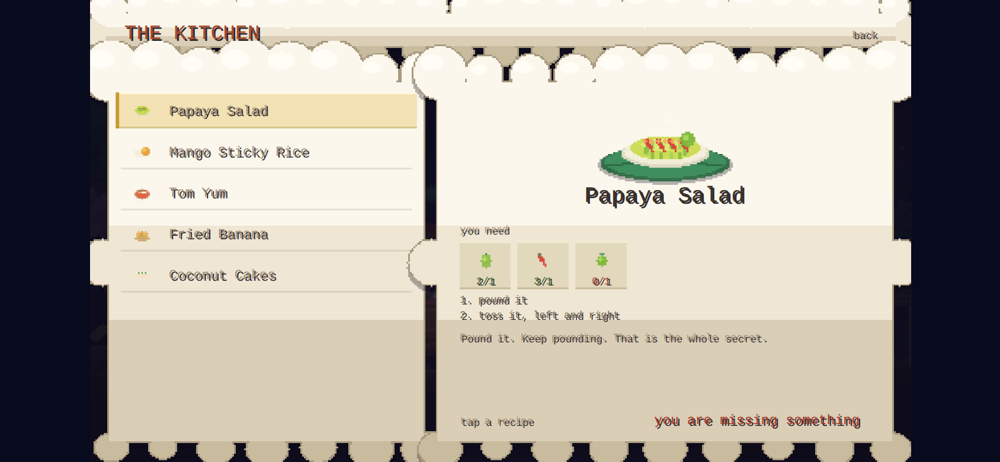

## The opening is played, not watched

Three things you did in your last life, and you do each one yourself. Nobody
narrates at you until after you've done it.

**Creep across a dark room and take the coin.** Tap along the floor to creep;
moving makes noise, standing still lets it settle, and if the meter fills the
woman asleep under the mosquito net rolls over and mumbles. Tap the coin, and
the offering bowl is one coin lighter.

**Drink it dry.** Four taps. Each one tips the bottle, tips the whole frame a
little further, and smears the stars sideways. Then you laugh past the temple
gate where a monk is bowing to nobody, and the bell rings for you anyway.

**Try to cheat the scale.** Everything you took is piled on one brass pan; on
the other there is one flower. Tap the two sides and the beam does lift — and
then it sags right back, every time, because that is the entire point. When you
give up it slams, and the soil starts to fall, and your eyes close on it.

| | | |
|---|---|---|
| 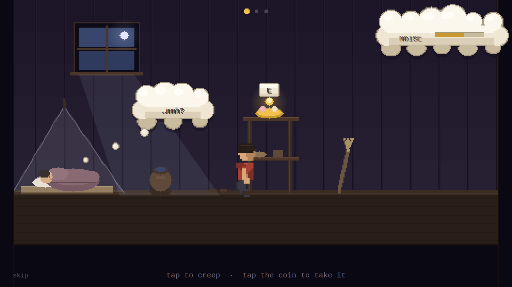 | 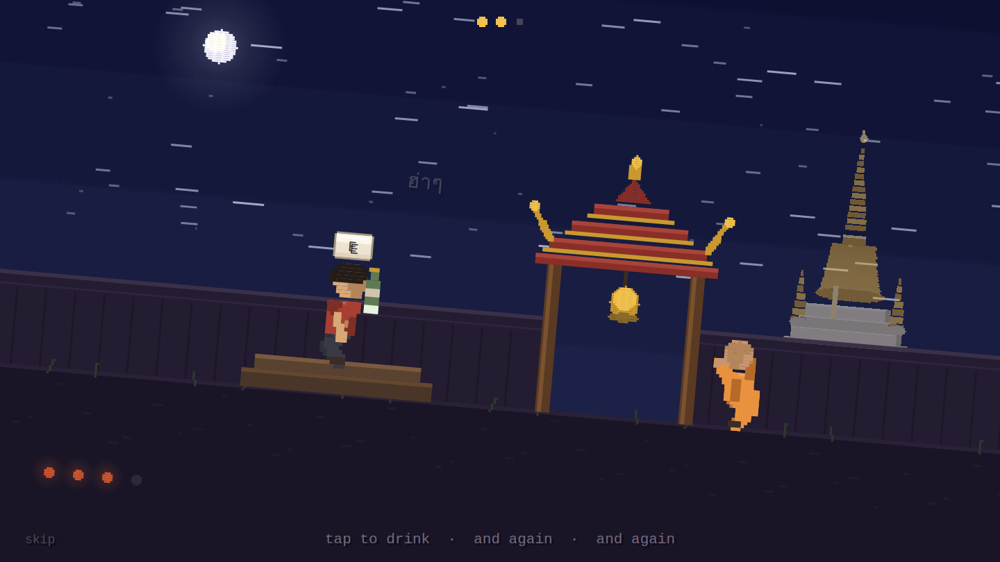 | 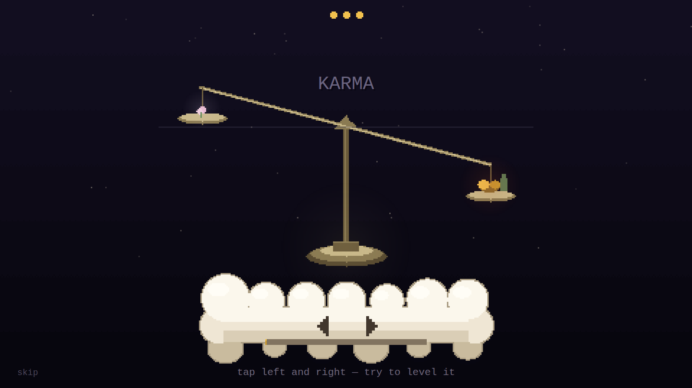 |

## You wake up in a graveyard

The game opens in the cremation ground at the west end of the village, which is
where they buried you. A small round glowing thing is waiting to explain this,
gently:

> **Khwan:** *Better you hear this standing: you woke up in a graveyard.*

That's **Khwan** — the life-spirit Thai belief says everybody carries and almost
nobody hears. She follows you the whole game, floats at your shoulder, and
teaches you one nudge at a time: how to walk, how to pick things, how to cook,
how to give something away. She is also the one who tells you that nobody here
is going to hurt you.

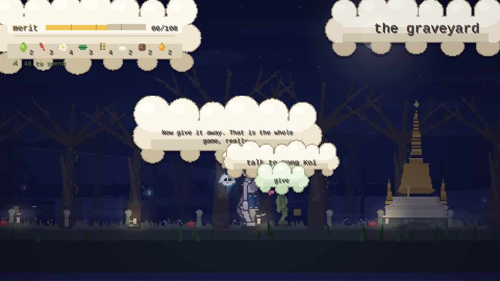

## The whole interface is made of clouds

Every panel, bubble, tag and menu is a drawn cumulus with scalloped lobes, a lit
top band and a soft shadow. Speakers get a round hand-drawn **portrait** on its
own little cloud beside the dialogue, and only one voice talks at a time.

Nothing in the interface is a font character standing in for a picture — the
ticks, hearts, stars, arrows, flowers, prayer beads and the book on the menu
button are all drawn from pixels, like everything else in the game.

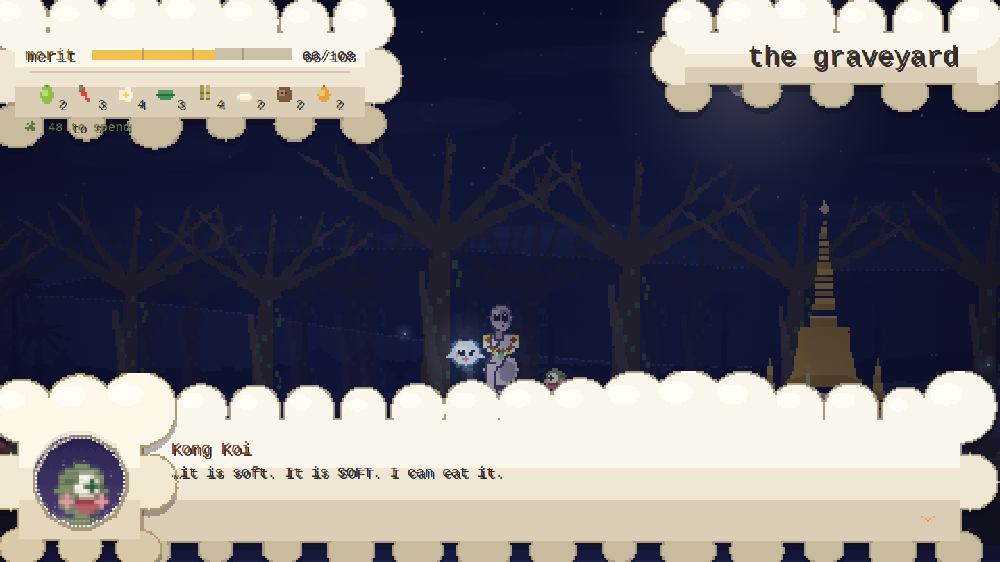

## What you actually do

**Pick things.** Rice and coriander in the paddies, chillies and lemongrass in
the gardens, jasmine in the flower patches, bananas and mango and banana leaf in
the grove, bamboo in the old forest, river clay by the pond. Everything regrows.

**Cook things.** Lung Somchai leaves his clay stove burning all night and is too
old to be precious about it. Five real dishes — papaya salad, mango sticky rice,
tom yum, fried banana, coconut cakes — each cooked through two hands-on steps:
pound in the mortar on the beat, keep the steam in the green band, flip when it's
golden, plate it nicely.

**And then it is plated properly.** Nothing you make is an inventory icon. Each
dish is served the way it would actually arrive: papaya salad heaped on a banana
leaf with a lime wedge and dried shrimp, sticky rice moulded beside sliced mango
and drizzled with coconut cream, tom yum steaming in its bowl with lemongrass
laid across the rim.

| | | |
|---|---|---|
| 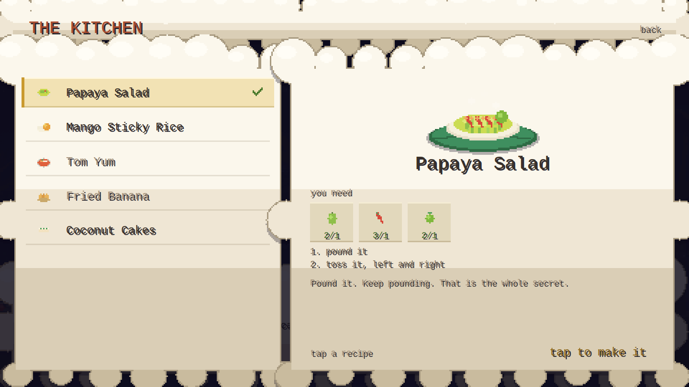 | 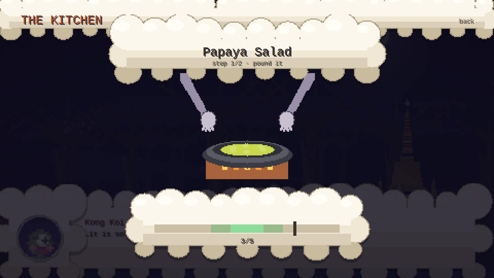 | 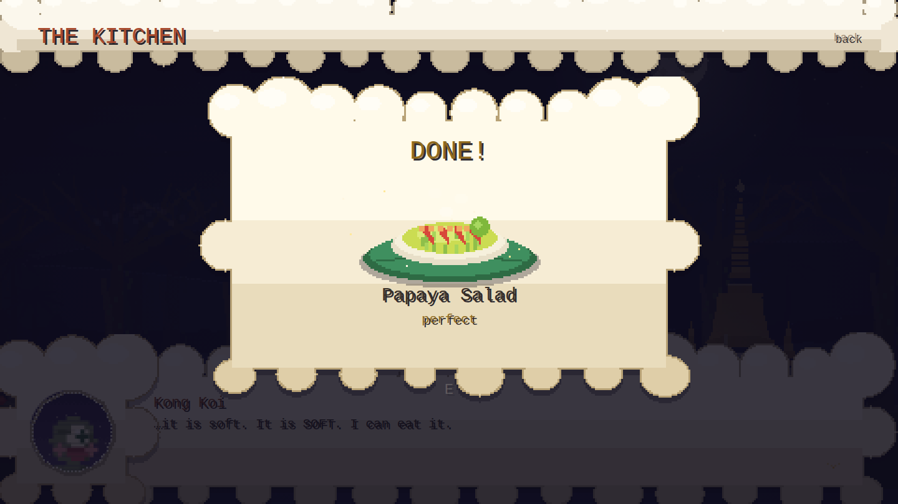 |

**Make things.** A mat outside the stall, and five things to weave: a jasmine
garland, a folded banana-leaf float, a winnowing basket, a paper lantern, and a
small roadside shrine — each one shown finished and turned in the light before it
goes in your basket.

**Help.** Four jobs nobody else can reach, each a hands-on minigame where you
steer your enormous hand directly: splice the dead streetlight while the current
kicks, lift a fallen tree off the road and keep it level, hang Phra Phum's fallen
garland, and lift the cat down from the tamarind — slowly, because she isn't
afraid of big, she's afraid of *sudden*.

| | |
|---|---|
| 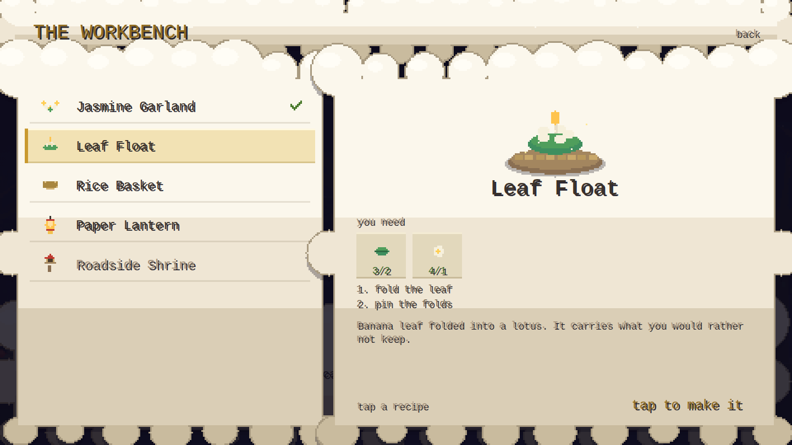 |  |

**Give it away.** That's the whole game, really.

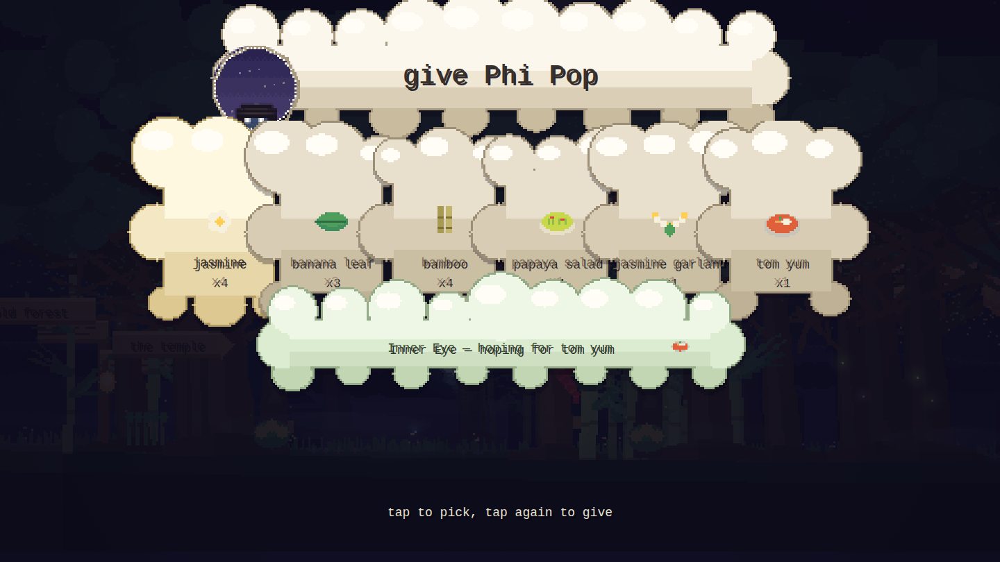

## Ascend, and be blessed

Merit is both your progress bar and your currency, and spending it never costs
you progress. But you don't just *tap* a skill and own it.

Choose one and the world drops away: the sky goes to dawn, god-rays open, and you
rise through streaming clouds — hold to climb, lean to drift. At the top there is
a terrace of cloud with a gold rail, and a **deva** waiting on it, one of three
depending on which branch you're climbing:

| Branch | The god who meets you | What they grant |
|---|---|---|
| **body** | **Mae Thorani**, the earth goddess wringing water from her hair | strength, stride, a lighter body |
| **hands** | **Witsanukam**, patron of every craftsman | steady hands, deft weaving, a divine tongue |
| **heart** | **Phra In**, Indra of the thirty-three | an inner eye, a cool heart, loving-kindness |

They say something to you, and then you hold to receive it — a beam comes down,
the gauge fills with gold, and the skill is *given* rather than bought. Then you
descend, and the ledger is waiting where you left it.

| | | |
|---|---|---|
| 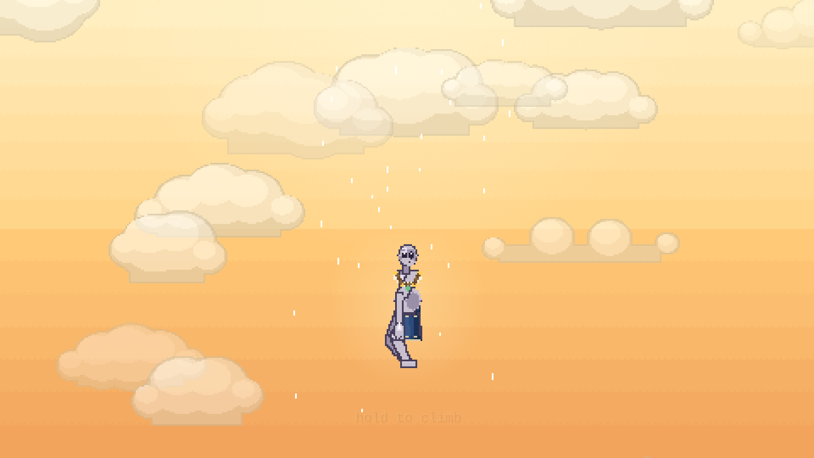 | 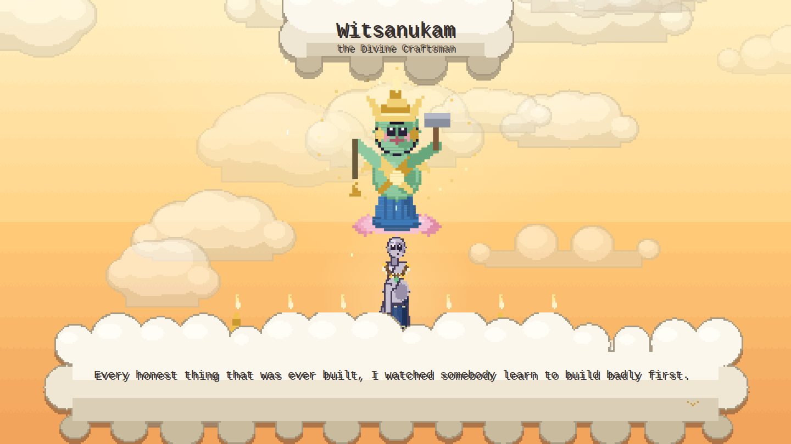 | 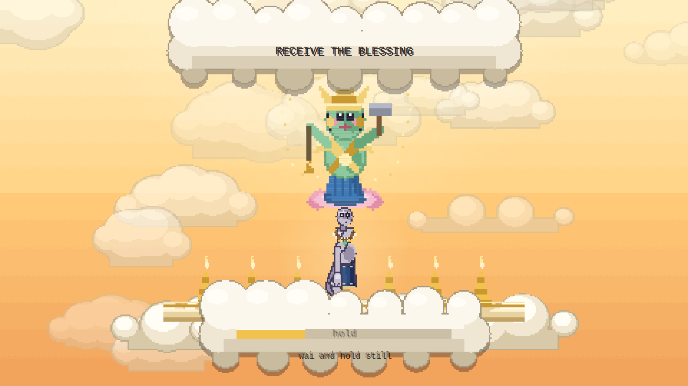 |

## The Ledger and the map

Four tabs on a drifting cloud sky: **skills**, **looks**, **friends**, and the
whole 5,600-pixel road drawn as a **map** — seven named zones along the top, every
stove, shrine, workbench, pond and grove pinned on four tiers so nothing collides,
your five ghost friends on their own row, a marker where you're standing, and one
line at the bottom telling you what to do next.

Every card is a tap target: tap it to read it, tap it again to choose it.

The skill tree runs down three columns:

| BODY | HANDS | HEART |
|---|---|---|
| Giant Stride | Steady Hands | Merit Magnet |
| Palm-Leaf Reach | Divine Tongue | Inner Eye |
| Carrying Pole | Deft Weaving | Cool Heart |
| Light Body | Two Hands | Loving-Kindness |

**Inner Eye** is the one to save for: it shows a little thought-cloud over
everybody's head with the thing they're quietly hoping for, so you never have to
guess. There's also a wardrobe of five hand-woven sarongs, a garland, a sabai
sash, 108 prayer beads and gold leaf — all simulated cloth, not swapped sprites.

| | | |
|---|---|---|
|  | 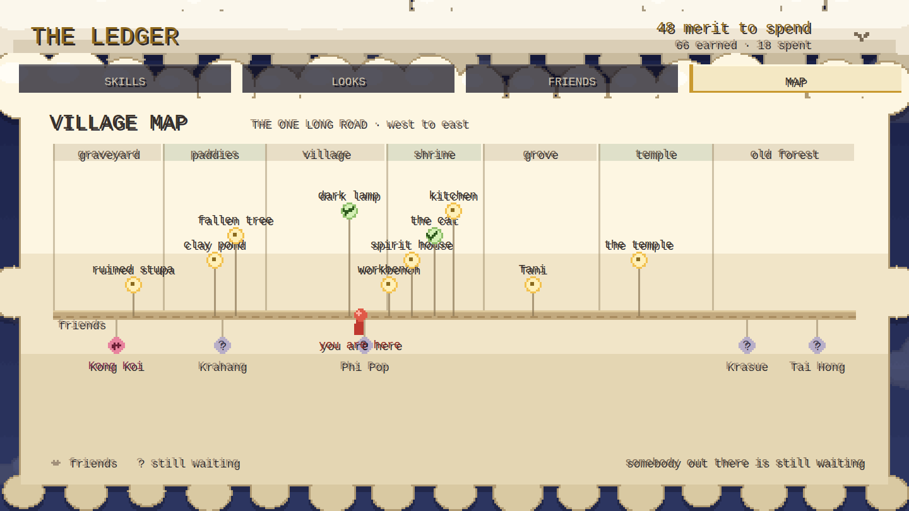 | 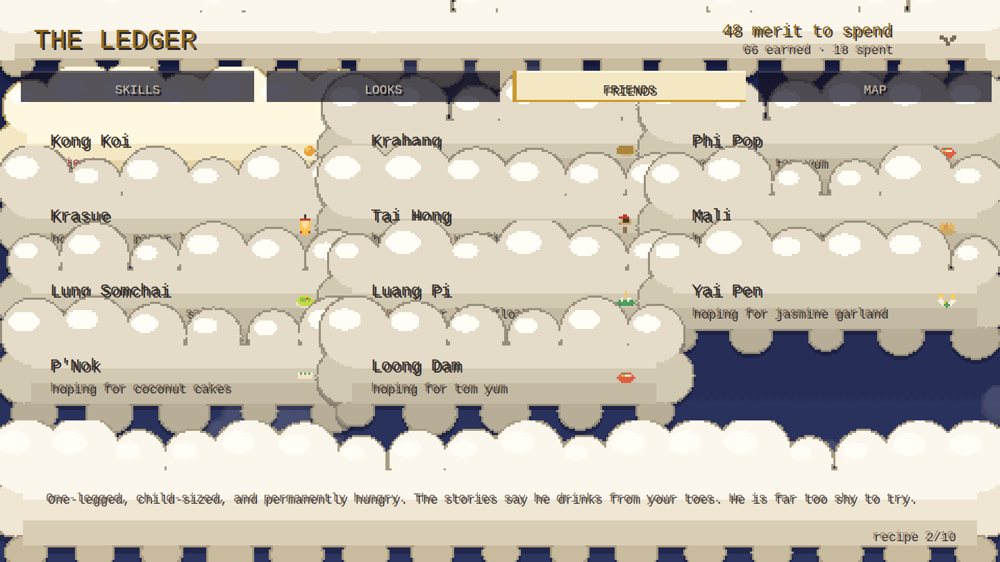 |

## Everybody is friendly, including the frightening ones

Thai folklore's most feared night spirits live here, and every one of them is a
neighbour with a small problem:

| Who | The story about them | What they actually want |
|---|---|---|
| **Kong Koi** | a one-legged forest spirit who drinks from sleeping travellers' toes | he's too shy to try, has no teeth, and would like something soft — mango sticky rice |
| **Krahang** | a man who flies at night on two rice-winnowing baskets | he came down hard in the paddy and both baskets are kindling. New ones, woven properly |
| **Phi Pop** | blamed for every stomach ache in four villages | has never possessed anybody. Wants a hot bowl of tom yum, handed over by somebody who isn't backing away while they do it |
| **Krasue** | a floating head trailing her own glowing entrails | leaves her body in the forest each night and can never find it again. Cheerful about it. Needs a lantern |
| **Tai Hong** | died badly on this road and simply stayed | not angry. Not anything. Just still there, waiting to be noticed. Wants a small shrine so people know somebody was here |

Plus five villagers, a monk who isn't supposed to want anything and would still
like a leaf float, and a cat.

## The crossroads

Five hand-painted **signposts** stand where the road forks, each with boards
pointing both ways — the graveyard back west, the village and the market ahead,
the temple and the banana grove onward — with a lantern hanging off the post and
a lamp pooling light on the dirt. You should never have to guess which way the
village is.

| | |
|---|---|
| 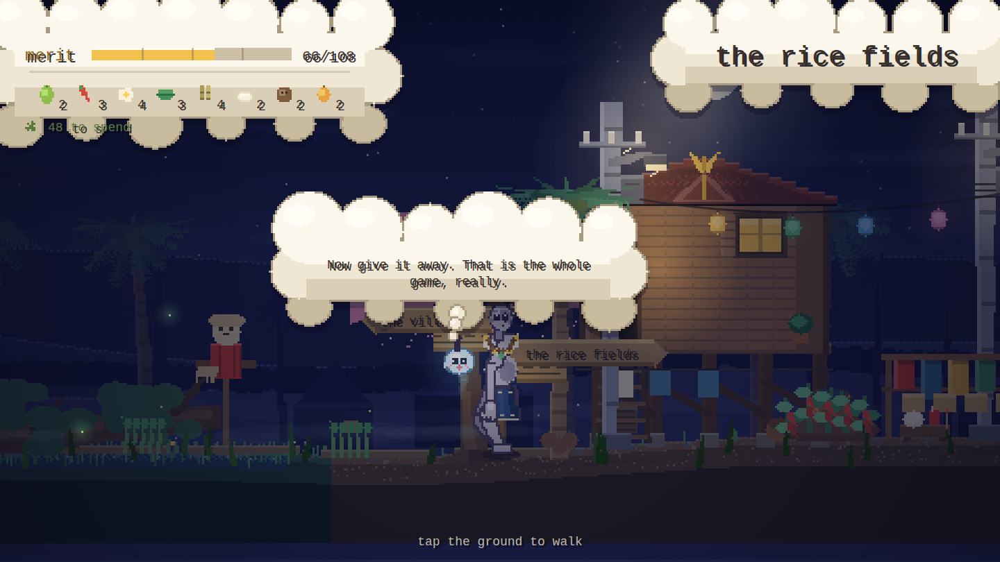 |  |

Fill 108 merit — as many as the beads on a prayer mala — and the village throws
you a water-pouring ceremony at dawn. Everyone you befriended comes to see you off.

## The lore (actual research)

- The prete is the Thai **hungry ghost**: **as tall as palm trees**, pot-bellied,
  **hands as big as palm leaves**, a **mouth the size of a needle's eye**. At
  night they make a thin high whistle asking the living to dedicate merit to
  them — which is your greeting button.
- The exit is real: when the living **make merit and dedicate it** — often by
  pouring water — a prete can be released.
- **Phra Phum Chao Thi**, the spirit-house guardian, is depicted as a regal gold
  figure holding **a sword in one hand and a money bag in the other** — look
  inside the shrine. He keeps the village ledger, and yours.
- **Phra Mae Thorani** is shown wringing water from her hair; **Phra Witsanukam**
  is the patron the craft guilds still garland once a year; **Phra In** is Indra,
  who in the Thai telling comes down himself when somebody's merit is worth the
  trip.
- **Nang Tani** genuinely lives in wild banana groves and is genuinely benevolent.
  **Khwan** is the Thai life-spirit; losing yours is what you say when somebody
  has had a fright.
- The red Fanta on the shrine ledge is not a joke.

Sources: [Preta](https://en.wikipedia.org/wiki/Preta) ·
[Ghosts in Thai culture](https://en.wikipedia.org/wiki/Ghosts_in_Thai_culture) ·
[Preta: Hungry Ghost Spirits in Thailand](https://mysakonnakhon.com/preta-hungry-ghost-spirits-in-thailand/) ·
[Krahang](https://en.wikipedia.org/wiki/Krahang) ·
[Kong Koi](https://en.wikipedia.org/wiki/Kong_koi) ·
[Phra Mae Thorani](https://en.wikipedia.org/wiki/Phra_Mae_Thorani) ·
[Vishvakarman](https://en.wikipedia.org/wiki/Vishvakarma) ·
[A Guide to Thai Spirit Houses](https://www.thethailandlife.com/thai-spirit-houses)

## What's inside

One HTML file, ~278 KB, 480×270 canvas integer-scaled with `image-rendering:
pixelated`. Boots in ~270ms and holds 60 fps.

- **Nothing is a sprite sheet, and nothing is a font glyph.** Every character is a
  procedural puppet posed fresh each frame — two-bone IK limbs, a walk cycle
  driven by *distance travelled* so feet never slide, velocity lean, landing
  squash, a pot belly on its own spring, and a verlet-simulated sarong. Every
  interface picture is drawn from pixel primitives too.
- **A 5,600-pixel road** through seven named zones over six parallax layers,
  pre-rendered once into cached canvases and built across frames behind a loading
  screen.
- **Every cloud is drawn, then cached.** Panels, bubbles, keycaps and sky clouds
  are scanline-filled once into offscreen canvases and reused; so are the radial
  glows on every lantern, lamp, firefly and floating head. That's what keeps a UI
  made entirely of soft shapes at 60 fps.
- **Menus are hit-tested from the draw pass.** Each screen records where it put
  things as it paints them, so a tap resolves against real layout instead of a
  second copy of the geometry.
- **Atmosphere:** strings of coloured lanterns swaying over the road, blossom
  trees, night-market stalls, drifting mist that pools in the graveyard and the
  paddies, candles on the graves, spirit-motes, fireflies, moths around the lamps,
  and a real-time lighting pass so fixing the streetlight visibly warms that
  stretch.
- **All audio synthesized live** — crickets, frogs, a ranat-ek pentatonic figure,
  temple gongs, and one long prete whistle.
- Autosave, a friends journal, canvas-drawn touch controls, and a dawn ending.

Made with rice and incense. May you go to a good place.
