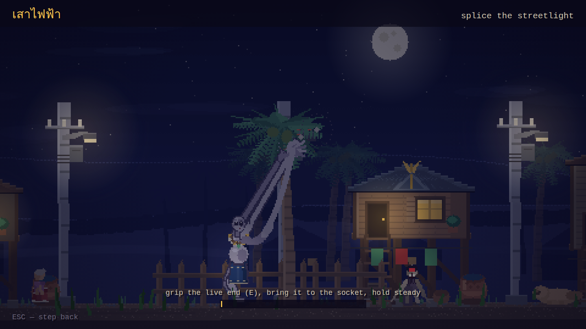
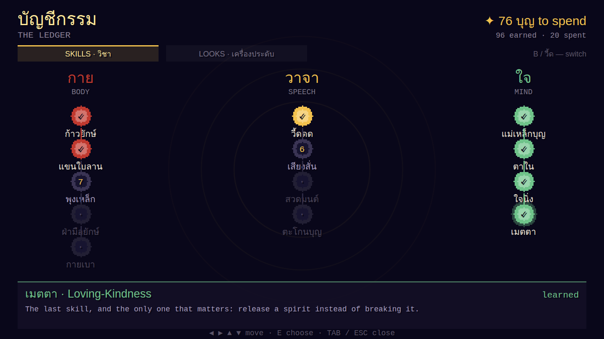
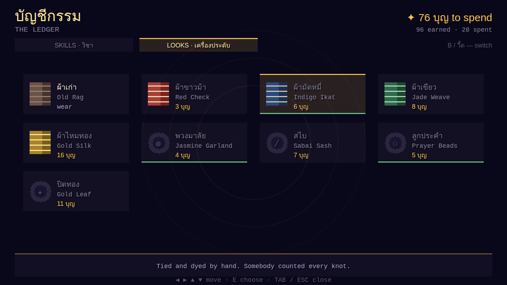
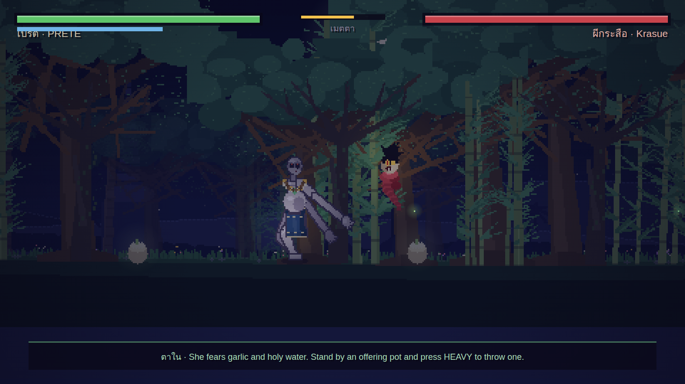
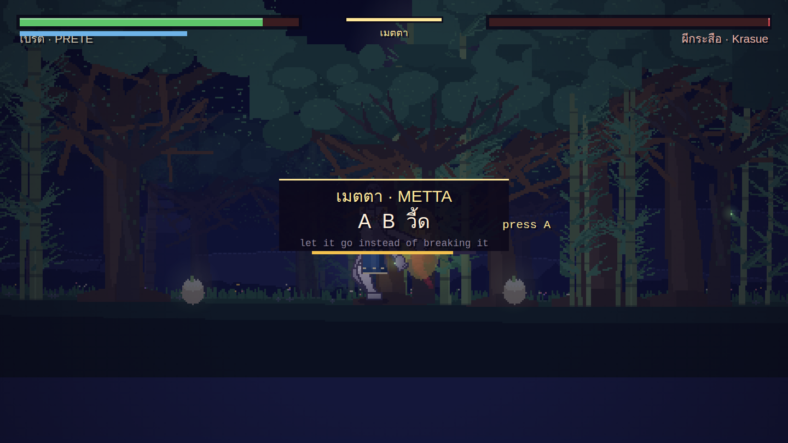
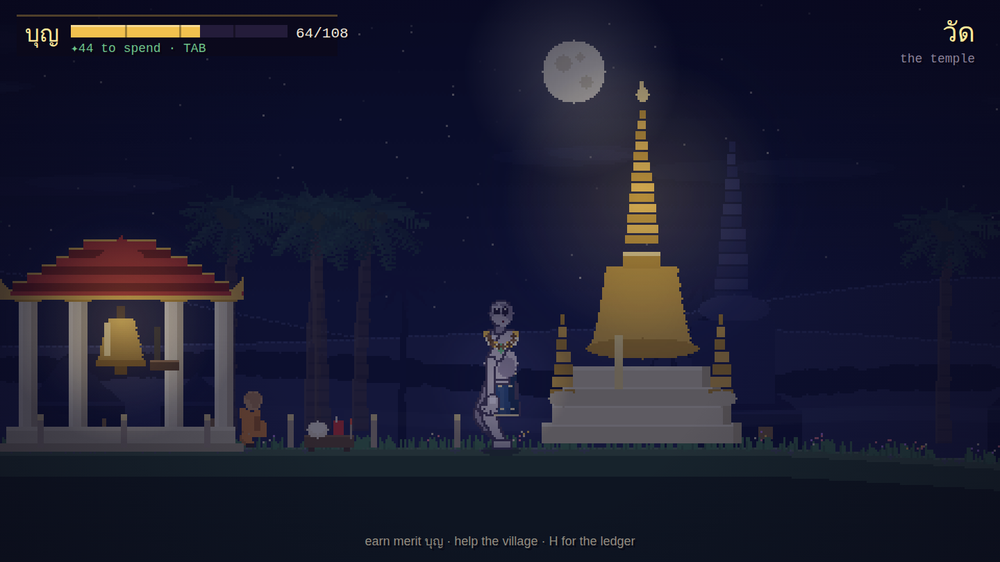

# Prete Simulator · เปรตซิมูเลเตอร์

A side-scrolling Thai ghost game about being nine feet of regret in a torn ผ้าถุง.

> karma is a ledger, not a cage.

In your last life you took what wasn't yours and drank what wasn't offered. The
ledger tipped, and you woke in the cremation ground as a **prete (เปรต)** — tall
as the palm trees, pot-bellied, hands like palm leaves, and a mouth the size of
the eye of a needle.

Walk one long road through a sleeping Thai village. Earn **108 บุญ** — as many as
the beads on a prayer mala — and the road home opens.

**Playtime:** ~30–45 minutes · no fail states (a prete cannot die twice) ·
plays on desktop and phone · sound on if you can

## Play

Open `index.html` in any browser. One self-contained file — no build, no assets,
no dependencies. Works from disk or any static host.

## Controls

| Input | Action |
|---|---|
| ← → / A D | walk |
| Space / ↑ | jump (twice, once you're hollow enough) |
| E / Enter | talk · interact · advance text |
| Z | light attack — a palm slap |
| X | heavy attack — the whole arm |
| C | วี้ดดด — the prete's whistle |
| Shift / ↓ | guard (hold ↓ to guard **low**) |
| Tab / H | the Ledger — skills and looks |
| M | mute · Esc | back |

On a phone the on-screen pads appear automatically. Turn it sideways — the
village is a long road. Progress saves in the browser.

## How merit works

**Phra Phum (พระภูมิเจ้าที่)** — the guardian spirit who lives in the little
gold-and-red house on its single pillar — keeps this village's ledger, and yours.
He gives you three ways to fill the other column:

- **Stand near when people pray.** Villagers walk to the **ศาลพระภูมิ** and
  dedicate merit to สัมภเวสี — wandering souls. That's you. Get close and the
  merit drifts over like moths to a lamp.
- **Help with that ridiculous body.** Four jobs nobody else can reach, each a
  hands-on minigame where you steer your enormous hand directly: splice the dead
  **เสาไฟฟ้า**, lift a fallen tree off the road, hang Phra Phum's fallen garland,
  and lift Meow-Meow down from the big tamarind — slowly, because she isn't
  afraid of big, she's afraid of *sudden*.
- **Face what the dark leaves lying about.** Five Thai spirits, each fought in a
  side-view arena with health bars and a combo counter.

## The Ledger — spend merit on skills and looks

Merit is both your progress bar and your currency, and spending it never costs
you progress. The skill tree follows the **three doors of karma**: กาย (body),
วาจา (speech), ใจ (mind).

| กาย · BODY | วาจา · SPEECH | ใจ · MIND |
|---|---|---|
| ก้าวยักษ์ Giant Stride | วี้ดดด The Whistle | แม่เหล็กบุญ Merit Magnet |
| แขนใบลาน Palm-Leaf Reach | เสียงสั่น Rattling Cry | ตาใน Inner Eye |
| พุงเหล็ก Iron Belly | สวดมนต์ Old Chant | ใจนิ่ง Still Mind |
| ฝ่ามือยักษ์ Giant Palm | ตะโกนบุญ Blessing Shout | **เมตตา Loving-Kindness** |
| กายเบา Light Body | | |

There is also a wardrobe: five hand-woven **ผ้าถุง** (the old rag you woke in, a
red-check ผ้าขาวม้า, indigo มัดหมี่, a jade weave, gold silk), a jasmine garland,
a สไบ sash, 108 prayer beads, and gold leaf pressed on square by square the way
people gild a Buddha. Each is simulated cloth, not a swapped sprite.

| | |
|---|---|
|  |  |

## The fights — the folklore *is* the mechanic

Every spirit is beaten the way the stories say it's beaten. Take **ตาใน (Inner
Eye)** and the game tells you which; otherwise you work it out.

| Spirit | What it does | How you actually beat it |
|---|---|---|
| **ผีกองกอย** Kong Koi | one leg, hops, cries *koi… koi…*, drinks from the toes of sleeping travellers | it always goes **low** — guard low, the way travellers cross their feet to sleep safe |
| **ผีกระหัง** Krahang | a villager by day; at night he flies on rice-winnowing baskets, riding a pestle | **break the baskets** mid-air. Grounded, he's only a rude man |
| **ผีปอบ** Phi Pop | wears a neighbour and eats them from the inside | **don't punch a neighbour.** Fists barely scratch it; sound drives it out — the whistle does full damage |
| **ผีกระสือ** Krasue | a floating head trailing her own glowing entrails | she fears **garlic and holy water** — stand by an offering pot and throw one |
| **ผีตายโหง** Phi Tai Hong | died badly on a road at night and simply stayed | **force can never finish it.** It stands back up at 1 HP forever. Only เมตตา ends it |

Beat a spirit and you can drive it off — or, if you've learned **เมตตา**, spend
the moment releasing it instead. Same fight, different ending, more merit, and
the epilogue counts which ones you actually freed.

## The lore (actual research)

- The prete (เปรต) is the Thai **hungry ghost**. Thai folklore pictures them **as
  tall as palm trees**, skeletal but pot-bellied, with **hands as big as palm
  leaves** and a **mouth the size of the eye of a needle**, so they can never eat
  enough. You get there through stealing, drinking, and above all wronging your
  parents — hence the giant hands and the tiny mouth.
- At night they make a **thin high whistle** (วี้ดๆ), asking the living to
  dedicate merit to them. That's your ranged attack.
- The exit is real: when the living **make merit and dedicate it**
  (อุทิศส่วนกุศล, often by pouring water — กรวดน้ำ), a prete can be released.
  That's the whole game.
- **Phra Phum Chao Thi** is depicted as a regal gold figure holding **a sword in
  one hand and a money bag in the other** — look closely inside the shrine.
- **Nang Tani (นางตานี)** really does live in wild banana groves, and really is
  benevolent. She's your first friend and the one who tells you the truth kindly.
- The red **Fanta (น้ำแดง)** on the shrine ledge is not a joke. No Thai spirit
  house is complete without one.

Sources: [Preta](https://en.wikipedia.org/wiki/Preta) ·
[Ghosts in Thai culture](https://en.wikipedia.org/wiki/Ghosts_in_Thai_culture) ·
[Preta: Hungry Ghost Spirits in Thailand](https://mysakonnakhon.com/preta-hungry-ghost-spirits-in-thailand/) ·
[Krahang](https://en.wikipedia.org/wiki/Krahang) ·
[Kong Koi](https://en.wikipedia.org/wiki/Kong_koi) ·
[The 13 Most Terrifying Ghosts in Thai folklore](https://theculturetrip.com/asia/thailand/articles/13-terrifying-ghosts-thai-folklore) ·
[A Guide to Thai Spirit Houses](https://www.thethailandlife.com/thai-spirit-houses)

| | |
|---|---|
|  |  |

## What's inside

One HTML file, ~165 KB, 480×270 canvas integer-scaled with `image-rendering:
pixelated`. Boots in about a quarter of a second and holds 60 fps.

- **Nobody is a sprite sheet.** Every character is a procedural puppet posed
  fresh each frame — two-bone IK legs and arms, a walk cycle driven by *distance
  travelled* so feet never slide, velocity-driven lean, landing squash, a pot
  belly on its own spring, and a verlet-simulated ผ้าถุง that swings when you
  turn.
- **A 5,600-pixel road** through seven named zones — cremation ground, rice
  paddies, village road, spirit house, banana grove, temple, old forest — over
  six parallax layers, pre-rendered once into cached canvases.
- **Everything drawn plank by plank**: stilt houses with clay-tile roofs, gable
  finials and laundry lines; the ศาลพระภูมิ with its garlands and offerings; a
  gold chedi, a bell sala, a naga staircase, a noodle cart with a striped canopy,
  water jars, and a soi dog asleep in the road.
- **A real-time lighting pass** — warm pools punched out of the night for every
  window, lantern and streetlamp, so fixing the เสาไฟฟ้า visibly warms the road.
  Fireflies in the grove. Dawn arrives when you do.
- **All audio synthesized live**: crickets, frogs, a ranat-ek pentatonic figure,
  temple gongs, war drums for the fights, and one long prete whistle.
- Hitstop, screen shake, combo counters, telegraphed enemy attacks with
  HIGH/LOW tells, perfect-guard slow motion, autosave, and canvas-drawn touch
  controls.

Made with rice and incense. ขอให้ไปสู่สุคติ 🌸
