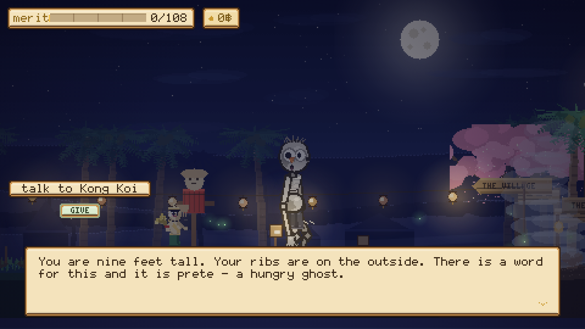

# Prete Simulator

A quiet side-scrolling game about waking up in a flooded rice field with no
memory at all, being handed one season's work by the goddess who owns the
field, and having to earn the story of your own life back.

> karma is a ledger, and you are not allowed to read your own.

You come to face down in standing water, in an abandoned paddy west of the
village, with a small glowing thing already mid-sentence at your shoulder. You
do not know your name. You do not know what you did. You are a **prete** — a hungry ghost, tall as the palm trees and thin as
a pole, ash-grey, with hands like palm leaves, a pot belly under a visible ribcage, a mouth the size of a needle's eye, one small orange
nose, six hairs left, and two enormous ringed eyes that have not closed properly
since. You cannot eat anything you cook. You're going to cook a great deal
anyway.

Nobody will tell you what you did. Not Mae Posop, who has watched the field
since before you were buried in sight of it. Not Phra Phum, who keeps the
ledger in his hands. **It comes back on its own, one
page at a time, as you earn the right to it** — and by the last page you will
wish it hadn't.

**Nothing in this game fights.** There are no enemies, no health bar and no way
to lose. There is one rice field, a village further up the road, a derelict farm
nobody has worked in years, a stove, a weaving mat, and eleven people — five of
them dead — who each quietly want one small thing.

**It starts with one field and nothing else.** The village is east and the mist
does not lift off that road until the rice is in, so the first ten minutes are a
barn, a water jar, a paddy, and a rice goddess standing in the mud telling you
what to do with them, in order. Seed. Water. Mud. Waiting. Thanks. Nothing else
in the game is explained until you need it.

**Then it is a livelihood.** Forage, cook, sell it at the stall for baht; rent
the rest of that farm off the notice on the gate; turn beds, flood the second
นาข้าว, plant durian, buy chickens; then cook what you grew for the people who
ordered it by name. Merit is what the ledger counts and baht is what the
landlord counts, and you cannot get both out of the same bowl of food — giving
it away earns one, selling it earns the other. That choice is the game.

Your dead friends will work the farm for you. That is not a metaphor: feed a
hungry ghost once and it will come and water your beds while you are away.

**Playtime:** an hour and a bit · built for phones, fine on desktop · sound on if you can

## Play

Open `index.html` in any browser. One self-contained file — no build, no assets,
no dependencies, and **not a single network request**: the art, the sound and the
lettering are all generated in the page. The road is built behind a loading
screen in about half a second.

## Controls

**Tap where you want to go.** That's the whole thing. The prete walks there and
uses whatever is standing on the spot — tap the stove and he walks over and starts
cooking, tap a plant and he picks it, tap a ghost and he says hello. A gold mark
pulses on the ground where you're headed. Drag to change your mind.

There are three buttons, bottom corners, and each one is a drawn picture rather
than a letter:

| Button | What it does |
|---|---|
| the open book, bottom left | your ledger — skills, looks, friends, and the map |
| the sound, bottom right | the prete's whistle, which is just a hello |
| the heart, bottom right | give somebody something you made |

Everywhere else a tap means *go on*: it advances dialogue, chooses a recipe, and
holds still to hold a gauge. Where a screen needs two sides — the rhythm steps,
the pans of the karma scale — the left and right thirds of the display stand in
for left and right.

A keyboard still works if you have one: arrows walk, **E** confirms, **G** gives,
**C** whistles, **Tab** opens the ledger, **Q** jumps to the map, **V** switches
between English and Thai, **M** mutes, **Esc** goes back. Turn a phone sideways. Progress saves in the browser.

## The past comes back in pieces, and you play every one

There is no prologue explaining who you were. There are **four memories** and you
earn every one of them. They arrive without asking — you'll be walking
down the road and the world will white out — and each one is a short scene you
play rather than watch: letterboxed, a title in the corner, dust in the light,
and nobody narrating at you until after you've done the thing.

**The shelf.** Tap along the floor of a room you half know. Moving makes noise
and standing still lets it settle; fill the meter and the shape asleep on the mat
rolls over and mumbles. There is a bowl on the shelf with a coin in it. Take it.

**The gate.** Three taps. Each one empties the bottle and tips the whole horizon
further. Then you laugh past the temple gate, and the bell rings for you anyway.

**The scale.** Everything you took on one brass pan; one flower on the other. Tap
the two sides and the beam does lift — and then it sags right back, every time,
because that is the entire point. When you give up it slams, and the soil falls.

**Four bowls.** The last page, and the only one you can't do anything about. The
same room, years later, by daylight. A photograph on the altar of a young man who
still had hair. An old woman kneeling, setting out rice. Reach for the bowl —
your hand goes straight through, three times, and she never looks up. Then she
sets out a fourth.

Everything you recover is filed in the **PAST** tab of your ledger, one line per
page, and until the last one turns the ending will not start.

| | | |
|---|---|---|
|  |  |  |
|  |  |  |

## You wake up in somebody else's rice field

The game opens face down in standing water in an abandoned paddy — no title
crawl, no scene to sit through, and **nobody explaining anything**. Five lines
of second person, no speaker, no portrait:

> *You are nine feet tall. Your ribs are on the outside. You have been under a
> long time.*
>
> *You reach for your name, the way you would reach for a coin in a pocket.
> There is nothing where it should be.*

There used to be a small glowing life-spirit at your shoulder who talked you
through all of this and then followed you about for the rest of the game. She
is gone. With Mae Posop standing in the field doing the same job, the two of
them talked over each other — two speech bubbles on screen at once, both
telling you what to do next.

**There is one guide now, and she is standing out in the water.** Everything
the game wants to tell you comes out of her mouth if you are near her, and off
a single line under the plaques if you have walked two zones away — because a
hint you cannot see is not a hint.

## Mae Posop, who owns the field

**แม่โพสพ.** Thai farmers have apologised to her for centuries — for dropping a
grain, for stepping on a fallen ear, for cutting when she was still carrying.
She is not a quest-giver with a marker over her head. She is standing in your
paddy because it is her paddy too, and it has stood empty two years and she has
taken it personally.

> **Mae Posop:** *You cannot eat. Good. Then you will not be tempted to keep any
> of it.*

She teaches the whole of a rice crop, one step at a time, in the order a field
actually happens — and she comes to meet you along the bund while she is doing
it, so the one character who explains the game can never end up somewhere you
can't reach:

| | |
|---|---|
| **Seed** | there is a sack of it in your barn, by the gate |
| **Water** | the โอ่ง in the shade of the house has never once run dry |
| **Mud** | let the water in, and put the seed down into it — gently, it is somebody |
| **Waiting** | keep the water up and let it alone. Rice has never once been hurried |
| **Thanks** | it is bowing. That is it asking. Cut it, and say thank you out loud |

Finish that and the mist lifts off the road east, and the village — which eats
what you just cut — is open. She stays in the field afterwards, and she still
has opinions.

| | | |
|---|---|---|
|  |  |  |

## The interface is one wooden box, cut from the same plank

Every panel, bubble, tag and menu is a **carved wooden frame** — a dark plank
edge, a lit inner bevel, a parchment field — and every one stays exactly inside
its own rectangle. Your merit sits on a small plaque in one corner; what you're
carrying sits on a **toolbar** along the bottom, one slot per thing, the way a
farming game does it. Speakers get a round hand-drawn **portrait** beside the
dialogue, and only one voice talks at a time.

Nothing in the interface is a font character standing in for a picture — the
ticks, hearts, stars, arrows, flowers, prayer beads and the book on the menu
button are all drawn from pixels. **So are the letters.** The game carries two
hand-drawn bitmap faces — a 5x7 for everything and a 3x5 for the small print —
and every glyph lands on whole pixels at whole-number scales, which is why the
text is sharp instead of smeared.

## The farm

Out west in the rice fields there is a shack with a hole in the roof, an empty
pen, and a notice still nailed to the gate. **One hundred and twenty baht and it
is yours** — the first bed, a handful of seed, and every other thing on the
place for sale on the board by the gate: another bed, a rice field, a hole for a
tree, a sapling, a chicken, a roof that keeps the rain out.

| | | |
|---|---|---|
|  |  |  |

**A barn, and a water jar.** Seed comes out of a **ยุ้งข้าว** — a rice granary
up on four posts, with a ladder and a hatch — and the tools you have earned hang
on the wall of it, so the skill tree has somewhere in the world to show up.
Water comes out of the **โอ่ง**, and it is a trip rather than a click: the jar
never runs dry, but you can only carry two waterings at a time until you go and
earn a proper can.

**Five dry beds.** One crop to a bed — green papaya, chilli, holy basil,
galangal, morning glory — each with a painted marker board you can read from the
far side of the road. **Sow, water, wait, pick.** Wet earth grows about twice as
fast; manure in your basket when you sow makes it faster still.

**Two นาข้าว.** A rice field is a different animal: a bunded box you flood, sow,
and then keep flooded, because rice in a dry paddy simply stops and waits. It
takes about twice as long as a bed and pays four rice, two bran and two seed —
and while it is standing there full of water it holds the moon in it.

**Three fruit trees.** Buy a sapling and put it in a hole and then *wait* —
durian, mangosteen, rambutan take the better part of a minute to come up and
then bear for the rest of the game. A durian is worth thirty-six baht on its
own, which is most of a bed's whole crop.

**A pen.** Chickens, ducks and one very large water buffalo. Keep rice bran in
the trough and they leave you eggs, duck eggs, buffalo milk and manure every
little while. Stop feeding them and they simply stop — nothing on this farm can
die, they just look at you about it.

| | | |
|---|---|---|
|  |  |  |
|  |  |  |

Every one of those is a *gesture*, not a menu tick: he folds ninety pixels of
leg into a crouch, reaches both long arms down to the soil, and the thing
happens at the moment his hands actually get there.

## Ghosts make good farmhands

Feed a hungry ghost the thing it has been waiting a century for and it becomes
your friend. Ask a friend for help and it stops haunting its patch of road,
comes to the farm, and takes a job:

| Who | What they do |
|---|---|
| **Kong Koi** hops the row with a bucket | waters any bed that has gone dry |
| **Krahang** flies in on his baskets | picks whatever is ripe and puts it in your basket |
| **Phi Pop** minds the trough | keeps bran in front of the animals |
| **Krasue** floats the dikes at night | keeps the water up in the นาข้าว, and cuts the rice |
| **Tai Hong** stands under the trees | brings the fruit down |

They keep at it whether or not you are on screen, they wear a small badge
saying what they are doing, and you can send any of them back to the road from
the board at the gate. One job to one ghost.

## Things that fly at dusk

Six of them, each drawn and each moving its own way, because that is the whole
pleasure of it: you learn that a dragonfly hangs perfectly still and then darts,
that a firefly cannot be hurried, that a grasshopper only goes when you get
close, and that a rhinoceros beetle does not care about you at all.

| | |
|---|---|
| **หิ่งห้อย** firefly | drifts over the water after dark and blinks · 14฿ |
| **แมงปอ** dragonfly | hangs still, then darts. Paddies only · 18฿ |
| **จักจั่น** cicada | clings to a trunk and shouts about it · 22฿ |
| **ด้วงกว่าง** rhinoceros beetle | walks a branch at night, horn first · 34฿ |
| **ตั๊กแตน** grasshopper | one enormous hop at a time · 11฿ |
| **ผีเสื้อ** butterfly | never in a straight line · 16฿ |

You need the net from your ledger, and then it is a swing rather than a click:
you get three, the hoop has a real radius, and the bug is living its own life
the whole time. Miss and it bolts. A beetle is worth more than a day of papaya,
which is exactly why children in this village spend the whole of dusk in the
long grass. Catch all six and the ledger notices.

## Planks, and a roof that keeps the rain out

There is a fallen trunk and a chopping stump on the track outside the gate. With
an **axe** you can hold to wind up — the axe rises, an arc fills, it gets heavy —
and let go to strike. Line up on the wedge and a plank splits off; miss and it
bounces and you feel it. Four to a session.

The shack then goes up in **three stages, paid in planks rather than only baht**:

| | | |
|---|---|---|
| **mend the roof** | there is sky where there should be thatch | 6 planks · 30฿ |
| **board the walls** | and a shutter that closes | 9 planks · 55฿ |
| **lay a proper floor** | somebody could live here again | 12 planks · 80฿ |

And the building changes at every stage — a hole through the ridge, then a mat
tacked over the gap and planks stacked ready, then a lit window and a lamp by
the door, then a ladder worth climbing, a mat at the top of it, and something
green in a pot. A prete has no use for a house. You build one anyway.

| | |
|---|---|
|  |  |

## Money, and orders

**P'Nok buys anything.** Raw produce, cooked dishes, woven things — the stall
takes it all and pays in baht, one item at a time or the whole basket at once.
A dish is always worth more than the sum of its parts, which is the entire
argument for owning a stove.

**And the village orders supper by name.** Up to three standing orders at a
time — *P'Nok wants 2 Tom Yum · 122฿* — printed across the top of the screen,
listed in full on the board by the stall, and repeated out loud if you go and
ask the person yourself. Cook it, carry it to them, and they pay in coins *and*
merit. It is the only thing in the game that pays both.

| | |
|---|---|
|  |  |

## What else you do

**Pick things.** Rice and coriander in the paddies, chillies and lemongrass in
the gardens, jasmine in the flower patches, bananas and mango and banana leaf in
the grove, bamboo in the old forest, river clay by the pond. Everything regrows.

**Cook things.** Lung Somchai leaves his clay stove burning all night and is too
old to be precious about it. Five real dishes — papaya salad, mango sticky rice,
tom yum, fried banana, coconut cakes — each cooked through two hands-on steps:
pound in the mortar on the beat, keep the steam in the green band, flip when it's
golden, plate it nicely.

**And then it is plated properly.** Nothing you make is an inventory icon. Each
dish is served the way it would actually arrive: papaya salad heaped on a banana
leaf with a lime wedge and dried shrimp, sticky rice moulded beside sliced mango
and drizzled with coconut cream, tom yum steaming in its bowl with lemongrass
laid across the rim.

| | | |
|---|---|---|
|  |  |  |

**Make things.** A mat outside the stall, and five things to weave: a jasmine
garland, a folded banana-leaf float, a winnowing basket, a paper lantern, and a
small roadside shrine — each one shown finished and turned in the light before it
goes in your basket.

**Help.** Four jobs nobody else can reach, each a hands-on minigame where you
steer your enormous hand directly: splice the dead streetlight while the current
kicks, lift a fallen tree off the road and keep it level, hang Phra Phum's fallen
garland, and lift the cat down from the tamarind — slowly, because she isn't
afraid of big, she's afraid of *sudden*.

| | |
|---|---|
|  |  |

**Give it away.** Merit is the ledger; coins are the landlord. Every made thing
in your basket is a choice between the two.

## Little scenes

The first time something happens to you the game takes three seconds to notice
it. Two black bars slide in, the rest of the road steps back into shadow, a pool
of warm light stays on whoever it is about, and one line types itself along the
bottom — the first seed you push into the ground, the first thing you grow, the
first person who asks you for something, the first dead neighbour who is kind to
you back.

They play **over the world where it stands**, on the real characters, with the
camera leaning onto them. Nothing pauses to a menu, nothing loads, nothing is
locked behind one, and a tap gets you out. Each one plays exactly once, ever.

## Ascend, and be blessed

Merit is both your progress bar and your currency, and spending it never costs
you progress. But you don't just *tap* a skill and own it.

Choose one and the world drops away: the sky goes to dawn, god-rays open, and you
rise through streaming clouds — hold to climb, lean to drift. At the top there is
a terrace of cloud with a gold rail, and a **deva** waiting on it, one of three
depending on which branch you're climbing:

| Branch | The god who meets you | What they grant |
|---|---|---|
| **body** | **Mae Thorani**, the earth goddess wringing water from her hair | strength, stride, a lighter body |
| **hands** | **Witsanukam**, patron of every craftsman | steady hands, deft weaving, a divine tongue |
| **heart** | **Phra In**, Indra of the thirty-three | an inner eye, a cool heart, loving-kindness |

They say something to you, and then you hold to receive it — a beam comes down,
the gauge fills with gold, and the skill is *given* rather than bought. Then you
descend, and the ledger is waiting where you left it.

| | | |
|---|---|---|
|  |  |  |

## The Ledger and the map

Five wooden tabs over a drifting sky: **skills**, **looks**, **friends**, the
**past** — your recovered memories, one flat page each, blank and question-marked
until they come back, with a red dot on the tab when there's one you haven't read
— and the whole 5,600-pixel road drawn as a **map**: seven named zones along the top, every
stove, shrine, workbench, pond and grove pinned on four tiers so nothing collides,
your five ghost friends on their own row, a marker where you're standing, and one
line at the bottom telling you what to do next.

Every card is a tap target: tap it to read it, tap it again to choose it.

The skill tree runs down four columns, and the last one is **tools**:

| BODY | HANDS | HEART | TOOLS |
|---|---|---|---|
| Giant Stride | Steady Hands | Merit Magnet | Sickle |
| Palm-Leaf Reach | Divine Tongue | Inner Eye | Watering Can |
| Carrying Pole | Deft Weaving | Cool Heart | Bug Net |
| Light Body | Two Hands | Loving-Kindness | Axe |

**Tools are the cheapest column in the game on purpose** — two merit for the
sickle — because the farm needs them to open up at all and nothing there should
ever be a wall. Each one changes what your hands can do, and each one appears
hanging on the barn wall once it's yours. And it is **Mae Posop** who meets you
at the top of the climb when you ascend for one: the rice mother handing you a
sickle is a different kind of blessing from a god handing you a virtue.

**Inner Eye** is the one to save for: it shows a little thought-cloud over
everybody's head with the thing they're quietly hoping for, so you never have to
guess. There's also a wardrobe of five hand-woven sarongs, a garland, a sabai
sash, 108 prayer beads and gold leaf — all simulated cloth, not swapped sprites.

| | | |
|---|---|---|
|  |  |  |

## Everybody is friendly, including the frightening ones

Thai folklore's most feared night spirits live here, and every one of them is a
neighbour with a small problem:

| Who | The story about them | What they actually want |
|---|---|---|
| **Kong Koi** | a one-legged forest spirit who drinks from sleeping travellers' toes | he's too shy to try, has no teeth, and would like something soft — mango sticky rice |
| **Krahang** | a man who flies at night on two rice-winnowing baskets | he came down hard in the paddy and both baskets are kindling. New ones, woven properly |
| **Phi Pop** | blamed for every stomach ache in four villages | has never possessed anybody. Wants a hot bowl of tom yum, handed over by somebody who isn't backing away while they do it |
| **Krasue** | a floating head trailing her own glowing entrails | leaves her body in the forest each night and can never find it again. Cheerful about it. Needs a lantern |
| **Tai Hong** | died badly on this road and simply stayed | not angry. Not anything. Just still there, waiting to be noticed. Wants a small shrine so people know somebody was here |

Plus five villagers, a monk who isn't supposed to want anything and would still
like a leaf float, and a cat.

## It speaks Thai, properly

There is a language key in the top right of the ledger. Press it — or **V** —
and the whole interface, every place name, every item, every skill, every prompt
and every thing a bed can be told to do turns over into Thai.

Thai is genuinely hard to draw at this size: forty-four consonants, vowels that
sit above, below, in front of and behind the consonant they belong to, and four
tone marks that stack on top of the ones already up there.

I did try hand-drawing it, the way the Latin face is hand-drawn — all 56 glyphs
the game actually uses, with the mark-stacking engine to go with them. At a
6×8 cell it was not legible: Thai letters are told apart by the position of a
small head-loop, and a loop two pixels across is a blob. Half the consonants
came out as the same shape. So that got thrown away.

What ships instead **rasterises the reader's own Thai face and downsamples it
to one bit properly** — drawn four times oversized, then each real pixel is
turned on if the glyph actually covers a third of it. Thresholding an
anti-aliased render, which is what it used to do, ate exactly the strokes Thai
cannot spare: the head-loops and the tone marks. It also draws Thai a third
smaller than before, because the layouts are measured for a 5×7 Latin cell and
Thai has to sit in the same box — at the old size every label in the ledger ran
into the column beside it.

The art for the face that did not work is kept in [`th/glyphs.py`](th/glyphs.py)
with a note on why, in case somebody wants to try it at a bigger cell.

Two more things had to be true before it counted as working:

- **A line that is half Thai and half not** — `+2 ข้าว`, `ต้องใช้ 6 แผ่นไม้`, a
  price with a number in front of it — is split into runs and each run goes to
  the face that owns it. The whole string used to go to the Thai face, so a
  number inside a Thai sentence looked nothing like the same number on the
  plaque beside it.
- **A device with no Thai font at all** renders every Thai codepoint as the same
  rectangle. The game checks for that once, by rasterising a real Thai letter
  and a private-use codepoint and comparing them, and if they come out
  identical the language switch declines and says why. A language of identical
  boxes is worse than no translation.

Thai has no spaces inside a word, so a long Thai run is broken by character —
but the Thai here uses spaces between *phrases*, and breaking by character
regardless split those in half. It breaks on the spaces first now, and only
chops a phrase when that one phrase is wider than the line.

The story prose — the memories, the villagers' lives, what Phra Phum will not
tell you — stays in English. Everything you need in order to *play* is
bilingual: the merit plaque, the standing request, the field prompts, the
kitchen, the ledger, the map, the signposts, and every step of the rice lesson.

Some words stay Thai in both languages, because there is no English for them
and the English would be worse: **นาข้าว** for a bunded flooded rice field,
**โอ่ง** for the big glazed water jar that stands in the shade of every house,
**ยุ้งข้าว** for the granary up on its posts, and **แม่โพสพ** for the woman
standing in your paddy.

| | | |
|---|---|---|
|  |  |  |

## Everyone talks to you differently depending on how well they know you

Nobody in the village has one line. Each of them has a register for a stranger,
a register for somebody who has fed them, and a register for asking — and asking
is the one that matters, because it is the only place in the game where a person
tells you plainly what to go and do:

> **Yai Pen:** *Eighty-one. I can still climb a ladder. That is what worries them.*
> **Yai Pen:** *If I ask my son he will take a week. If I ask you it is done tonight.*
> **Yai Pen:** *Bring me 2 jasmine. Then we are square.*

Feed them once and the first line changes for good.

## The crossroads

Five hand-painted **signposts** stand where the road forks, each with boards
pointing both ways — the graveyard back west, the village and the market ahead,
the temple and the banana grove onward — with a lantern hanging off the post and
a lamp pooling light on the dirt. You should never have to guess which way the
village is.

| | | |
|---|---|---|
|  |  |  |

Fill 108 merit — as many as the beads on a prayer mala — and the last page turns.
Then the village throws you a water-pouring ceremony at dawn, and everyone you
befriended comes to see you off. The farm keeps going without you; somebody will
find the lanterns still burning over the beds and wonder who left them on.

## The lore (actual research)

- The prete is the Thai **hungry ghost**: **as tall as palm trees**, pot-bellied,
  **hands as big as palm leaves**, a **mouth the size of a needle's eye**. At
  night they make a thin high whistle asking the living to dedicate merit to
  them — which is your greeting button.
- The exit is real: when the living **make merit and dedicate it** — often by
  pouring water — a prete can be released.
- **Phra Phum Chao Thi**, the spirit-house guardian, is depicted as a regal gold
  figure holding **a sword in one hand and a money bag in the other** — look
  inside the shrine. He keeps the village ledger, and yours.
- **Phra Mae Thorani** is shown wringing water from her hair; **Phra Witsanukam**
  is the patron the craft guilds still garland once a year; **Phra In** is Indra,
  who in the Thai telling comes down himself when somebody's merit is worth the
  trip.
- **Nang Tani** genuinely lives in wild banana groves and is genuinely benevolent.
  **Mae Posop** is carried out of the last field of the harvest wrapped in
  cloth, like a bride, and you apologise to her out loud for a dropped grain.
- The red Fanta on the shrine ledge is not a joke.

Sources: [Preta](https://en.wikipedia.org/wiki/Preta) ·
[Ghosts in Thai culture](https://en.wikipedia.org/wiki/Ghosts_in_Thai_culture) ·
[Preta: Hungry Ghost Spirits in Thailand](https://mysakonnakhon.com/preta-hungry-ghost-spirits-in-thailand/) ·
[Krahang](https://en.wikipedia.org/wiki/Krahang) ·
[Kong Koi](https://en.wikipedia.org/wiki/Kong_koi) ·
[Phra Mae Thorani](https://en.wikipedia.org/wiki/Phra_Mae_Thorani) ·
[Vishvakarman](https://en.wikipedia.org/wiki/Vishvakarma) ·
[A Guide to Thai Spirit Houses](https://www.thethailandlife.com/thai-spirit-houses)

## What's inside

One HTML file, ~476 KB, 480×270 canvas integer-scaled with `image-rendering:
pixelated`. Parses and initialises in about a tenth of a second, has the whole
road built inside half a second behind a loading screen, and holds 60 fps.

- **Nothing is a sprite sheet, and nothing is a font glyph.** Every character is a
  procedural puppet posed fresh each frame — two-bone IK limbs, a walk cycle
  driven by *distance travelled* so feet never slide, velocity lean, landing
  squash, a pot belly on its own spring, and a verlet-simulated cloth wrap. The
  prete is drawn cartoon-first: one hard ink line all the way round, flat colour
  inside it, forty-two pixels of leg on 3px-wide bones, arms that hang past the
  hip, and a head far too big for either.
- **A planted foot does not move.** The walk cycle is split into a stance half
  and a swing half rather than driven by a cosine: through stance the foot
  tracks straight backwards at exactly his walking speed, which is the only
  shape that leaves it stationary against the ground. The phase advances one
  half-cycle per step length travelled, so the identity that keeps it honest —
  `phaseRate * stride === 1` — holds at every speed. Measured slip is 0.00 px/s
  at five different speeds, in both directions.
- **Working with your hands takes a beat.** Planting, watering, picking, giving
  and putting your palms together are one system: a crouch, a reach and a
  payload that fires at the middle of the movement, when his hands actually
  arrive. Nothing in the field is instant, and nothing is a menu.
- **He moves slowly, and late.** The head and the hands ride their own springs and
  arrive a beat behind the shoulders; the body carries a slow idle sway and a
  breath; the walk eases in and drifts out over most of a second instead of
  snapping to speed. None of it is keyframed — it falls out of the simulation,
  which is why it never repeats exactly.
- **The farm runs whether or not you are looking at it.** Crops, rice, fruit
  trees and animals all advance on the same fixed step as everything else, and
  so do the ghosts you hired — the harvester really does walk the row and put
  things in your basket while you are two zones away buying seed.
- **The tutorial cannot get stuck behind itself.** Mae Posop's rice lesson does
  not step forward one beat at a time; it scans backwards from the last step for
  the furthest thing that has demonstrably happened, because harvesting a paddy
  resets its stage and "keep the water up" can never be true again afterwards.
  She also walks the bund towards you while she is teaching, so the one
  character who explains the game can never end up somewhere you can't tap.
- **Every prompt in the world is one ordered list.** Fixed furniture first — the
  barn, the jar, the log, her — then the beds and paddies, then people, then the
  things flying about. A dragonfly drifting over a ripe bed must never be what
  your tap lands on. (The people loop was missing the guard the rest of the list
  had, which is how Krahang came to be answering for the water jar.)
- **The bugs each have their own motion, not a shared wander.** A dragonfly
  accelerates in bursts and coasts; a firefly integrates two slow sines; a
  grasshopper is a ballistic arc with a cooldown; a cicada is pinned to a trunk
  and emits an actual synthesized chirp; a beetle ignores you entirely. Each is
  clamped to the patch it was spawned in and despawns when you are far enough
  away.
- **The little scenes are not a mode.** No state machine, no separate render
  path: the bars, the dimming, the light pool and the typed line are one
  function drawn over the live world, and the game underneath keeps running.
- **The cutscenes use the same rig ideas at a different scale.** The man you used
  to be has hair and ordinary eyes and already that nose, and the prete himself
  climbs out of his own grave in the first scene, drawn by the same function that
  draws him in the village.
- **The type is part of the art.** Two bitmap fonts defined as row bitmasks and
  rasterised in the page; each drawn string is cached to its own small canvas, so
  a line of text costs one blit rather than a few hundred rectangles. There is no
  webfont, so nothing loads late and nothing reflows.
- **A 5,600-pixel road** through seven named zones over six parallax layers,
  pre-rendered once into cached canvases and built across frames behind a loading
  screen.
- **Every panel is drawn, then cached.** Frames, bubbles, keycaps and sky clouds
  are filled once into offscreen canvases and reused; so are the radial glows on
  every lantern, lamp, firefly and floating head. One function draws every box in
  the game, so the whole interface changes shape from a single place.
- **Menus are hit-tested from the draw pass.** Each screen records where it put
  things as it paints them, so a tap resolves against real layout instead of a
  second copy of the geometry.
- **Atmosphere:** strings of coloured lanterns swaying over the road, blossom
  trees, night-market stalls, drifting mist that pools in the graveyard and the
  paddies, candles on the graves, spirit-motes, fireflies, moths around the lamps,
  and a real-time lighting pass so fixing the streetlight visibly warms that
  stretch.
- **All audio synthesized live** — crickets, frogs, a ranat-ek pentatonic figure,
  temple gongs, and one long prete whistle.
- **The baht sign is a drawn glyph.** It lives in the Thai Unicode block, so
  every price was being rasterised from the platform's Thai face and coming out
  in a different typeface from the number beside it. It has its own 5x7 bitmap
  now, and the Thai matcher steps around it.
- **The type has a second alphabet.** The bitmap faces cover Latin; Thai is
  supersampled four times from the platform face and downsampled to 1-bit by
  coverage, then cached like every other string, and a line that mixes the two
  is split into runs so each goes to its own face. Translation happens at the
  drawing boundary — `pTxt` and `wrap` look every string up on the way to the
  screen — so no call site had to be touched and an untranslated string simply
  comes through in English rather than going missing.
- **One guide, not two.** The tutorial nudges, every "you need seed" and "the
  jar is by the house", all funnel through one call. If Mae Posop is within
  earshot it comes out of her mouth; if you are two zones away it comes up on a
  line under the plaques, which drops below whatever the HUD has already put in
  that band. Before this there was a second spirit at your shoulder saying the
  same kind of thing at the same time, in a bubble of her own.
- **Sprite-baked static art.** The rice, the tree crowns, the farmhouse, the pen
  and the barn are hundreds of tapers and ellipses each, and they are the same
  hundreds every frame — so each is painted once into a small canvas and blitted
  from then on, keyed by whatever about it can actually change. Verified
  pixel-exact against painting straight into the world: zero pixels differ at
  every farm location. It bought 12 fps.
- Autosave, a friends journal, canvas-drawn touch controls, and a dawn ending.

Made with rice and incense. May you go to a good place.
