# Prete Simulator

A quiet side-scrolling game about climbing out of the ground with no memory at
all, being fed by an old man who is not afraid of you, and paying him back with
one morning's work in a field.

> karma is a ledger, and you are not allowed to read your own.

You come up out of a burial field at three in the morning, one handful of
somebody else's earth at a time. You do not know your name. You do not know
what you did. You are a **prete** — a hungry ghost, tall as the palm trees and
thin as a pole, ash-grey, with hands like palm leaves, a pot belly under a
visible ribcage, a mouth the size of a needle's eye, one small orange nose, six
hairs left, **no nose at all**, two big soft eyes with a green iris and a light
in the corner of each, a blush across the bridge of nothing, and — this is the
folklore's own detail and the whole of him — **ปากเท่ารูเข็ม, a mouth the size of
the eye of a needle**. He can get the smell of a thing and nothing else.
You cannot eat anything you cook. You're going to cook a great deal anyway.

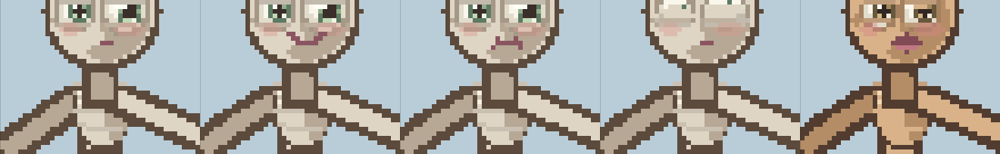

*Left to right: his face at rest, pleased, sorry, tired — and at the far right,
what four turns in the light have made of him. The needle of a mouth widens a
little every time, and by the end it is a mouth.*

**He is drawn for a cozy game, on purpose.** Everything the folklore actually
says is still there — tall as a palm, thin as a pole, a pot belly over a
starved ribcage, almost no hair, a mouth like a needle's eye — and none of it
has to be frightening. He went through a build with a sea horse's snout and
claws for hands and a black outline, and he read as a monster. So: warm oatmeal
instead of corpse grey, a soft brown line round him instead of a black one, a
round head with no pointed jaw, three soft ribs instead of four hard ones, a
proper neck, soft mitts with three short fingers instead of splayed claws, a
tuft of hair that leans instead of a crown of spikes, and a blush. The
silhouette is the same hungry ghost. The reading is somebody who has had a very
long night.

Far down the road there is one light on: a noodle cart with an old man behind
it, open since four in the afternoon, selling to nobody. **He looks you up, and
up, and up, and puts down the ladle, and tells you to sit before you frighten
the moths.** Then he walks you home past the sleeping houses and the dogs, puts
rice out on the step, and tells you to come back at first light because there
is a field to turn and he is seventy-one.

Nobody will tell you what you did. Not Lung Somchai. Not Mae Posop, who has
watched the paddies since before you were buried in sight of them. Not Phra
Phum, who keeps the ledger in his hands. **It comes back on its own, one page
at a time, as you earn the right to it** — and by the last page you will wish
it hadn't.

**Nothing in this game fights.** There are no enemies, no health bar and no way
to lose. There is a burial field, a road, a village, a derelict farm nobody has
worked in years, a stove, a weaving mat, seven miles of country, and fourteen
people — eight of them dead — who each quietly want one small thing.

**It starts with one night and one old man.** The first twenty minutes are a
walk home in the dark, a meal you cannot eat, a few hours under somebody's
floorboards, and then a plough put into your hands at sunrise. Break the
ground, carry the water, put the seed in. Nothing else in the game is explained
until you need it.

**Then it is a livelihood, and it runs a day at a time.** Wake at six with a
full bar and a clock in the corner; spend the bar on the field; put the crop in
the basket by the gate; be somewhere with a bed before two in the morning. Sleep
is the only thing that moves the world on — the basket is paid, the watered beds
come up a stage, and you wake to a card telling you what the night did. Forage,
cook, tip the basket in; rent the rest of that farm off the notice on the gate;
turn beds, flood the second นาข้าว, plant durian, buy chickens; then cook what
you grew for the people who ordered it by name. Merit is what the ledger counts
and baht is what the landlord counts, and you cannot get both out of the same
bowl of food — giving it away earns one, sending it earns the other. That
choice is the game.

And merit is also the bar. A prete cannot eat, so nothing you cook puts your
strength back; doing a kind thing for somebody does. **You cannot farm this
land without being good to the people on it**, which is the one rule the whole
thing is built to make you feel rather than read.

Your dead friends will work the farm for you. That is not a metaphor: feed a
hungry ghost once and it will come and water your beds while you are away.

**The title screen is the game, in one picture.** He is sitting on the คันนา —
the ridge of packed earth between one paddy and the next, which in a flooded
field is the only thing that is not water — at first light, legs out in front
of him and birds on him: one on his head, one standing on the palm of his
out-held hand, another two on the earth beside him. Every so often he raises
the hand to look at whatever has landed on it. Nothing in that image is a
painting: the paddy, the rice, the bund, the reflection under him, the egrets
standing out in the middle distance and the birds are all drawn from code, and
the birds choose their own next perch.


It stopped naming keys, too. It used to say **PRESS ENTER** across the middle
and **N — new night** underneath, which is two problems in one line: there is no
N on a phone, so the only way to start over was a key half the players do not
have — and a Thai screen with ENTER written across it is not a Thai screen. It
says what your thumb does now (*แตะเพื่อเริ่ม*, *tap to carry on*), and the new
night is a small plaque you can actually hit. **N** still works if you have one.

**Playtime:** an hour and a half or so · built for phones, fine on desktop · sound on if you can

## Before you play

Leave the title screen alone for five seconds and the camera goes for a walk.

Not a painted sequence — there is no such thing in this game. It is the world
itself at three in the morning with the interface taken off: the shop, the only
light left on the road; the crossroad with a dog asleep in the middle of it; the
temple; the shuttered stall with one lamp swinging; the houses with everybody in
them; and then the burial ground, pushing slowly in on one patch of turned
earth. Thirty seconds, letterboxed, and any key brings the title back.

Which means it can never go stale. Add a house and the house is in the opening.

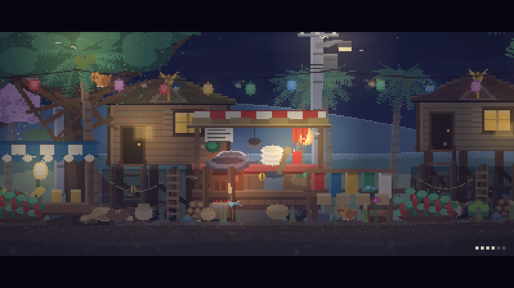

## Play

Open `index.html` in any browser. One self-contained file — no build, no assets,
no dependencies, and **not a single network request**: the art, the sound and the
lettering are all generated in the page. The road is built behind a loading
screen in about half a second.

## Controls

**Tap where you want to go.** That's the whole thing. The prete walks there and
uses whatever is standing on the spot — tap the stove and he walks over and starts
cooking, tap a plant and he picks it, tap a ghost and he says hello. A gold mark
pulses on the ground where you're headed. Drag to change your mind.

**And when you get there, everything in reach is named, with an arrow pointing
at it.** There used to be a wooden plaque over whatever you were nearest, naming
one thing. Then, for a while, there was a row of little discs over his head with
a picture in each — which was pretty and useless: a row of discs cannot tell you
that this one is the water jar and that one is Yai Pen, and by the time you had
learned twenty glyphs you had learned a second language for no reason.

So the words came back, one per thing. A small plate above each thing with its
name on it and a gold arrow out of the bottom of the plate, tip on the thing.
The one the button does is gold-edged; the rest are quiet. If two things stand
so close that their labels would land on the same thumb, the later one goes up a
row and drops a dotted thread back down to its own arrow — the layout is
resolved against the tap target, not the plate, because two plates a hair apart
still hand one thumb two answers. A small pink heart in the corner of a person's
label means you could give them something as well as talk to them.

The list exists because the game used to keep exactly one interaction at a time,
and the shipping basket, the rice barn and a ghost all stand within about thirty
pixels of each other — so two of the three were simply unusable, whichever way
you shuffled along. Now none of them are.

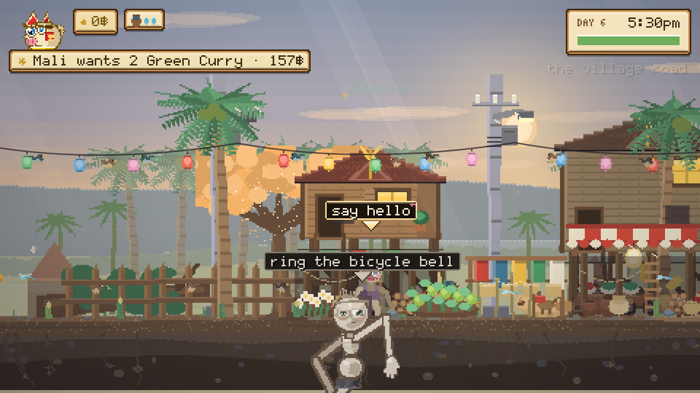

There are four buttons, bottom corners, and each one is a drawn picture rather
than a letter:

| Button | What it does |
|---|---|
| the open book, bottom left | your ledger — skills, looks, friends, and the map |
| the sound, bottom left | the prete's whistle, which is just a hello |
| the heart, bottom right | give somebody something you made |
| the chevron, bottom right | jump |

**And you can jump.** He always could; there was simply nothing to land on.
Now there is: the low wall out of the graveyard, the crates by the noodle cart,
the chopping log, fence rails, the water jars along the road, the roof of the
field hut, his own floor beams, the fallen trees and the stepping stones out in
the deep country. Every one of them is a one-way plank — you go up through it
and land on top — and holding **down** while you jump steps you back off it.

The jump has the small mercies that make one feel good: a tenth of a second of
coyote time off a ledge, a jump buffered just before you land, a short hop if
you let go early, a beat of float at the top of the arc, more steering in the
air than on the ground, and a grab for the lip of a plank you nearly cleared.
On a touch screen a **flick upward anywhere** jumps too, so the button is a
convenience rather than the only way up.

Everywhere else a tap means *go on*: it advances dialogue, chooses a recipe, and
holds still to hold a gauge. Where a screen needs two sides — the rhythm steps,
the pans of the karma scale — the left and right thirds of the display stand in
for left and right.

A keyboard still works if you have one: arrows walk, **space** jumps, **shift**
runs, **E** confirms, **G** gives, **C** whistles, **Tab** opens the ledger,
**Q** jumps to the map, **V** switches between English and Thai, **Esc** goes
back. Turn a phone sideways. Progress saves in the browser.

| | |
|---|---|
|  |  |

### The tutorial is seventeen pictures

It used to be seventeen sentences read out along the bottom of the screen. It
is seventeen little rows of pictures now — what you do, in the order you do it,
with an arrow between each — and three or four words underneath saying what the
row is for. Rice is **work · water · sleep · pick**, which is the entire lesson;
the caption just says *that is rice*.

The numbers that come up over your head went the same way. A gift used to read
`+3 merit · noodles for the unseen (the steam is enough)`. It is a gold star and
a **+3** now. Nothing in the sentence was worth the second and a half it took to
read.

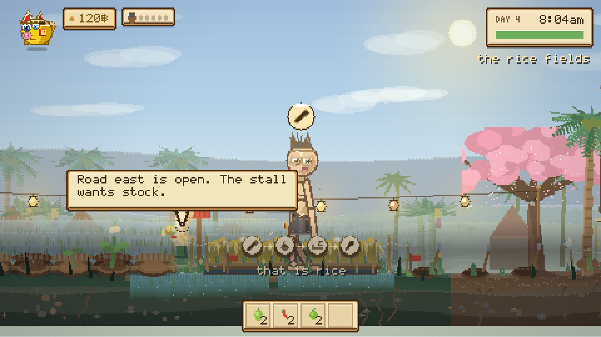

## The past comes back in pieces, and you play every one

There is no prologue explaining who you were. There are **four memories** and you
earn every one of them. They arrive without asking — you'll be walking
down the road and the world will white out — and each one is a short scene you
play rather than watch: letterboxed, a title in the corner, dust in the light,
and nobody narrating at you until after you've done the thing.

**The shelf.** Tap along the floor of a room you half know. Moving makes noise
and standing still lets it settle; fill the meter and the shape asleep on the mat
rolls over and mumbles. There is a bowl on the shelf with a coin in it. Take it.

**The gate.** Three taps. Each one empties the bottle and tips the whole horizon
further. Then you laugh past the temple gate, and the bell rings for you anyway.

**The scale.** Everything you took on one brass pan; one flower on the other. Tap
the two sides and the beam does lift — and then it sags right back, every time,
because that is the entire point. When you give up it slams, and the soil falls.

**Four bowls.** The last page, and the only one you can't do anything about. The
same room, years later, by daylight. A photograph on the altar of a young man who
still had hair. An old woman kneeling, setting out rice. Reach for the bowl —
your hand goes straight through, three times, and she never looks up. Then she
sets out a fourth.

Everything you recover is filed in the **PAST** tab of your ledger, one line per
page, and until the last one turns the ending will not start.

| | | |
|---|---|---|
|  |  |  |
|  |  |  |

## The first night

The game opens with you under the ground, and the only control that does
anything is *pull*.

**There is not one written word in this scene.** There used to be eight: six
narration cards spread through the digging and a line of instruction under
them, which is a wall of reading in the first thirty seconds of a game, before
anybody has touched anything. What is there instead is a pale hand and two gold
chevrons coming up out of the dark, which every person alive reads without
being told, and a bar that fills.

**Tap, and a hand comes up through the soil.** Seven of them and you are out,
kneeling in a burial field at three in the morning with your hands full of
somebody else's earth. *Then* the words come, four of them, and the last one is
the whole of the tutorial: **far down the road, one light is on.**

| | |
|---|---|
|  |  |

### Lung Somchai, who is not afraid of you

He has had that cart on that corner for thirty years. Drunks, monks, a
policeman who never paid, two elephants once in the same week. He looks at your
knees, then further up, and further up again — which is played rather than
printed, because a nine-foot ghost standing over a small old man is a picture
and a picture does not need a caption — and he puts the ladle down.

> **Lung Somchai:** *Ah. One of the hungry ones. My grandmother fed one on the
> back step every Wan Phra of her life.*
>
> **Lung Somchai:** *Well, I am closing. Nobody comes at three. Walk with me —
> the house is not far and there is rice in the pot.*

**Then you follow him home, and that is the whole scene.** He wheels off east
at an old man's pace and waits, with commentary, whenever you fall behind. On
the way: a dog called Daeng who barks at him too, and every other dog in the
village answering; his own field, dark and untouched for two seasons; a window
going out overhead as you pass under it; a hundred yards of sleeping houses.

**His family are not there, and nobody says so.** The house says it. There is a
washing line built for four people with one shirt on it and the pegs still up
either side. A rope swing off the floor beam with nothing on the seat. A child's
bicycle in under the stilts where it has been for years, with the tyres gone. Two
sandals by the step, side by side, much too small. Three water jars, of which he
fills one; the other two have been dry long enough to grow a web across the mouth
and moss round the foot. He sets out two plates for supper, looks at them, and
puts one back — *habit; thirty years of habit takes longer than the people do* —
and that is the only line about it in the whole game. The boy rang at New Year.
Two minutes. Very good line, though.

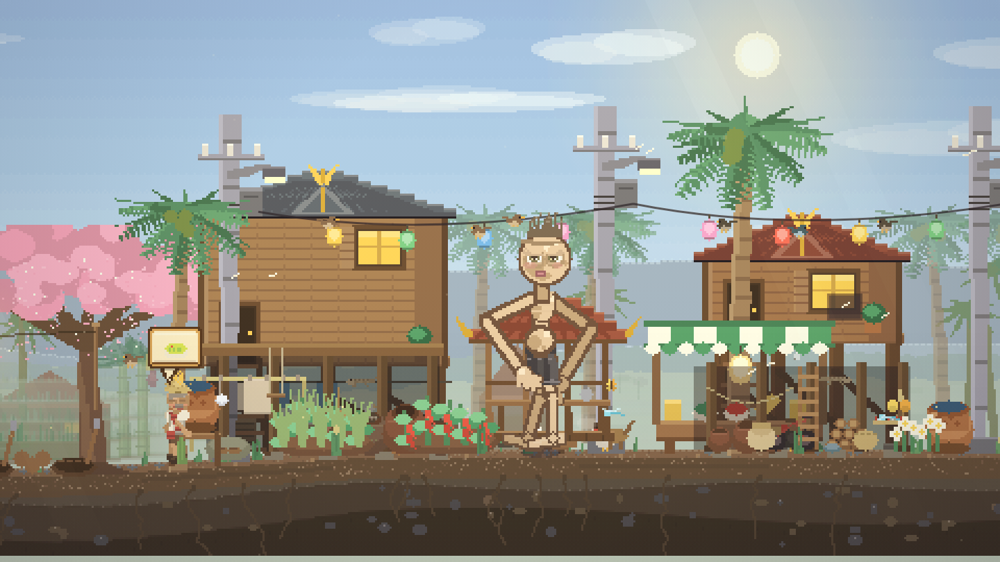

At the house he puts a banana leaf of rice down on the step and steps back —
the way you put food out for a dog you have decided to like. **You get it as
far as your mouth.** The mouth is the width of a needle's eye and the rice is
rice. What comes through is the steam.

**That is played as a scene, not as an interaction.** The bars come down deeper
than anywhere else in the game, the village goes dark around him, the camera
leans in, and nothing is said at all for three seconds while it happens.

He stoops ninety pixels of leg down to the step for it, gets both hands under
it, brings it all the way up, tips his face into the bowl, and holds it there
with his hands shaking while the mouth opens as far as a needle's eye opens.
The lines land on the frame where it does not work. Then he puts it back down.

> *It is the first kind thing anybody has done for you and you cannot even do
> it properly.*

He tells you to sleep somewhere that is not the road. There is space under his
floor, between the stilts. You crawl in, you lie down — and you go up.

| | |
|---|---|
|  |  |
|  |  |
| 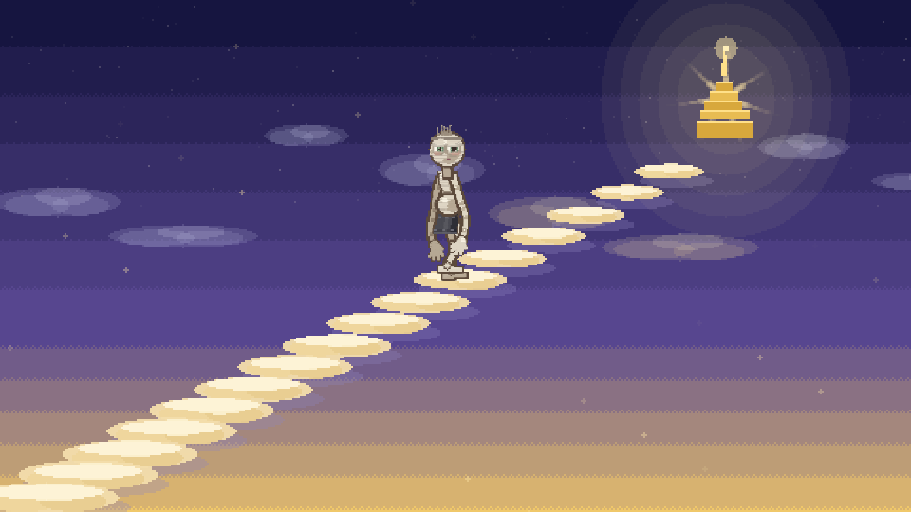 | 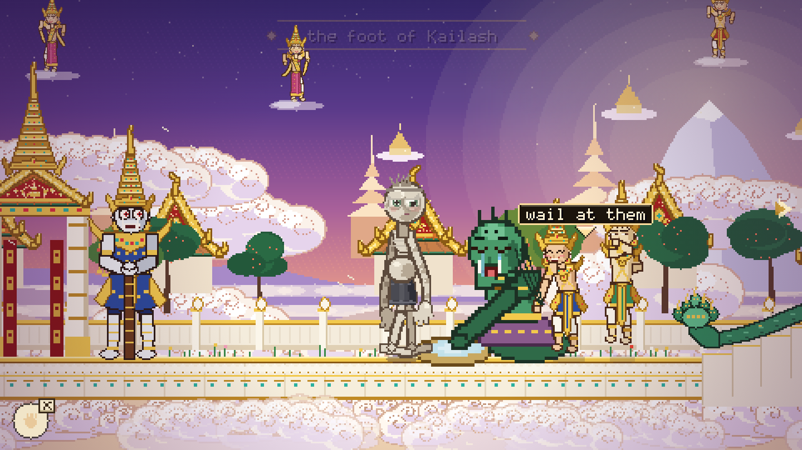 |
| 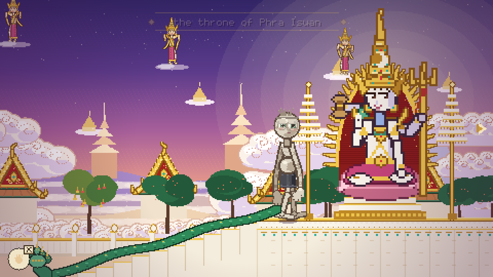 |  |

## The plough, the jars, and the seed

In the morning he is up before you, holding something, and he walks you west
past the hut to five beds that have gone to brick.

**The plough is the one mini-game in the first hour and the whole of it is one
idea: the ground pulls the blade, and you drive on the pull.** A marker swings
across a band under the furrow and the share dips with it. Land it in the green
and a slab of earth turns over with a noise like a door closing, the note goes
up a step, and the furrow gets a little longer; land it in the middle of the
green and it is a clean one, and the note goes up two. Miss and the blade skips
out of the ground, the combo dies and the swing slows down.

It gets faster every time you connect, so a bed always ends harder than it
started, and a bed turned without a single skip is worth two merit on its own.
Six bites a bed, five beds. Birds come down for the worms.

Then the ground wants water before it wants seed, and **the โอ่ง are things you
actually pick up**. Lift one, carry it — you walk slower, and you are visibly
carrying it — and either tip it over a bed or put it down wherever you want it
to live from now on. It holds three pours. Refill at the big jar by the hut.

He sows from the near end. You take the far one, a seed pressed in at a time,
and he will finish the field alone if you let him, at about a bed a minute,
saying *slowly, slowly, it all goes in the same ground.*

| | |
|---|---|
|  |  |


## What a ghost can do that a farmer cannot

Four things only a body like yours can do, and every one of them makes *his*
work quicker rather than yours easier. They come back to you in the twenties and
thirties of merit, after the morning that teaches you to carry one jar:

| Skill | What it does |
|---|---|
| **Water Yoke** · คานหาบน้ำ | a jar on each end, and no slower for it — two at a time, at walking pace |
| **Ploughman** · มือไถ | you know the pull now; the window to drive the blade is half again as wide |
| **Seed Shot** · พ่นเมล็ด | hold a seed behind that needle of a mouth and put it in a bed from clear across the field |
| **Long Draught** · อึกใหญ่ | drink the jar — all of it — then stand at the end of a row and give it back |

Seed Shot arcs a grain across the field and thumps it into the soil from ninety
pixels away. Long Draught waters every turned bed within eighty pixels at once,
in one sweep, and looks completely ridiculous. Both of them are the same joke:
the body that is a punishment turns out to be extremely good at farming.

## Mae Posop, who owns the field

**แม่โพสพ.** Thai farmers have apologised to her for centuries — for dropping a
grain, for stepping on a fallen ear, for cutting when she was still carrying.
She is not a quest-giver with a marker over her head. She is standing in your
paddy because it is her paddy too, and it has stood empty two years and she has
taken it personally.

> **Mae Posop:** *You cannot eat. Good. Then you will not be tempted to keep any
> of it.*

She teaches the whole of a rice crop, one step at a time, in the order a field
actually happens — and she comes to meet you along the bund while she is doing
it, so the one character who explains the game can never end up somewhere you
can't reach:

| | |
|---|---|
| **Seed** | there is a sack of it in your barn, by the gate |
| **Water** | the โอ่ง in the shade of the house has never once run dry |
| **Mud** | let the water in, and put the seed down into it — gently, it is somebody |
| **Waiting** | keep the water up and let it alone. Rice has never once been hurried |
| **Thanks** | it is bowing. That is it asking. Cut it, and say thank you out loud |

She used to be the first thing in the game and the reason the road east was
shut. She is not any more: the old man's morning is the opening now, and there
is no wall of mist across the one route the story takes. **She is a thing you
find**, standing in a paddy nobody has worked, once the first field is in — and
the rice crop she teaches is the whole second act of the farm.

| | | |
|---|---|---|
|  |  |  |

## The interface is one wooden box, cut from the same plank

Every panel, bubble, tag and menu is a **carved wooden frame** — a dark plank
edge, a lit inner bevel, a parchment field — and every one stays exactly inside
its own rectangle. Your merit sits on a small plaque in the top left and the day,
the clock and what's left in you on another in the top right; what you're
carrying sits on a **toolbar** along the bottom, one slot per thing, the way a
farming game does it. That is the whole permanent interface: two plaques and a
row of slots, and nothing else is on screen unless you are standing next to it.
Nobody speaks from a box at the bottom of the screen: the words come out of the
head they belong to, in a cloud with a tail, and only one voice talks at a
time.

Nothing in the interface is a font character standing in for a picture — the
ticks, hearts, stars, arrows, flowers, prayer beads and the book on the menu
button are all drawn from pixels. **So are the letters.** The game carries two
hand-drawn bitmap faces — a 5x7 for everything and a 3x5 for the small print —
and every glyph lands on whole pixels at whole-number scales, which is why the
text is sharp instead of smeared.


## A day

The unit of this game is a day, and it is the Stardew Valley shape on purpose:
**the clock, the bar, the basket, the bed.**

**Six in the morning to two the next night.** The clock in the top right is the
real one — the sky reads off it rather than the other way round, so half past
six is orange because it is half past six. It runs at about three game-minutes
to the second, which makes a full day something like six or seven real minutes
of work.

**A bar, not a stamina meter.** Every job on the farm costs something out of it:
turning a bed, watering, picking, flooding a paddy, chopping, catching. Empty it
and nothing dramatic happens — the game simply stops letting you work, and if
you stand there empty for six seconds the prete lies down where he is and the
night takes him. You lose the rest of the day, which is Stardew's rule, and no
more than that.

The one thing that fills it back up is **merit** — which is the only mechanic
here that had to be reinvented rather than borrowed, because Stardew refills the
bar with food and a prete cannot eat. Doing a kind thing for somebody puts the
strength back in your arms. That is the whole theology of the game in one
number: the only way to keep working the land is to keep being decent to the
people on it.

**The basket by the gate.** You are never paid at the counter for a crop. You
put it in the basket outside your gate, somebody comes for it in the night, and
the coins are there in the morning.

**Sleep is the only thing that moves the day on.** Lie down under the farmhouse
and the night passes in one fade: the basket is emptied and paid, every watered
bed moves a stage, the flooded paddies count another night, the trees grow, the
animals leave you something, the ghosts you hired do a night's work — and you
wake to **a card that tells you exactly what the night did**, which is the only
screen in the game that stops the world.

| | | |
|---|---|---|
|  |  |  |

**Hearts, and one present a day.** Everybody in the village and every ghost has
ten hearts. Turning up and talking to somebody counts once a day; a present
counts for a lot more, and the thing they have actually been hoping for counts
for most of all — but only one present each, per person, per day. A friendship
made in one afternoon with a full basket is not a friendship. The FRIENDS page
of the ledger is the row of hearts.

An order is not a present, though, and never counts against the day's one: when
somebody has asked you for two bowls of something by name, you can hand over
both.

## The night somebody explains it

Everything in this game runs on merit, and for a long time nobody ever told you
that. The pig in the corner and the number behind it were simply **there from
the first frame** — a system handed to you before you had any reason to want it,
which is the oldest sin in this kind of game.

So the first night you sleep, you do not just sleep. You go up.

**And the first night you sleep is the first night of the game** — the one
where Lung Somchai points under his own floor and you crawl in between the
stilts. That used to be its own little screen: the underside of the boards
three feet above your face, your own knees in the bottom of frame, and five
lines of prose about a gecko saying its own name. It was nice, and it was the
one and only time this game asked anybody to read five paragraphs, and it sat
exactly where the most important thing in the story should have been. The god
was arriving a whole chapter later, on the first *ordinary* sleep, which meant
you met him after somebody had already handed you a farm. Wrong way round.
The prose screen is gone; he crawls under the boards, shuts his eyes, and goes
up, and comes back down into the morning under the same house.

There is a gold ปราสาท above the cloud with two ยักษ์ at its gate, and sitting in
front of it is **พระอิศวร** — the Thai Shiva, blue through the skin, four arms, a
ตรีศูล in the upper right hand, a ชฎา with the crescent bitten into it, and the
third eye that opens while he talks. You kneel on the cloud in front of him and
he tells you what you are, what บุญ is, what to do about it, and then a piggy
bank comes down a beam of light and he gives it to you to keep it in.

> *You were not made hungry to punish you. You were made hungry so you would go
> and look for something.*

> *What you are looking for is บุญ. It is not a coin and it is not a score. It is
> what is left over when somebody is glad you were there.*

**Until that has happened there is no pig and no merit anywhere on the screen.**
Not in the corner, not on the morning card, not floating up off the thing you
just did. The first time a stranger's day goes better because you were in it,
you get a piggy bank from a god, and only then does the game start counting.

He is the biggest thing on that screen on purpose, and the prasat is behind him
rather than around him, because gold on gold is not a silhouette: there is a
soft night painted behind his head so the crown reads.

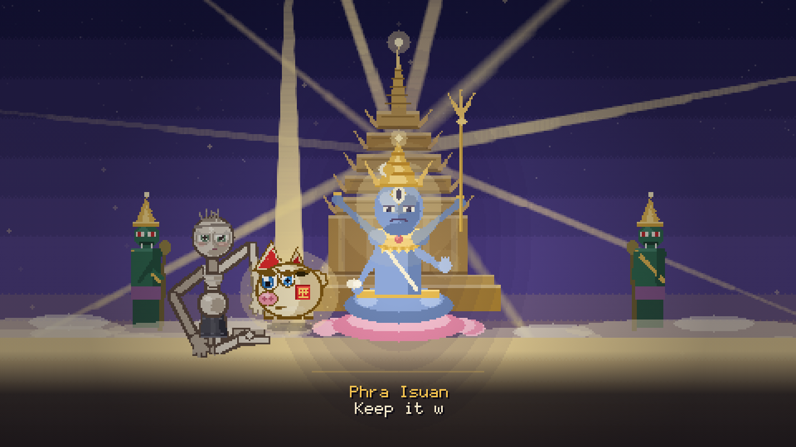

## Merit is a light, not a number

It used to print **+2 merit** over whatever you had just done. Seven different
places in the code did it, in three different phrasings, and none of them told
you anything the pig in the corner was not already showing.

Now nothing says a number. What comes off the thing you just did is a **mote of
light** — a bright core, a halo that pulses, a six-step tail of itself and four
spokes of glare so it survives being drawn over a bright sky — and it arcs
across the screen into the slot on the pig's back. When it goes in the pig
kicks, throws a few sparks, and **oinks**.

The oink is fired by the mote landing rather than by a timer set when you did
the good turn, which is a small thing and the difference between a sound effect
and a reaction.

## The piggy bank, and four times it breaks

It is a **กระปุกออมสิน** — the fat ceramic pig every Thai child has on a shelf —
lying across the corner of the screen and filling with gold from the snout end.
Merit goes in through the slot on its back. In the last quarter a thin gold arc
comes up over it and coins start dropping into the slot on their own, because it
knows.

**And then it breaks.** The village dims, the pig comes up out of the corner of
the screen and stands over you three times its size with the cracks spreading
across the ceramic, and it goes — in a bang of white that fills the screen, and
thirty coins going up and out. When the light lets go, what is standing there is
a little less of a hungry ghost than what walked in:

- the dead grey warms towards skin
- the ribs sink under it
- the starved belly comes down
- the two saucer eyes stop being saucers
- seven hairs become sixteen, and go dark
- and the mouth — the eye of a needle, the whole joke of him — opens a fraction

Four times, over a whole game, at fifteen, thirty-eight, seventy and a hundred
and four merit. You cannot buy it. It is the only thing in the game merit is not
spent on, because it is what merit **means**. And it is the same puppet
throughout — there is no second sprite, only this one with the ghost turned
down.

The village does not stop for it, either. The day runs, the crops drink, the
ducks carry on being ducks. He is the only thing that cannot move, which is
rather the point of it.

| | |
|---|---|
| 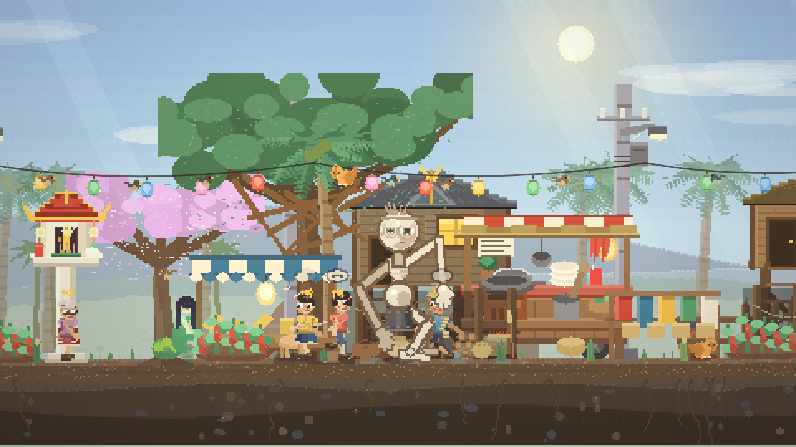 | 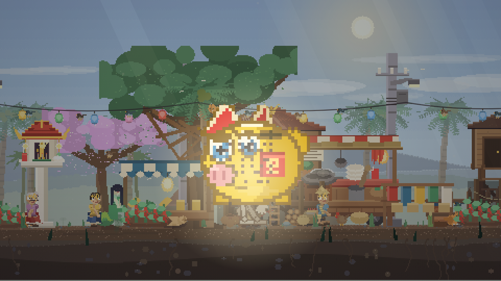 |
| 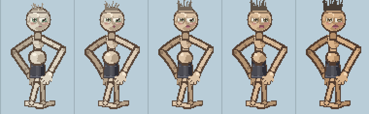 | 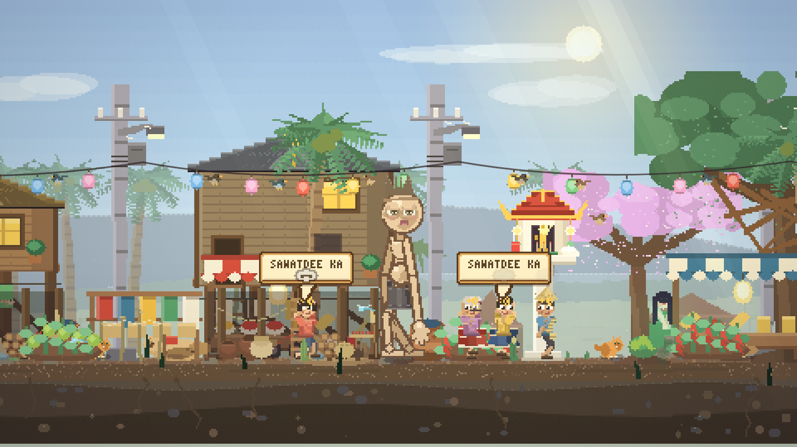 |

## Building things for people who will never know

Thai merit-making is not mostly about praying. It is about putting things where
other people will need them. There are five plots along the road and the farm,
staked out in bamboo and string by somebody who never came back to them:

| | what it is | what it takes |
|---|---|---|
| **ศาลพระภูมิ** | a spirit house, at the edge of your field | timber, clay, and flowers for the roof |
| **คอกควาย** | a shed, so something large has somewhere out of the rain | posts, bamboo, and thatch |
| **ศาลาริมทาง** | a roadside shelter with a bench you could lie down on | a frame, and a tiled roof |
| **โอ่งน้ำ** | a jar of drinking water and a tin cup, for anyone walking | a stand, and a jar to go on it |
| **บ่อน้ำ** | a well, because the nearest water is four hundred paces | a stone ring, a frame, a bucket |

Each goes up in two goes — raise the frame, then put the roof on — and each is
worth more merit than anything else in the game, because it is worth more. And
each one keeps being worth something afterwards: you can pay respects at the
spirit house, sit a while under the sala, draw a bucket up from the well, or
top the jar up for whoever comes past next. Once a day, each.

Nobody ever thanks you for any of it. Nobody knows who put them there.

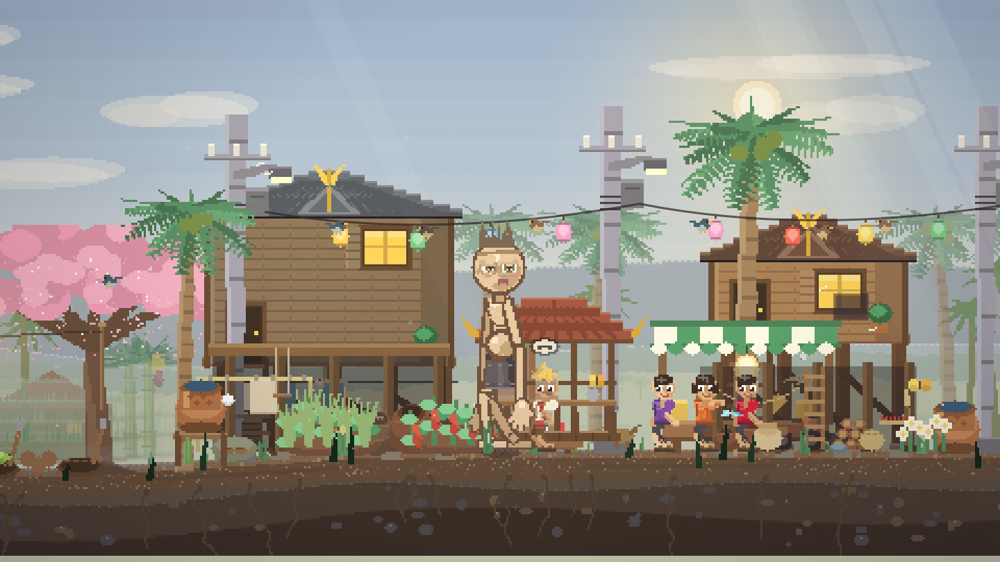

## The buffalo

**ควาย.** The biggest thing in a Thai village and the least hurried. It used to
be a twenty-six pixel prop standing in the pen with the chickens, which is not
what a buffalo is.

It walks the farm now, head down, chewing, with an egret riding on its back
taking the ticks off — and neither of them thinks anything of it. When the sun
gets high it goes and lies in a flooded paddy with only its back and its horns
above the water, which is the single most characteristic thing a buffalo does.
At dusk it walks itself home to the shed, if you built it one. It drops what it
drops, and that is fertiliser. Scratch it once a day and it leans into your hand.

The horns are the whole animal: one long flattened crescent each side, out of
the top of the skull and swept back and up until they nearly meet over the neck.
Get those wrong and you have drawn a cow.

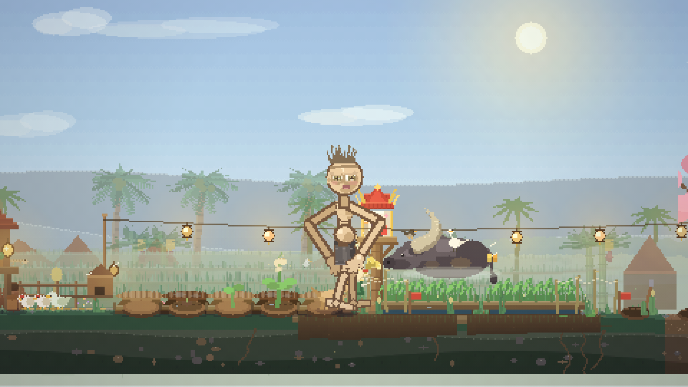

## The farm

Out west in the rice fields there is a shack with a hole in the roof, an empty
pen, and a notice still nailed to the gate. **One hundred and twenty baht and it
is yours** — the first bed, a handful of seed, and every other thing on the
place for sale on the board by the gate: another bed, a rice field, a hole for a
tree, a sapling, a chicken, a roof that keeps the rain out.

| | | |
|---|---|---|
|  |  |  |

**A barn, and a water jar.** Seed comes out of a **ยุ้งข้าว** — a rice granary
up on four posts, with a ladder and a hatch — and the tools you have earned hang
on the wall of it, so a tool you have earned shows up somewhere in the world
rather than only in a list.
Water comes out of the **โอ่ง**, and it is a trip rather than a click: the jar
never runs dry, but you can only carry two waterings at a time until you go and
earn a proper can.

**Five dry beds.** One crop to a bed — green papaya, chilli, holy basil,
galangal, morning glory. **Sow, water, sleep, pick.** A watered bed moves on one
stage in the night and a dry one does not move at all, so watering before dark
is the whole job. There is no signboard on a stake telling you what is in it:
walk up to a bed and what is growing there fades in over the soil, and fades
out again behind you.

**Two นาข้าว.** A rice field is a different animal: a bunded box you flood, sow,
and then keep flooded, because rice in a dry paddy simply stops and waits. It
takes two flooded nights to a stage instead of one, and pays four rice, two bran
and two seed — and while it is standing there full of water it holds the moon in
it.

**Three fruit trees.** Buy a sapling and put it in a hole and then *wait* —
durian, mangosteen, rambutan take eight nights to come up and then bear every
second night for the rest of the game. A durian is worth thirty-six baht on its
own, which is most of a bed's whole crop.

**Something got into it.** From the sixth night on, things start arriving in the
beds overnight — a **grasshopper**, a **cutworm**, or a **golden apple snail**,
each drawn on the soil of the bed it is in, so you find it by looking at your
field in the morning rather than by reading a message about it. A bed with
something in it does not grow that night, and if it is still there the night
after, the crop goes *backwards* a stage. The odds get worse the more of the
field is already infested, which is the whole argument for dealing with it
today.

The answer is the **ถังพ่นยา** — a tank on your back and a lance, twenty-six
merit, the one tool in the game that does not make you faster at anything. It
holds six charges, it refills at the water jar, and the meter for it sits up in
the corner next to the basket. Walk up to a bed with something in it, spray, and
the mist goes over the row.

Two things soften it. It never happens in the first working week, so nothing eats
your crop before you can afford the answer to it; and the night one arrives it
only sits there — growth for that night is worked out first — so you always get a
morning to find it and a day to do something before it costs you anything. **And
a cat that lives with you halves it**, because a cat sleeps in the crop and the
things that eat crops do not care for that.

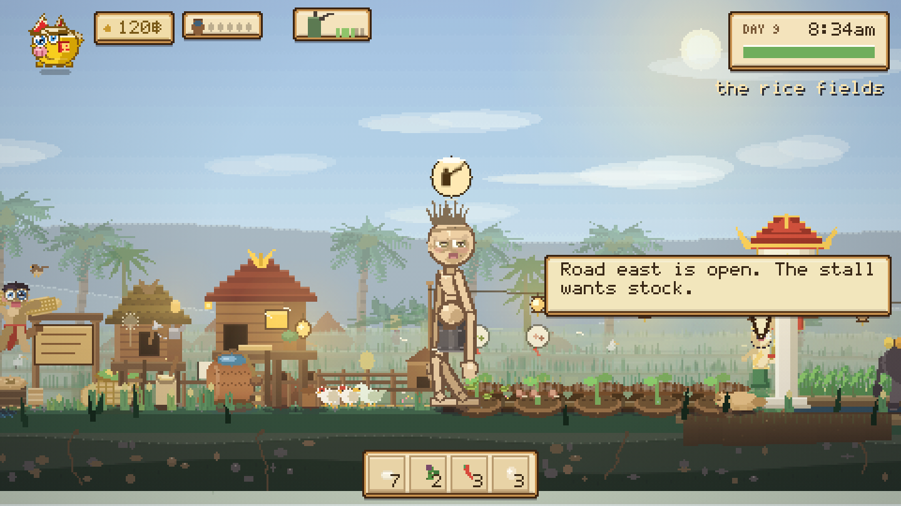

**A pen.** Chickens, ducks and one very large water buffalo. Keep rice bran in
the trough and they leave you eggs, duck eggs, buffalo milk and manure every
little while. Stop feeding them and they simply stop — nothing on this farm can
die, they just look at you about it.

| | | |
|---|---|---|
|  |  |  |
|  |  |  |

Every one of those is a *gesture*, not a menu tick: he folds ninety pixels of
leg into a crouch, reaches both long arms down to the soil, and the thing
happens at the moment his hands actually get there.

## What is on the road, and only on the road

For one version there were eighteen vehicles running the whole length of the
map, which put a two-stroke through the banana grove and past the spirit house
every few seconds. **There is no road there.** The metalled road starts at the
crossroad and runs east past the shop; west of it is a dirt lane with a water
buffalo on it, and nothing with an engine belongs on it. Six vehicles, one
stretch, and the village gets its quiet back.

They are drawn the way the houses are now — a part at a time, with a lit edge
and a shadowed side on each one — instead of a slab with two black circles:

- a **wheel** is a rim, a tyre, a hub and four spokes that turn with the
  distance travelled
- a **bike** has a fork, a swingarm, an exhaust, both mudguards, a mirror on a
  stalk, a number plate, a tail lamp and an indicator
- a **rider** has a helmet with a strap and a visor, a hand on the bar, a foot
  on the peg, and a lean
- and after dark the **headlamp throws a pool on the tarmac** rather than a
  wedge of card out of the air

The six of them are: the ordinary step-through; **four on a bike** with the
smallest standing on the footwell holding the mirror; a **รถพ่วง** with a whole
kitchen bolted to its side — glass case, gas bottle, awning, bell; a
**delivery** with three gas bottles and a rack of eggs stacked far higher than
is reasonable; a pickup with sacks roped in the tray; and a **สองแถว** with four
people riding home on the benches.

### The dogs asleep in it

A soi dog asleep used to be a loaf with an ear on it: one oval, one smaller oval,
a triangle, two rectangles for paws, and a sine wave for breathing.

Now it is **flat out on its side in the dust**. All four legs push away from the
body — out past the barrel at both ends, with a hock and an elbow in them, since
a leg that stops inside the body is a leg nobody can see — and the front pair
stretches on past the nose, which is how a dog that has given up on the day
actually lies. The muzzle is down on the ground with a slack lip. The tail lies
along the dirt and hooks back under. The ear is flopped over the side of its face
and flicks every few seconds; a paw goes every few seconds after that; the eye is
a shut *curve* rather than a dash, because a dash is a dead dog. Every so often a
**z** comes off it.

It breathes on **two clocks at once** — a slow one under a much slower one —
because a single sine wave reads as a machine rather than an animal. Gohan, who
is not a soi dog, got the same treatment through his coat, plus a crease cut into
the ruff behind his head: white on white is nothing, and his head had been
invisible for a month.

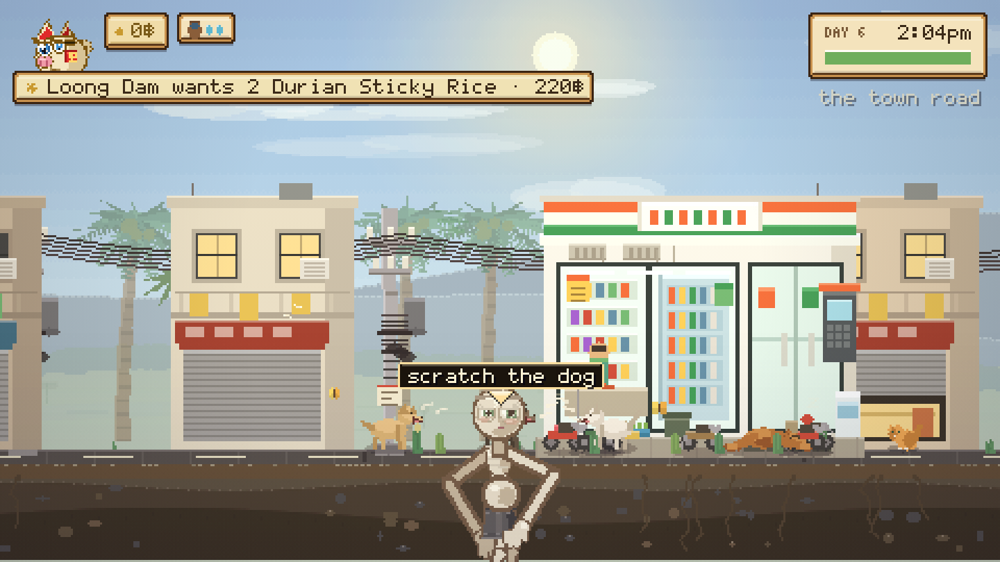

**And they drive.** Speed is a throttle, not a switch: they come off it for the
dog asleep in the road, they indicate and roll to a halt at the shop, they sit
there for a few seconds and pull out again. Following is judged on the *gap*
rather than on the leader's speed — matching a percentage of the car in front
means a stopped leader multiplies backwards through the queue until the whole
road is welded to the tarmac, which is exactly what happened the first time.
How many are out at all depends on the hour: the school run and the evening
market put all six on it, and three in the morning is one dog and the moon.

## A village with a day in it

Everybody used to do the same thing at three in the morning as at three in the
afternoon: drift ninety pixels either side of where they were standing, for
ever, with their arms down.

The hour decides now. There is a yard to sweep at seven, rice to winnow at nine,
shade under the tamarind to sit in at one, a pot on at five, and a door to be
behind at ten. Each of those is a pose with something in the hands — a broom, a
flat winnowing tray with the grain jumping in it, a ladle in a pot, a folded palm
fan going in the heat.

**The monk walks the road at first light** with his bowl, and everybody he
passes goes down on one knee without being told to. If you are standing there
with rice, you can put it in — rice you cannot eat, into a bowl you will never
hold. It is worth more merit than almost anything.

**Two people who end up next to each other stop and say something,** and then go
on. The lamp on the corner is mended. Somebody did that. Nobody says who.

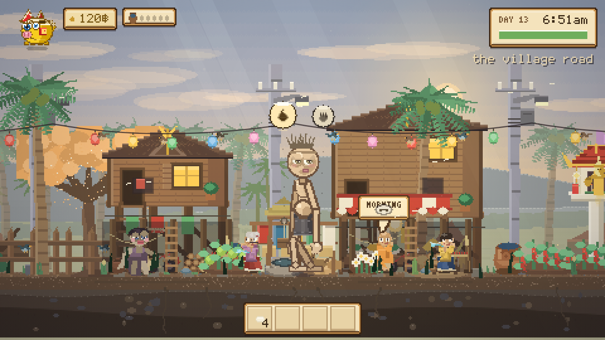

**And they look at you.** This is where the piggy bank shows: at the start they
take a step back with their hands up and a **!** over their heads, because you
are nine feet of dead thing. One burst of light later they only stare. Two, and
you get a wave. Three, and somebody wais you in the road — which is the first
time anybody has greeted you since the ground, and the game stops for a second
to let you have it.

**The ghosts stopped staring too.** They used to face you from anywhere on the
screen, which is the posture of a thing waiting to be clicked. They look where
they like now, drift a few pixels on their own clock, and turn when you are
close enough to be worth turning for.

## Ghosts make good farmhands

Feed a hungry ghost the thing it has been waiting a century for and it becomes
your friend. Ask a friend for help and it stops haunting its patch of road,
comes to the farm, and takes a job:

| Who | What they do |
|---|---|
| **Kong Koi** hops the row with a bucket | waters any bed that has gone dry |
| **Krahang** flies in on his baskets | picks whatever is ripe and puts it in your basket |
| **Phi Pop** minds the trough | keeps bran in front of the animals |
| **Krasue** floats the dikes at night | keeps the water up in the นาข้าว, and cuts the rice |
| **Tai Hong** stands under the trees | brings the fruit down |

They keep at it whether or not you are on screen, they wear a small badge
saying what they are doing, and you can send any of them back to the road from
the board at the gate. One job to one ghost.


## Things that fly at dusk

Six of them, each drawn and each moving its own way, because that is the whole
pleasure of it: you learn that a dragonfly hangs perfectly still and then darts,
that a firefly cannot be hurried, that a grasshopper only goes when you get
close, and that a rhinoceros beetle does not care about you at all.

| | |
|---|---|
| **หิ่งห้อย** firefly | drifts over the water after dark and blinks · 14฿ |
| **แมงปอ** dragonfly | hangs still, then darts. Paddies only · 18฿ |
| **จักจั่น** cicada | clings to a trunk and shouts about it · 22฿ |
| **ด้วงกว่าง** rhinoceros beetle | walks a branch at night, horn first · 34฿ |
| **ตั๊กแตน** grasshopper | one enormous hop at a time · 11฿ |
| **ผีเสื้อ** butterfly | never in a straight line · 16฿ |

You need the net from your ledger, and then it is a swing rather than a click:
you get three, the hoop has a real radius, and the bug is living its own life
the whole time. Miss and it bolts. A beetle is worth more than a day of papaya,
which is exactly why children in this village spend the whole of dusk in the
long grass. Catch all six and the ledger notices.


## Half past four, and the lane fills with children

Between four and half past six every lane in rural Thailand fills with children
who have just got out of school and have not yet been called in for dinner.
They play two things, and now so do these.

**เตะบอล.** Four of them, a ball, and **two sandals for a goal** — which is what
a goal is. Whoever is nearest chases it and belts it at somebody else, which is
the whole of village football; everybody else drifts toward where it is going,
badly. They are wearing **market-copy shirts**: two English clubs, the national
side, and three nobody can identify any more, each with somebody's number on the
back. Stand in the middle of it and the ball comes to you, because a nine-foot
ghost standing in the road is the only invitation a Thai child needs. Kick it
back and that is worth something.

**เบย์เบลด.** Too hot for the pitch between ten and half past three, so they are
in the shade with a **plastic washing-up bowl** and two spinning tops, which has
been the playground currency here for twenty years and comes back round every
time the cartoon is rerun. Three — two — one, and they let go together; the tops
circle, clash, and one of them goes over the rim. You can stand and watch, and
watching is worth something too.

| | |
|---|---|
| 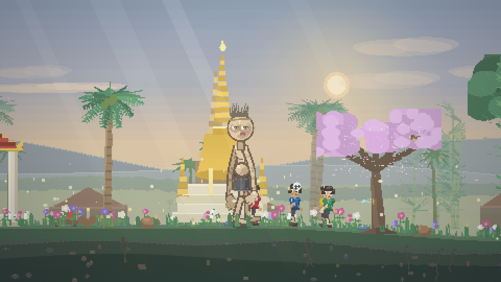 | 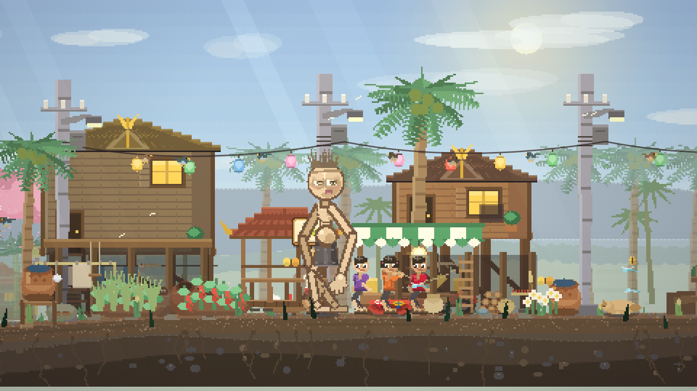 |

## What a day is actually made of

The timetable above is half a life. Nobody sweeps a yard for three hours
because it is between five and eight; they sweep it until it is swept, and
then they are hungry, and they go and eat, and on the way they meet somebody
and stop.

So the timetable is the backbone and **five needs are the interrupts**. Hunger,
tiredness, company, merit and chores each fill at their own rate, each has
somewhere that empties it — the stall, the shade, the shrine, their own yard —
and when one gets loud enough it takes the person off their mark and sends them
there until it is quiet again. Rates differ by person: Yai Pen is at the shrine
twice as often as anyone, Mali would rather be talking than eating, and Lung
Somchai barely leaves his cart because he never has.

Each need is scored against **its own** bar rather than against the others.
Hunger fills three times faster than the wish to sit at the shrine, so comparing
the raw numbers meant hunger always won and nobody ever went to the shrine at
all — the slow needs were starved by the fast ones.

The result is that nobody stands anywhere for three hours, the same person is
somewhere different on two different mornings, and the village has traffic
through it that nobody wrote. It is also where the conversations come from: two
people whose stomachs are the same size end up at the stall together, and that
is not scheduled either.

## Eight in the morning, and six at night

The loudspeaker on the pole plays the national anthem twice a day and the entire
country stops where it is standing and faces it, for one minute, every single
day. It is the most ordinary thing in Thailand and the strangest thing to watch
if you have never seen it.

Nobody explains it to you. The village simply stops — the villagers, the kids,
the ball — and you work out that you are the only thing still moving. Stand
still for it and that is worth something, once a day.

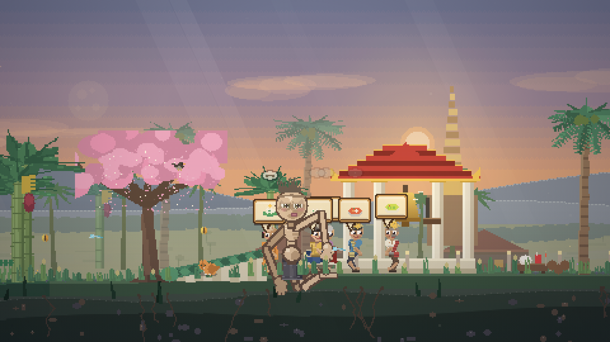

## And everything else that lives here

A village at night is not empty and a village in the morning is extremely not
empty. None of this does anything for you. That is the point of it.

**Birds** sit on the wires between the streetlamps, on the fence rails and up in
the trees, hopping about and turning round. They will not stay while a nine-foot
ghost goes past: get within forty pixels and they go up in a clatter, wheel
about for a few seconds, and come back to *near enough* the twig they left,
which is the whole charm of a bird. Whistle and you clear a hundred and fifty
pixels of them at once. Turn a bed over and they come down for the worms.

**Dogs** — three of them out on the road, and they have opinions about you at two
in the morning. One barks, the others answer, and the rest of the road stays
asleep through it. Hold out a hand and it will smell it for a long moment, the
way a dog does when it is making a decision about you; then it leans on your
shin, which is as high as it can reach, and after that it is your dog and you can
scratch its ear.

**And fourteen more, with names.** Seven cats and seven dogs live the length of
the map — under the stall, on the temple wall, asleep in the shade of the shop,
in the long grass behind the farm. Every one of them can be sat with **once a
day**: he folds all the way down, they lean into it, a heart comes up, and that
is a point of merit for a kindness that nothing in the village was going to
notice. Three of those and the animal has decided about you.

Then you can **ask one along**. It walks a little behind you the whole way down
the road, sits when you stop, and catches up when you get too far ahead — and it
is not only decoration. **A dog makes people less nervous of you**, so the eye
over a villager's head fills at about half speed while it is with you; **a cat
halves what gets into the crop** overnight. One at a time, and you can leave it
wherever you like and ask another.

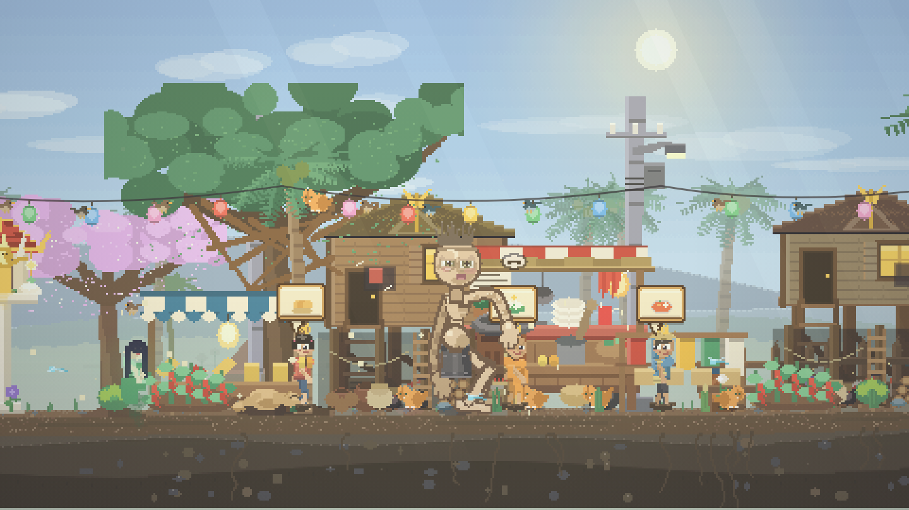

**And they have a day of their own.** A village animal is not a wander with a
radius on it. A cat is flat out in the shade from nine until four and then owns
the place until dawn; a dog is asleep on the warm concrete at noon, up and
shouting at three in the morning, and only really busy at dusk when the cooking
starts. The hour picks the behaviour and the behaviour picks how far it will go
and how fast.

**And they have opinions about each other.** Two that meet do something about
it: two dogs sniff and then either play a lap of the road or lie down together;
two cats groom a friend or freeze at a stranger, neither of them blinking; and a
dog meeting a cat is the oldest scene in the village. None of it is written down
anywhere — it is a picture over their heads and a change in what they are doing,
which is how you read an animal in life too.

**Gohan.** Fifteen now, because one of them is not a soi dog. The others are
short-haired, lean and the colour of the road; he has a thick white coat that
moves a beat behind him, a ruff round his neck and a plumed tail carried up over
his back. He is somebody's dog who stopped having a somebody, and he still sits
when a person walks past, out of a habit nobody rewards any more. Loong Dam will
tell you where the collar came off.

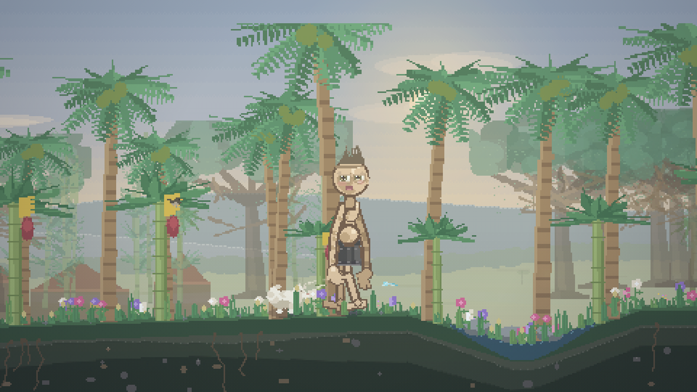

**Chickens** peck and scratch under the houses and scatter when you get close,
and roost when it is dark. **Frogs** sit at the pond and out in the flooded
paddy and hop away from you in exactly the wrong direction. **Geckos** live on
the walls and are mostly a noise — ตุ๊กแกกกก, seven times, at the worst possible
moment. **Squirrels** work the banana grove. **Butterflies and dragonflies** are
out all day; **fireflies** replace them at dusk.

**And the grass parts.** Every tuft within a couple of hundred pixels is a
little spring with a rest position set by the wind. Walk through and they lie
down and come back up behind you; so do the chickens, and so does the old man.
Push through enough of it and something comes out — a butterfly, a dragonfly, a
grasshopper, a bird, or at night a firefly that was sitting in there the whole
time.

## Seven thousand pixels of country

Nine named zones, west to east: the burial ground, the roadside where his cart
is parked, the rice fields and the derelict farm, the village road, the spirit
house, the banana grove, the temple, the old forest, and — new, and worth the
walk — **the deep country**, where the road runs out into palms and bananas, a
stream with three stones across it, and fallen trees thick enough to stand on.
Nothing lives out there but birds and the noise of them.

The same road at two in the morning and at nine is not the same road. At night
it is lamps and lit windows and a hard dark between them; by morning the far
ridge has gone half to haze, the windows are open with washing hung in them, and
you can see how much of the village is actually chickens.

| | |
|---|---|
|  |  |
|  |  |

## Planks, and a roof that keeps the rain out

There is a fallen trunk and a chopping stump on the track outside the gate. With
an **axe** you can hold to wind up — the axe rises, an arc fills, it gets heavy —
and let go to strike. Line up on the wedge and a plank splits off; miss and it
bounces and you feel it. Four to a session.

The shack then goes up in **three stages, paid in planks rather than only baht**:

| | | |
|---|---|---|
| **mend the roof** | there is sky where there should be thatch | 6 planks · 30฿ |
| **board the walls** | and a shutter that closes | 9 planks · 55฿ |
| **lay a proper floor** | somebody could live here again | 12 planks · 80฿ |

And the building changes at every stage — a hole through the ridge, then a mat
tacked over the gap and planks stacked ready, then a lit window and a lamp by
the door, then a ladder worth climbing, a mat at the top of it, and something
green in a pot. A prete has no use for a house. You build one anyway.

| | |
|---|---|
|  |  |

## Money, and orders

**P'Nok sells; she does not buy.** She used to take anything off you over the
counter, which made the basket by your gate pointless — so now her stall is
where seed and bran come from, and the crop goes in the basket. She says so if
you try. A dish is still always worth more than the sum of its parts, which is
the entire argument for owning a stove.

**And the village orders supper by name.** Up to three standing orders at a
time — *P'Nok wants 2 Tom Yum · 122฿* — printed across the top of the screen,
listed in full on the board by the stall, and repeated out loud if you go and
ask the person yourself. Cook it, carry it to them, and they pay in coins *and*
merit. It is the only thing in the game that pays both.

| | |
|---|---|
|  |  |

## What else you do

**Pick things.** Rice and coriander in the paddies, chillies and lemongrass in
the gardens, jasmine in the flower patches, bananas and mango and banana leaf in
the grove, bamboo in the old forest, river clay by the pond. Everything regrows.

**Cook things.** Lung Somchai leaves his clay stove burning all night and is too
old to be precious about it. Five real dishes — papaya salad, mango sticky rice,
tom yum, fried banana, coconut cakes — each cooked through two hands-on steps:
pound in the mortar on the beat, keep the steam in the green band, flip when it's
golden, plate it nicely.

**And then it is plated properly.** Nothing you make is an inventory icon. Each
dish is served the way it would actually arrive: papaya salad heaped on a banana
leaf with a lime wedge and dried shrimp, sticky rice moulded beside sliced mango
and drizzled with coconut cream, tom yum steaming in its bowl with lemongrass
laid across the rim.

| | | |
|---|---|---|
|  |  |  |

**Make things.** A mat outside the stall, and five things to weave: a jasmine
garland, a folded banana-leaf float, a winnowing basket, a paper lantern, and a
small roadside shrine — each one shown finished and turned in the light before it
goes in your basket.

**Help.** Four jobs nobody else can reach, each a hands-on minigame where you
steer your enormous hand directly: splice the dead streetlight while the current
kicks, lift a fallen tree off the road and keep it level, hang Phra Phum's fallen
garland, and lift the cat down from the tamarind — slowly, because she isn't
afraid of big, she's afraid of *sudden*.

| | |
|---|---|
|  |  |

**Give it away.** Merit is the ledger; coins are the landlord. Every made thing
in your basket is a choice between the two.


## Little scenes

The first time something happens to you the game takes three seconds to notice
it. Two black bars slide in, the rest of the road steps back into shadow, a pool
of warm light stays on whoever it is about, and one line types itself along the
bottom — the first seed you push into the ground, the first thing you grow, the
first person who asks you for something, the first dead neighbour who is kind to
you back.

They play **over the world where it stands**, on the real characters, with the
camera leaning onto them. Nothing pauses to a menu, nothing loads, nothing is
locked behind one, and a tap gets you out. Each one plays exactly once, ever.


## Ascend, and be blessed

Merit is both your progress bar and your currency, and spending it never costs
you progress. But you don't just *tap* a skill and own it.

Choose one and the world drops away: the sky goes to dawn, god-rays open, and you
rise through streaming clouds — hold to climb, lean to drift. At the top there is
a terrace of cloud with a gold rail, and a **deva** waiting on it, one of three
depending on which branch you're climbing:

| Branch | The god who meets you | What they grant |
|---|---|---|
| **body** | **Mae Thorani**, the earth goddess wringing water from her hair | strength, stride, a lighter body |
| **hands** | **Witsanukam**, patron of every craftsman | steady hands, deft weaving, a divine tongue |
| **heart** | **Phra In**, Indra of the thirty-three | an inner eye, a cool heart, loving-kindness |

They say something to you, and then you hold to receive it — a beam comes down,
the gauge fills with gold, and the skill is *given* rather than bought. Then you
descend, and the ledger is waiting where you left it.

| | | |
|---|---|---|
|  |  |  |

## The Ledger and the map

Four wooden tabs over a drifting sky: **looks**, **friends**, the **past** — your
recovered memories, one flat page each, blank and question-marked until they come
back, with a red dot on the tab when there's one you haven't read — and the whole
ten-thousand-pixel road drawn as a **map**.

It used to be one straight line across a sheet of paper with every label dealt
out onto four rows above it, which is a diagram of a road rather than a map of a
country — and ten thousand six hundred pixels will not fit on one line at a
readable scale anyway. So it is **two strips now**, west to east and then east
again, folded the way a strip map folds a long road onto a short page, with an
arrow off the end of the first strip and back in at the start of the second.

Each strip is drawn country rather than a coloured band: hatched paddy, roof
triangles over the village, blobs of tree through the grove and the forest, a
gold chedi at the temple, grey blocks along the town, and the road wandering
down the middle of it — inked where you have walked and dotted where you have
not. Every landmark is a **small picture on a post**: a chedi, a wok, a spirit
house, a cat, a crossroad, a shop. Each one's name sits on its own scrap of
paper, and when two names want the same inch of road the second one slides along
until it is clear, with a hairline back to the post it belongs to. Nothing on
that map lands on anything else, and there is a test that proves it.

Underneath: the ghosts you have met as small dots on the road, a red pin bobbing
where you are standing, a compass rose, a scale bar that says **half an hour's
walk**, how many friends you have made, and how much of the road you have
actually covered.

Every card is a tap target: tap it to read it, tap it again to choose it.

### There used to be a fifth tab, and it was a skill tree

It ran five columns wide with twenty things in it, each with a price, and it was
the one screen in this game that asked you to do sums: is Inner Eye worth five
merit, and is that better than a sarong. It is gone.

**Merit goes into the piggy bank now and nowhere else.** Everything you used to
buy in that tree arrives on its own as the total climbs — tools first, because
the farm needs them to open up at all and nothing here should ever be a wall:

| at | what comes back |
|---|---|
| 2 · 5 · 12 · 24 | Sickle, Watering Can, Bug Net, Axe |
| 8 · 16 | Merit Magnet, Inner Eye — the thought-cloud over everybody's head with the thing they are quietly hoping for |
| 20 · 32 · 51 · 78 | Water Yoke, Ploughman, Seed Shot, Long Draught — the field skills, held back until after the morning that teaches you to carry one jar at a time |
| 28 · 41 · 63 · 86 | Giant Stride, Palm-Leaf Reach, Carrying Pole, Light Body |
| 36 · 46 · 70 · 94 | Steady Hands, Divine Tongue, Deft Weaving, Two Hands |
| 57 · 102 | Cool Heart, Loving-Kindness |

Each arrives as a mark in the air over your head and goes straight into your
hands — a tool appears hanging on the barn wall the moment it is yours.

**Four of them are still worth the whole ceremony.** The one that ends each
branch — Light Body, Two Hands, Loving-Kindness, Long Draught — still takes you
up through the cloud deck to a deva who has been waiting, and you hold the button
while the blessing fills. Rare, late, and never in the middle of something. Every
other one is a second and a half and back to work.

The wardrobe stayed: five hand-woven sarongs, a garland, a sabai sash, 108 prayer
beads and gold leaf — all simulated cloth, not swapped sprites.

| | | |
|---|---|---|
|  |  |  |

## A stick, and four buttons worth pressing

The bottom-left corner is a **joystick**: a carved well with a gold knob in it,
and a thumb on that is what this game wanted. Push it and he walks; push it all
the way and he runs; shove it up and he jumps; pull it down and he steps off the
plank he is standing on. Tapping the ground to walk somewhere still works — the
stick just wins when both are asked at once.

The buttons moved over to the right hand so one thumb can reach all four without
stretching, and they are discs now rather than little square plaques: a rim, a
bevel, a light on the top-left, a shadow underneath, and a real press that sinks
the whole thing a pixel and takes the highlight off. Jump is the big gold one.
The pictograms were redrawn to be readable at arm's length — an arrow coming off
the ground, a heart, a mouth with the sound going out of it, a book.

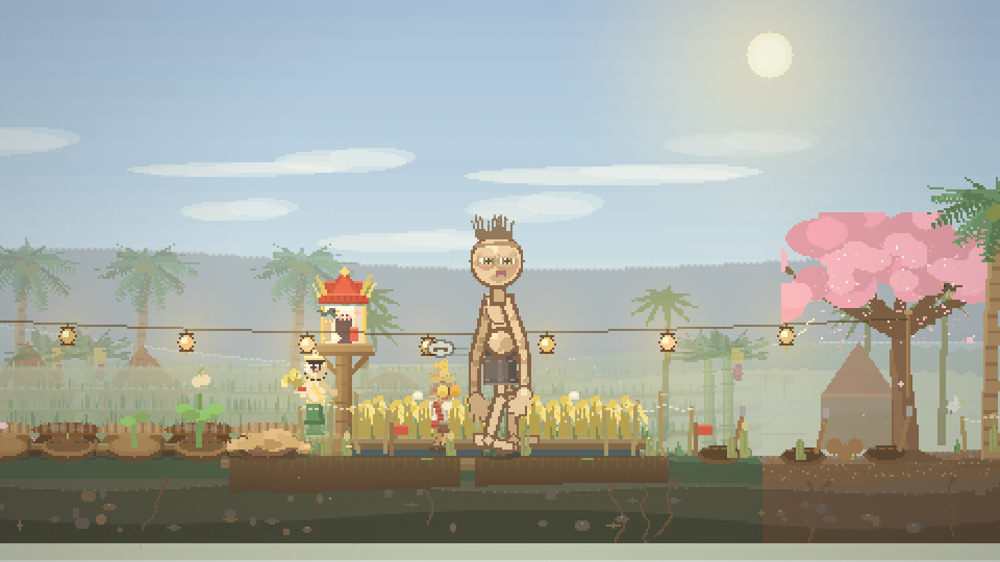

## Nothing cuts any more

The game used to cut. You pressed the ledger and the ledger was simply there; you
walked into a task and the field was gone between one frame and the next. A cut
is free and it reads as a bug.

Everything that changes what is on the screen goes through one call now, which
covers, does the thing at the darkest point, and uncovers — and the covers are
drawn out of the same parts as the rest of the game:

- **rows** — nine bands the depth of a paddy row, sliding in from alternate sides
  with a lit edge on the leading side. The title screen gives way in these.
- **page** — the ledger is a book, so it turns a ruled page down over the screen.
  So does the stall, and the giving screen.
- **iris** — a circle closing on wherever you happen to be standing, with a warm
  rim on the hole. Mini-games close in like this.
- **night** — a dark blue with stars coming through it, so the black is a sky
  rather than a blank.
- **gold** — a flood of light with rays turning in it, for when something is
  being given to you.

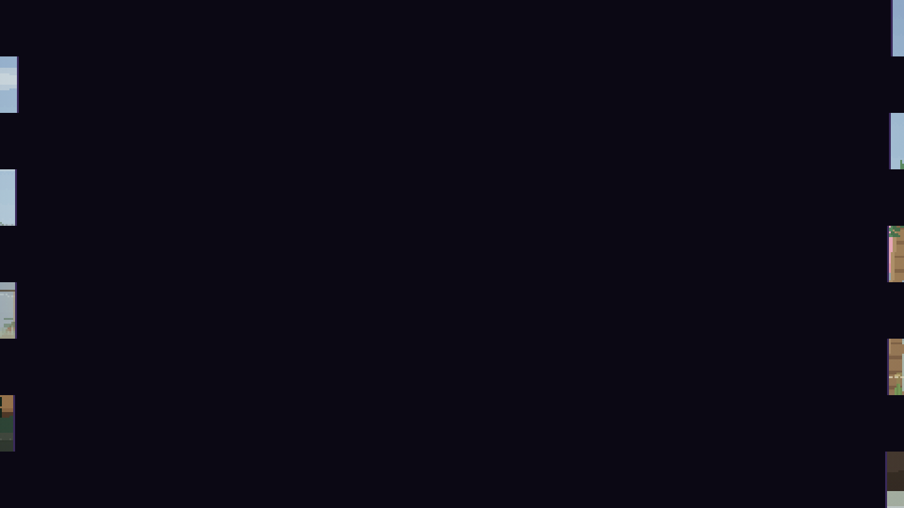

## Ten thousand pixels of road, and you have to walk it to know it

The world used to stop at seven thousand two hundred pixels of country lane.
Past the old forest there is now:

**The crossroad.** A real one — a side road running away from you in
perspective with its own centre line and its gravel shoulders, the convex
traffic mirror on a post that every Thai junction has, a corner spirit house
with a red drink and three sticks of incense on it, a bus shelter nobody is
waiting in, and a dog asleep across the middle of it.

**The town road.** Two rows of concrete shophouses — roller shutters half up
with a light on behind them, balconies with washing out, air-con boxes, a water
tank and an aerial on every flat roof — and a **convenience store** that never
shuts: a striped awning, a wall of fridges, a counter with somebody behind it,
and the light out of the glass front lying on the road at night. It sells green
papaya, bird chillies, limes, eggs, rice, coconut milk in a carton, and one cold
sweet drink you cannot drink and somebody else can.

**Traffic.** Motorbikes with a rider and sometimes a sack on the back, pickups
with sacks in the tray, and a songthaew with three people riding home on the
benches under its orange roof. They come both ways and they sound the horn for
the dogs, which is the correct behaviour and the only reason the dogs are still
alive. Stray dogs sleep in the road, get up when you come near, and lie back
down when you have gone; scratching one is worth a merit the first time.

**And the poles.** Square-section concrete, two crossarms, porcelain
insulators, a transformer drum, a flyer stapled on at eye height, and the
bundle of nine cables sagging between them that is the real national
architecture. They march the whole way and out into the far paddies.

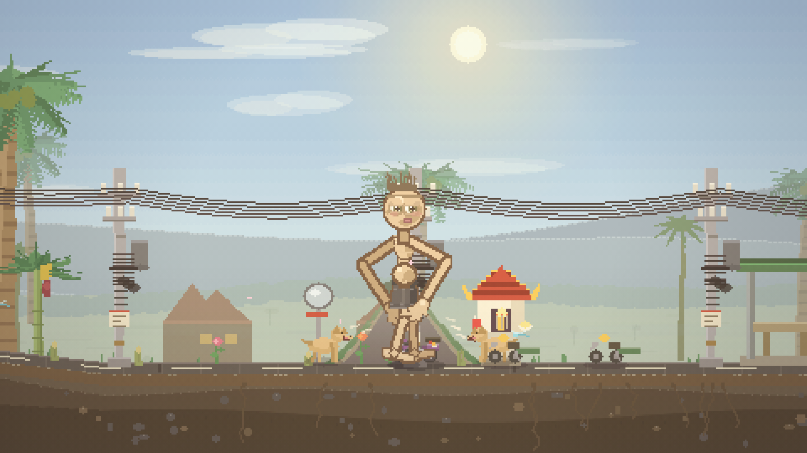

| | |
|---|---|
| 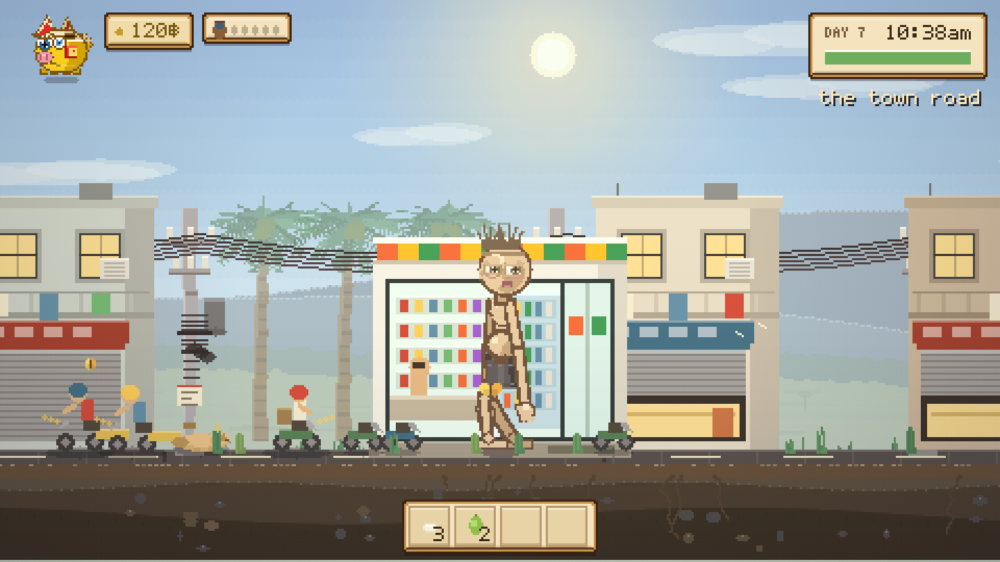 | 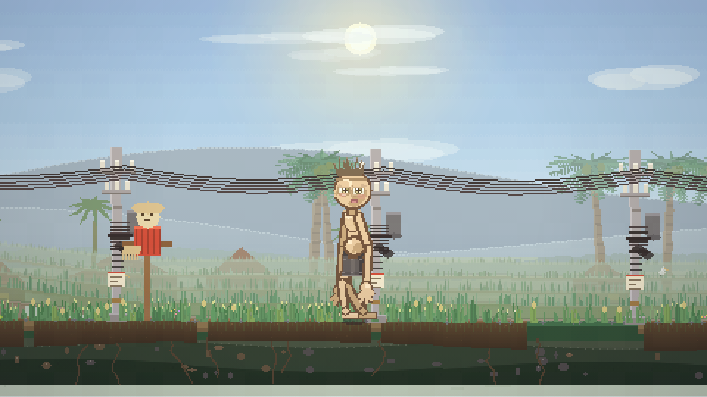 |

### The map starts blank

It used to open with the whole seven miles on it, every zone named and every pin
already placed, which is a map somebody else drew for you. The paper is blank
now. Zones appear when you have walked them, pins when you have been past them,
the road is inked behind you and dotted ahead, your ghost friends are not
on it until you have met them where they stand, and the corner tells you what
percentage of the road you have actually seen.

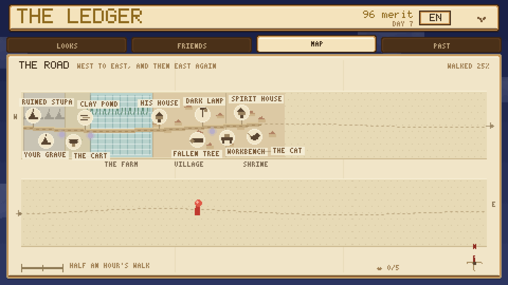

## The rice fields, which is what this game is a picture of

There used to be a seven-pixel strip of blue at the foot of the farm with grass
either side of it, which is a puddle.

There are now **four terraces of standing rice stepping away from you** behind
the farm — one field running into the next rather than three thin sheets with
the country showing between them, the crop at its own height and its own green
on every step, long slow waves going across it in the wind, and four egrets out
in it.

**And there is no water lying at your feet any more.** A flooded paddy is a
thing that happens for about three weeks of the year; the rest of the time a
rice field is earth, and a field you are about to plant is bare turned earth
with the harrow lines still in it. That is what is under you now: dark wet soil
combed into rows, drying paler along the tops of the ridges, with the crop
standing behind it. The blue is gone from the near field entirely.

It used to be much worse than that. Water ran under the village houses and
across the road, which is not a paddy, it is a flood; and the hills in the far
distance filled straight down to the bottom of the frame in ridge blue, so from
anywhere without trees in front of it the middle distance read as a lake lying
across the whole country. Behind the village there is land now — a hazy green
plain with hedgerows and clumps of palm lying across it.

## Pounding som tam

Papaya salad is not a timing bar. It is a rhythm, and the rhythm is: **strike,
turn, strike, turn**. The pestle comes down on the beat and you hit it; between
strikes you turn the papaya over with the spoon — the outer thirds of a phone
screen, or the arrow keys. Every fourth beat something else goes in the ครก and
you can see it arrive: chillies, then tomato, then the long beans. Land one
cleanly and the juice comes over the rim.

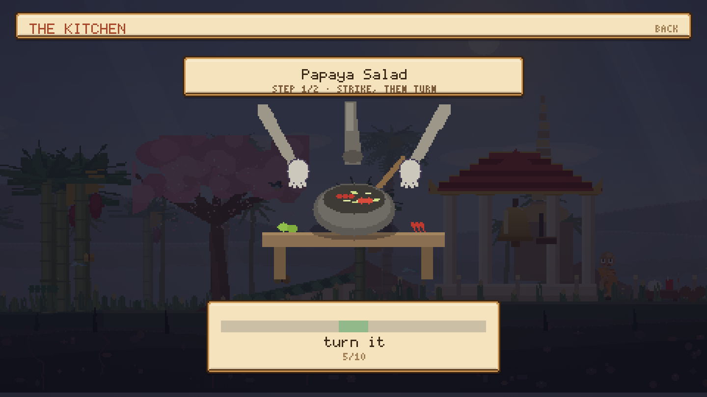

## Six favours, and a card that remembers them

The village had orders — cook this, bring it here, get paid — and that is a job,
not a favour. A favour is somebody telling you a small problem and you deciding
whether it is yours.

| Who asks | What they want | Why |
|---|---|---|
| **Luang Pi** | three flowers | it is a merit day and the shrine is bare |
| **Yai Pen** | som tam | her arm is not what it was, and she will not say so |
| **P'Nok** | four bamboo | the awning has leaned since the rain |
| **Mali** | two krathong | the second one is for her mother, who is not here |
| **Lung Somchai** | two tom yum | somebody ordered two and he is one person |
| **Loong Dam** | Gohan's collar | it came off in the long grass past the crossroad |

They arrive one at a time as the days go on, so nobody hands you six at once.
**You are never given one** — you are offered one, and you can say no, and saying
no is not held against you: they ask again tomorrow, because that is what
neighbours do. Each pays merit rather than baht, and a heart.

A picture over their head says which it is — a call sign to be asked, a grey one
while it is running, a green star when you are carrying what they wanted. And
what you said yes to sits down the left under the purse: the picture of the
thing, its name, and a row of dots that fill as you collect. No numbers, no
percentages, no log to open.

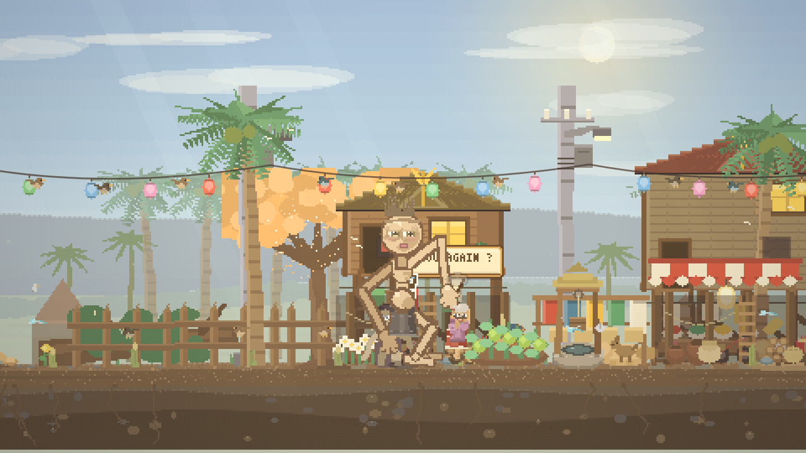

## And the wok

Neither is stir-frying. A กระทะ over a gas ring is a **rock**, not a beat: the
pan swings left, swings right, and the moment you want is the far end of the
swing — at a quarter and at three quarters of it, where the food is at the top of
its arc and the toss is free. Hit it and the whole panful goes up and comes back
down. Miss and it just slides.

**And it gets quicker.** Every hit speeds the rock up by about a sixth, so the
five tosses that make a plate of **ผัดกะเพรา** start comfortable and end as fast
as you are. The window is drawn as two lit bands on the meter rather than one, so
you can see that there are two chances a swing before you learn it the hard way.
Green curry uses it too, after the boil.

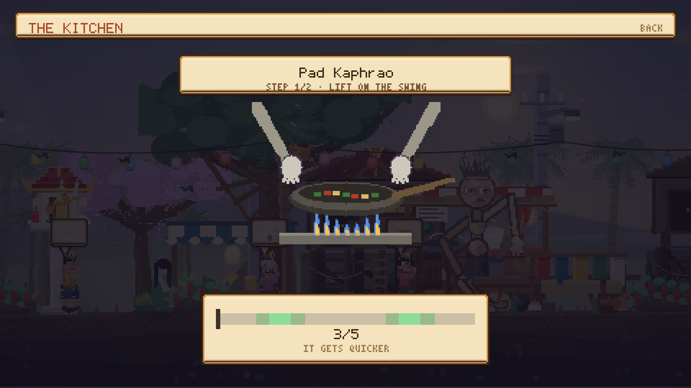

## And the charcoal

**หมูปิ้ง.** Charcoal is not a dial. It goes out if you leave it and it flares if
you fan it, so this one is not a beat at all — it is a **heat you have to hold**.
Fan to bring it up, stop to let it fall (faster the hotter it already is, which
is charcoal), and keep it inside the band while six skewers cook. Too cold and
nothing happens; too hot and it flares and you can see the ends go black.

And every so often a skewer starts to catch and wants turning, and you turn it
with a flick left or right, and if you do not, it burns. The coals are the meter
as well as the picture: they brighten when you fan and go grey when you stop,
which means you can play the whole thing looking at the food.

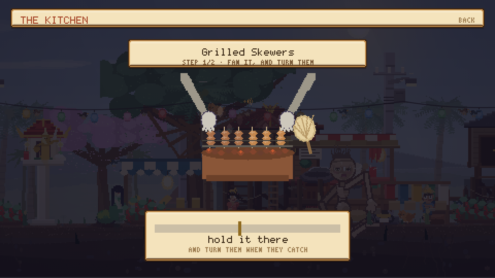

## Keeping out of sight

Nine feet of grey ghost walking up a village road at two in the morning is a
thing people have a reaction to, and the reaction is always the same. You can go
round that now.

**Hold down** — or pull the stick down — and he folds almost in half and moves
at a crawl. Standing upright inside somebody's view while they are facing you
fills a small eye over their head; when it fills, they see you, and whatever
they were doing is over. Crouched it fills at a tenth of the rate, and in a
**hiding place** it barely fills at all. Walk a stretch past somebody without
frightening them and it counts for something.

There used to be six of those, hand-placed: the ditch west of the farm gate, the
long grass by the first house, under the tamarind, the banana grove, the bus
shelter, behind the bins on the town road. **Every palm on the map is one now** —
fifteen of them, standing the length of the road, each with a strip of cover on
its far side. Six places to hide is a stealth level with six answers in it;
twenty-one is a road you can actually get down, and the thing you do is drift
from trunk to trunk while somebody comes the other way. A word fades in over his
head when he is properly out of sight, so you know without guessing.

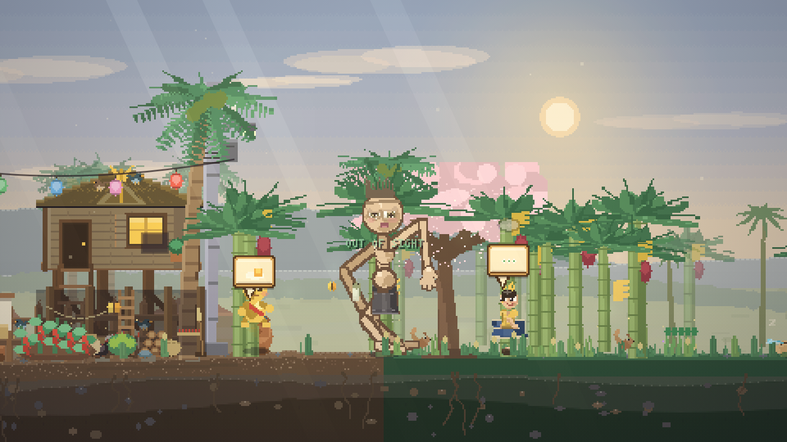

### Most of the village is not a guard

Everybody used to fill that eye at the same rate, which turned the road into a
stealth level and the six people on it into patrols. They are not patrols.

**Four of them are never going to mind.** Luang Pi has sat up all night with
worse than you and has said so. Mali is seven, and to a seven-year-old you are
simply a tall person who will play. Lung Somchai carried your dinner out to the
step the first night you were above ground. And **anybody you have actually made
friends with** stopped wondering what you were some while ago — two hearts is
enough. Walk straight past any of them, upright, at midnight, and nothing
happens at all. The first time you come near one each day a small **shut eye**
shows over them and then leaves you alone, so you learn who is safe without
being told.

Yai Pen is eighty-one and those glasses are for reading: she notices you at
thirty-six pixels and not a pixel further.

That leaves two people in the whole village who will actually be startled, which
is the right number.

Twice the road makes a scene of it. **Headlights at the crossroad after dark**:
a pickup comes up the road, its beams sweep along it, and you hold one button
through a window to stay still. **The dogs at the edge of town**: one tap, in
time, to get past them slowly. Both can be lost, and losing is not a game over —
it is brakes, a long look, and the road again faster than before.

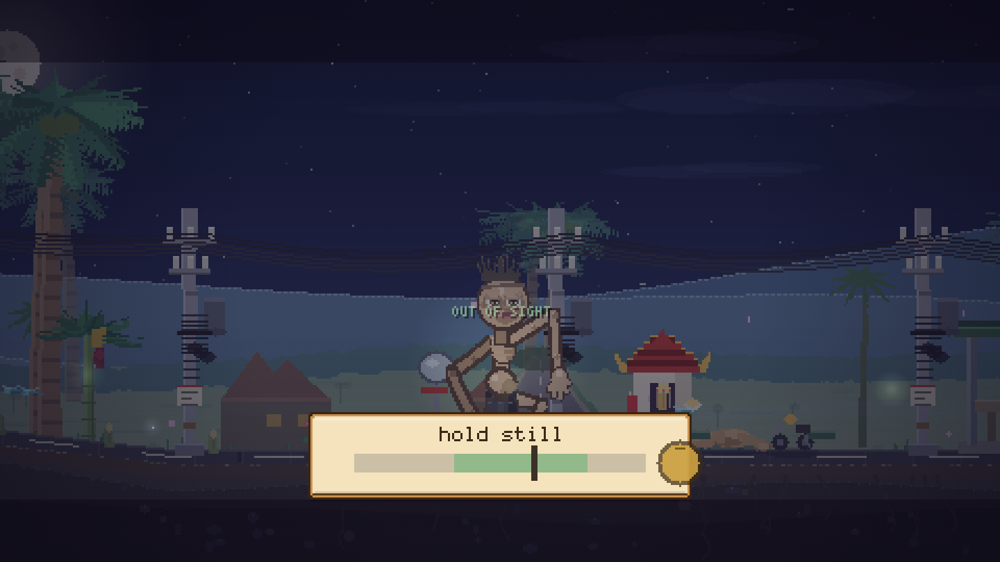

## Sleeping, which you do every day

It was a black rectangle with a line of type, held two seconds — the thing the
player saw more often than anything else in the game. Then it was a painted
landscape of paddies and hills, which was prettier and still wrong: it was not
this village, and you had just spent an evening in this village.

So now the night goes over **the place you actually lay down in**. Nothing else
moves — the game stops stepping the world while he sleeps — and the only thing
that changes is the light. The clock winds forward from the hour he lay down,
through the small hours, to half six in the morning, and the village's own sky
does the rest: its own moon comes down, its own stars come out and go in, its
own sun comes up behind the houses he was standing among.

The overlay on top of that is only what the sky has no way of saying: the small
hours pressed down over everything, what the night was, and the new day's number
arriving with the sun. Drawing a moon of my own on top only gave the village two
of them.

**And he lies down.** Sleeping used to be a cut — you pressed the thing under
the house and the screen was already going dark, so the one moment in the day
when this enormous starved thing stops being upright happened entirely off
camera. Now he folds up: the knees go first, the hip comes down, the whole long
body tips over onto its side and the head lands last. He curls. He breathes on
two clocks, a slow one under a much slower one, because one sine wave reads as a
machine. Two z's come off him. In the morning he does the same thing backwards
and stands up into the daylight.

It is one continuous pose rather than two sprites cross-faded: `k` runs nought
to one and every joint on him is a lerp along it, so there is no frame where he
is in two places. At `k=0` the hip and chest are the standing prete's own
numbers, so the hand-off from `drawPrete` is a step of a pixel or two rather
than a jump.

**His eyes close to a slot, not to black.** There used to be a fade to solid
black at the start and another back out at the end, which meant the night I had
spent all that time on was the night nobody could see. Two lids come across
instead — the top one doing nearly all of the work, the way a real one does, and
the bottom one stopping well short of the ground, because the thing you are
meant to be looking at is him lying on it.

A tap skips it, but never past the point where the day turns over, and never
past him getting up.

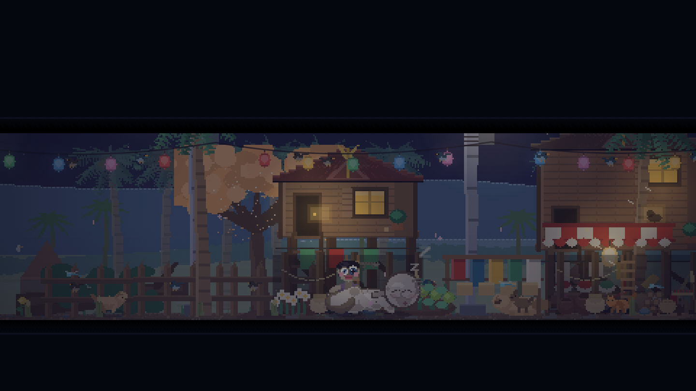

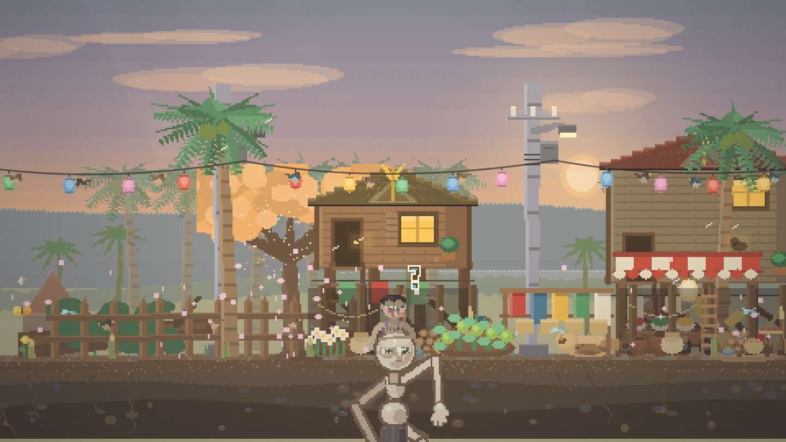

### Half six, not six

The village used to wake at six on the dot. At six sharp this sky is still very
nearly dark — the sun does not clear the horizon until about a quarter to seven
— so the night scene was ending before the sunrise it had spent five seconds
building toward. It wakes just after half six now.

## One person, drawn one way

There used to be nine or ten different people in this game, in the sense that
there were nine or ten different pieces of code that each had their own idea of
what a person was. The villagers had a face, a two-bone leg and a sandal. The
girl on the till in the shop was a stack of striped rectangles. The monks on the
alms round were a robe and two dots. The crowd at the หมอลำ stage, the kids at
the Songkran barrel, the ones kneeling with a tray — each of them was somebody's
ellipses, and each of them was a different height, with the eyes in a different
place.

Now there is one figure. `drawVillager` is the whole of it, and `drawPerson`
lets a scene ask for one without having to build a villager: a place, a shirt,
a haircut, and a pose.

```js
drawPerson(g, { x, y, face, skin, shirt, hair:'bun', pose:'kneel' });
```

The poses are hand targets the same IK solves: `reach` over a counter, `hold` a
bowl at the waist, `pour`, `point`, `dance` for รำวง with both hands over the
head, and `kneel` and `sit`, which fold the legs under and bring the whole
figure down. Everything else — the ชฎา on a dancer, ประแป้ง on a Songkran
cheek, a flowered shirt, a monk's robe, an apron, a งอบ — is a flag on the same
figure.

A scene that is drawn closer than the world is passes a `scale`. That does not
scale the canvas, which would turn every rounded rectangle soft: the figure is
drawn once at 1× into a scratch canvas and blitted up with smoothing off, so a
person in the shop is the same person as a person on the road, only nearer.

### He is too big for the village, and it shows

He is about **two and three-quarter times a grown man** — which is what the
folklore says, and what makes a doorway a problem for him. Under a house on its
stilts, under the market awning, under the eaves of the food cart or the sala,
he goes down. Not because anything stops him: because that is what being too
big for somewhere looks like.

`stoopAt(x)` returns how far down he has to go where he is standing, eased over
eighteen pixels at each edge so he ducks on the way in rather than snapping at
the threshold — 0.02 → 0.18 → 0.40 as he walks under one.

That reuses the crouch, which needed fixing first. `sit` was passed to the
figure as a continuous amount from nought to one and read as a **boolean** —
and `SNEAK.k` decays exponentially toward zero without ever arriving, so one
crouch left a value like `1e-8` behind and he spent the rest of the session
walking around fully seated. That is the bug where he gets stuck sitting. It is
an amount now, blended through the legs and the arms, and the sneak value
snaps to a real zero when it gets close.

### The dogs can see him

Nobody in the village can. The dogs can, and they do not like it: they get up on
their front legs, put their head back, and shout until he goes away — ears
forward, mouth opening on the beat, tail up, three short bars of noise thrown
out of the muzzle and gone. There is a synthesised bark to go with it: a short
sawtooth buzz that falls in pitch with a slap of filtered noise on the front,
twice, sometimes three times, pitched differently per dog.

A cat does not bark. It looks at the place where you are, which is worse.

Sneaking properly stops both.

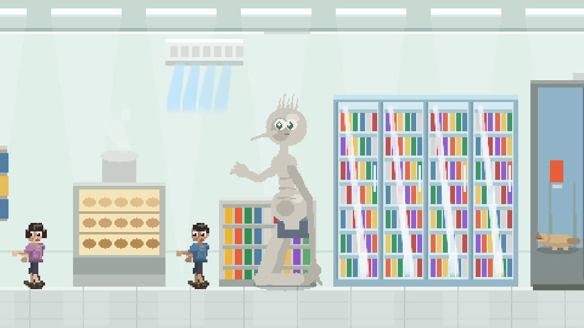

### There are no scarecrows in a Thai rice field

There were three in this one, which was simply wrong. What stands at the edge of
a field here is **ศาลเพียงตา** — a one-post shrine about eye height with a
little house on it, a red tiled roof with gold finials, white walls, gold corner
posts, and whatever the family had to give that morning: a red drink, a saucer
of rice, three sticks of incense burnt down, a garland. There is a fence of
sticks round the foot of it.

The test greps the built file: no `artScarecrow`, no หุ่นไล่กา, and the thing at
the edge of the field is a shrine.

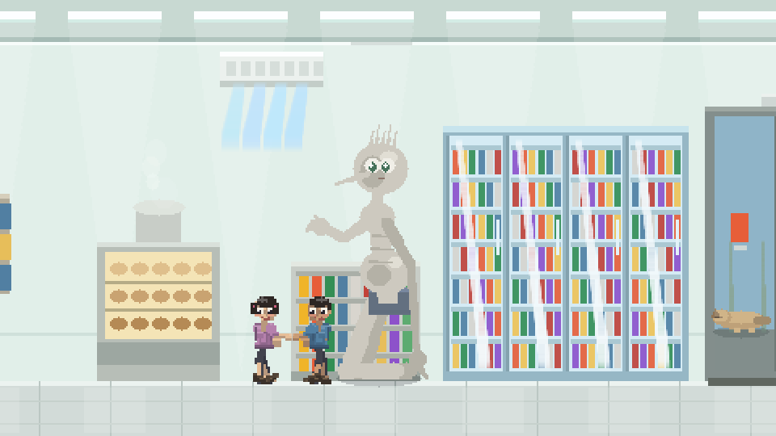

### Nobody walks backwards any more

A cosine can only hold a foot still for one instant, so a cosine walk always
skates. The prete was given a proper one a while back — the cycle split into
STANCE, where the planted foot tracks straight back at exactly walking speed and
therefore does not move over the ground at all, and SWING — but the villagers
were still on the cosine, and worse, they multiplied the foot's offset by `face`
on top of a **signed** phase. Walking right that cancelled out. Walking left it
inverted the cycle: the foot that should have been planted was in the air, and
the one in the air was dragging along the ground. They moonwalked.

The measurement, before: walking left, the planted foot slid **0.72 pixels a
frame** — 1.7× the body's own speed, in the wrong direction. Walking right it
was 0.147. Now it is 0.000, both ways, at every speed.

The other half of it is that a stride and a phase rate are one fact, not two:
the phase has to advance exactly one half-cycle per stride of ground covered or
the foot skates however you split the cycle. Both now come from one place,
`villStride` and `villPhase`, and there is a test that greps the built file for
anything advancing a `.phase` by anything else.

### They were walking backwards, and no test could see it

This one took four goes, and the reason it kept coming back is worth writing
down.

A walk cycle has **a direction in time.** The foot leaves the ground at the
back, swings forward fast with the knee up, and lands at the front. The lift
peaks early in the swing. The heel comes up at toe-off and not at heel strike.
Every one of those is asymmetric, and every one of them is what tells you a
person is walking forwards rather than backwards.

The phase advanced on `vx * dt` — **signed**. Walk left, and vx is negative, so
the phase ran backwards, so the whole cycle played in reverse: the foot lifted
at the front, drifted back through the air, and planted at the back.

**And it does not make the planted foot slide.** That is why it survived. Slip
is a symmetric property — it measured 0.000 pixels a frame the entire time, in
both directions, at every speed, and there was a test saying so. Every test I
had said the walk was fine while it was visibly running in reverse.

The fix is one rule, and it is now written at the top of `gaitLeg` in capitals:

> **The phase advances on distance travelled, `|vx|`, always forwards. Facing
> is a mirror in x, never a reversal in time.**

Every x that comes out of the cycle is multiplied by `face` at the point of use.
The no-slip identity still holds, because `face === sign(vx)` whenever anybody
is actually walking:

```
d(worldX)/dt = vx + face*stride*(-2/π)*(|vx|*π/(2*stride)) = 0
```

And the test that actually catches it walks somebody each way and compares the
two cycles **pose for pose**, measured along whichever way they are facing.
Before: 15.2 pixels of mismatch. Now: 0.00, for the villagers and for him.

The same bug had a second head on it. The villagers' arm swing was multiplied by
`face` *as well as* running on the reversed phase — two flips, which cancel — so
walking left their arms swung in step with their legs instead of against them.

### Arms like noodles, and why it had to be two chases and not a spring

He is nine feet of hungry ghost with nothing inside. His arms should not
read as two sticks on a hinge.

The obvious answer is a spring: give the hand some mass and let it overshoot
at the end of a swing. It looked wonderful and it failed two tests at once.
At fifteen frames a second the hand landed **seven pixels** from where it
landed at sixty, because the spring is still ringing when the slow phone
samples it and the phase of a ring is not frame-rate independent. Stiffen it
enough to kill the ring and his hands then **snapped** into place at the
start of every job — twenty-two pixels in one frame, on a body forty-two
pixels tall.

Two exponential chases in series have neither problem:

```js
cur.mx += (tx - cur.mx) * 0.30;      // the first follows the pose
cur.x  += (cur.mx - cur.x) * 0.26;   // the second follows the first
```

It lags smoothly and it **never overshoots**, so there is nothing left
ringing for a frame rate to catch at the wrong moment, and nothing ever
arrives in one step. Drift at 30/20/15/120fps: 0.08, 0.19, 0.34, 0.00 pixels.
Worst single-frame hand movement: 2.4 of a 5.46 budget.

And the lag is the whole point. Two stages of lag is a long lag, and the
distance between where the pose says the hand is and where the hand actually
is gets fed, perpendicular to the limb, to a new `pBow` — a taper whose
middle is pulled sideways by a quadratic. The upper arm trails one way, the
forearm trails harder the other, and that S is what reads as boneless. A
straight line between shoulder and elbow is a bone. There is a slow ripple
under it too, so even standing still the arms hang like something with no
skeleton in them.

### The arm is a noodle, not a linkage

Two bones and a hinge, then two bones with beads on. Both of those are a
linkage with decoration, and a linkage is what makes him look like a puppet:
the eye finds the hinge and everything past it swings as one rigid piece.

It is a **chain** now: fourteen points from shoulder to palm, with a travelling
wave run down the whole length of it — a sine in arc position, moving outwards
in time, with an amplitude that is nought at the shoulder, largest around the
forearm, and nought again at the hand. Both ends stay pinned exactly where they
were, so nothing about reach changes and nothing pops; everything between them
ripples.

Laying those fourteen points along the two bones did not help, though, because
six of them were on one straight line and seven on another and the eye still
found the vertex where they met. So the elbow stopped being a point *on* the
path and became the **control point of one quadratic**. Pushed out by four
thirds it makes the curve pass exactly through the elbow at its halfway mark:
the arm bends as far as the solver says, with no corner anywhere in it. An arm
at full stretch has its elbow on the chord, which puts the control on the chord
too, and gives back the straight line it should be.

Then the last thing that read as a hinge: two bones of 25 and 28 spanning 46
put the elbow thirteen pixels off the line no matter how straight the arm
looks, and following that gave two arms bowing opposite ways around him like a
barrel hoop. That displacement belongs to a linkage. It is taken at full
strength only while the arm reaches out sideways and faded out as the arm turns
vertical, where the slack goes downward instead — which is what slack in a rope
actually does. The hand hangs at seven eighths of the arm's own length rather
than at a fixed 37 pixels, so there is far less slack to dispose of, and the
two hands are held twenty pixels apart so the pair does not close into a loop.

Two things keep the wave from being janky. It is driven by `p.anim`, which
advances in fixed simulation steps, so it is identical on any frame rate —
nothing here integrates against the draw clock. And the amplitude scales with
how hard the arm is being swung, so a still arm barely ripples and an arm at
the end of a fast swing carries a long one down to the fingers.

Drift at 30/20/15/120fps is 0.08/0.19/0.34/0.00 pixels, and the worst
single-frame hand movement is 1.6 of a 5.46 budget.

One bug fell out of this. `sitting` was true from two per cent of a sit, and
the seated arm pose — one hand planted behind him taking his weight, the other
held out flat — came on at full strength with it. A scene asking for a tenth of
a crouch got the whole seated pose on a character who was standing up, which is
what had him on all fours in front of พระอิศวร. The arms wait for `sit > 0.35`
now.

### The night he goes up, in five acts

One static tableau with a wall of speech in front of it is a slideshow. The
dream is five scenes now.

**He folds up.** Under Lung Somchai's boards, in the actual village, with the
camera easing onto him and three z's coming off him. This one is drawn as an
*overlay on the ordinary world pass*, not instead of it — an earlier cut called
`render()` from inside `render()`, which is a trap with a canvas this shares.

**The stair.** Sixteen slabs of cloud going up and away, a gold ปราสาท very
small at the top of them, and a long climb. He gets smaller as he goes, which
is the cheapest way to say "a long way".

**นนทก.** This is the opening of the รามเกียรติ์, and it is the best scene in
this game. Nonthok knelt at the foot of ไกรลาส washing the devas' feet, and
every time one went past it took a handful of his hair, until he was bald and
weeping. In the epic he goes up and asks พระอิศวร for a diamond finger, takes
his revenge, and it ends with an army and a bridge to Lanka. Here somebody
else arrives first: a nine-foot starving ghost the devas have never seen
before, who is not frightened of them because he has nothing left to lose. You
stand all the way up and you wail, and they run.

> *Nobody has ever done that. Three hundred years of them, and nobody.*
>
> *I was going to ask him for a weapon, you know. I had the words ready.*

That is the first merit you ever earn and nobody tells you it counts. The monk
and Phra Phum and Tani all bring it up afterwards, and the monk finishes the
story you interrupted.

**The throne.** The aura went through four versions and every one of them was
sticks. Eleven long gold tapers out of the spire; then thirteen short ones;
then eleven short ones cut into four pieces each with the alpha falling off
square along the length. All of them came out as pale straight rods driven
through the chedi, because that is what a straight line of constant colour
*is* at this resolution, whatever you fade it to.

There are no beams at all now. What reads as heaven is a very soft radial
bloom, two slow rings going out of it, and one enormous shaft of light coming
down from above the frame and widening as it falls — eight nested wedges at
two and a half per cent each. Light with no edge in it.

He kneels in front of it with his palms together and his head lowered. Holding
a ไหว้ is not the same as *performing* one: the action version is a bell that
rises, peaks and lets his arms drop again, so the rig grew an `o.wai` that
simply holds.

**The gift.** The pig is not handed over, it is *summoned*: three rings draw
themselves in the air out of nothing, petals open on the outer one, the light
falls inward and collapses, and the thing bangs into existence with a flash and
a squash. Then he picks it up — he comes up out of the ไหว้ to take its weight,
because you cannot hold a thing that size with your palms together, and it goes
exactly where the rig says his palms ended up rather than at a height guessed
off the floor. And he is **still holding it when he wakes**, for seven seconds,
in the morning under the same house. Being handed something in a dream and
waking with your arms empty is the oldest cheat there is.

One more thing had to land before any of this read: the two devas. They stood
to Nonthok's right holding a tuft of hair in the air *beside* them, and what
the frame showed was two shining people minding their own business next to a
yaksha doing the washing-up. Only the near one grabs now — a short arm straight
down onto the crown of his head, with the hair drawn stretched from his scalp
to the fist and giving way. The far one waits its turn with the last handful
held up where he can see it. Both of them reaching gave two arms sixty pixels
long crossing the frame, and an arm that long is a plank.

### เพื่อน, as postcards

The friends page was a list: a name, ten little hearts, and the thing they
want. That is a save-file inspector, not a page about people.

Everyone you know gets a **postcard** now — their face, a gold rule round the
inside, a franked stamp in the corner with one bar per heart, and a line that
changes with how well they know you. The one you are on lifts off the page and
catches a little light from somewhere above it, and its message side opens
underneath. Same heaven the god sits in: parchment, gold, and an aura on the
card in hand.

### LOOKS, with him actually standing in it

Four rows of round badges and a line of type is a shopping list. He stands on
the left now at full height on a plinth of cloud, wearing whatever is on, and
the rack is beside him — so choosing a sarong is looking at a sarong.

### A map with a thickness

The map was coloured bands on paper, which is a diagram. Each row of country is
a **slab**: a top face you look down on at a shallow angle, a cliff of earth
under its front edge, and a shadow on the paper below that. Everything standing
on the land — trees, roofs, the town, the chedi — gets a one-pixel contact
shadow, which at this size is the entire difference between a picture of a
country and a picture of a coloured rectangle. Paddy dikes stand proud of their
water so a field reads as terraced instead of as graph paper.

And what you have not walked is not bare paper any more, it is **cloud lying on
it**: you can see there is country under there and nothing at all about what it
is.

### Four segments in an arm

Two bones and a hinge is a pair of chopsticks. It was shoulder → elbow → hand,
and at his length that reads as an armature however nicely it bends.

There are three joints on it now — one halfway up the humerus, the elbow, and a
wrist — and the important part is that **the IK did not change.** The solver
still places the elbow for shoulder-to-hand exactly as it did, so reach and
frame-rate behaviour are untouched; the extra joints are placed *along* what
came back, at t = 0.52 and t = 0.74 of the two segments. Along the drawn curve,
not the straight line between the ends, which is what `bowPt` is for: a joint
interpolated on the chord sits off the inside of every bend, which is where a
bone would be and a noodle would not.

They are drawn as **creases, not beads.** Ringed in the outline colour each one
came out very nearly the width of the limb, notched the silhouette, and turned
the arm into a length of bamboo. A joint is a place where the light changes: a
shade dot inside the limb, and a pixel of highlight on the near side of it.

### Nobody in this village has anywhere to be

Everyone walked at 22 pixels a second, which at this scale is a person
hurrying, and a village where everybody is hurrying is a train station. One
constant — `VILL_PACE`, now **0.38** — is multiplied into every walk speed in
the game: the villagers' routines, the monk on his alms round, the children
after the ball, and the cutscene walks home. The fastest anybody moves is a
little over eight pixels a second, which at this scale is a stroll in the heat.

Turning it down broke the step length, which is the part worth writing down.
`villStride` was 0.27 of the speed with a floor of 2.2, tuned when everybody
walked at twenty-two. At eight it pinned to the floor and the whole village
**shuffled** — two-pixel steps taken twice a second, which is not slow, it is
frantic. It is 0.62 of the speed with a floor of 3.2 now, and the character's
own step multiplier moved *inside* the clamp so the floor is a floor for
everybody: outside it, ลุง's short tired step scaled the minimum down to two
pixels and he took them 1.09 times a second. A slow walk is a long step taken
rarely — everybody now lands between 0.75 and 0.8 steps a second.

### Three seasons, because Thailand has three

Not four. It has ฤดูร้อน, the hot one, when the light goes white and the
grass goes to straw; ฤดูฝน, the rains, when everything is violently green;
and ฤดูหนาว, the cool one — not cold, but clear at dawn with mist off the
paddy and a breeze that does not stop for three weeks. Ten days each, so a
save that runs a month sees all three.

The season is part of the **cache key** for the baked grass tufts, so the
whole ground changes colour with the calendar rather than being tinted at
draw time. It also sets the wind strength, how often it gusts, what blows
through the air, how much dust hangs low in the frame, and a flat coat of
its own colour over the finished picture — weakest at night, when the
night's grade already owns the shot. It says which season it is on the
morning card and under the clock.

### Wind that arrives, crosses, and goes

The wind was two sine waves added together, which is a fan rather than
weather. Real wind is mostly nothing and then a gust.

So a gust is now an object: born off one edge of the loaded world, with a
width, a speed and a strength that comes in over a beat and out over a beat,
travelling across everything in its path. `windAt(x)` is the base wind plus
a raised cosine for every gust overlapping that x — a shoulder rather than
an edge. That last part is the whole trick: a field where every blade leans
at once is a texture, and a field where the lean **crosses** it is a place
with weather in it.

Gusts shake petals loose as they pass. The flowers are baked the same way
the grass is — five heights, seven bends, three kinds, three colourways per
season — and they lean further and come back slower than grass does, because
a flower is on a long stem. Walking through them knocks them over and
occasionally knocks something out of them.

### Replies

Everything anybody said in this village landed on a mute wall. You pressed a
button and the next sentence appeared. That is a cutscene with extra steps,
and it is why talking to people felt like reading the game rather than being
in it.

A line may now carry `r`: two or three things you could say back, each one
`{t, then, do}` — the words, the lines it leads to, and anything it changes.
Picking one **splices** its lines into the queue after the current one, so a
reply is not a branch in a tree that has to be maintained.

Every voice got a fourth register, `rep`, next to how they talk to a
stranger, to a friend, and when they are asking for something. Two are drawn
at random per conversation, so the same neighbour is a different conversation
on Tuesday. The rules are the rules of the rest of the game: there is never a
wrong answer, nobody is ever locked out of anything by being blunt, and the
polite option is not the good option — it is just one of the things a person
might say.

One of the options, when somebody has a favour going spare, is *"Anything you
need doing?"* — which is how the favours are found now, rather than by an
icon over a head.

### Four more favours, and a field kit

Six favours ran out somewhere in the second week, and a village that stops
asking you for things is a village that has finished with you. Three green
mangoes for Yai Pen, four coconuts for Nok's stall, three lumps of clay so
Uncle Dam can find out whether his hands still remember how to throw a pot,
and four bunches of roadside herbs for the temple kitchen. Between them they
use every basket in the game.

And two new things to wear, because a prete who has rented a farm and spent a
season on it should be allowed to look like a farmer: a งอบ at his scale,
tipped back the way anybody actually wears one, and a จอบ carried at his side.

### A third head: the knee hinged the wrong way

Even after all that it still read as backwards, and this time the cause was one
character. Both legs solved their knee with

```js
ik2(hipX, hipY, ankleX, ankleY, thigh, shin, face > 0 ? 1 : -1)
```

`ik2` places the knee at `atan2(ankle − hip) + acos(...) * flip`. The ankle is
below the hip, so that base angle is about +π/2, and adding a positive term
swings the knee round to **negative x** — behind him. Facing right, every knee
in the village bent backwards. A human leg looks like `>` when it is walking
right; these looked like `<`, in every frame of the cycle, and that alone is
enough to make a perfectly correct walk cycle read as a man walking in reverse.

It survived two passes of testing because the knee test measured

```js
Math.abs((k.x - ax)*dy - (k.y - ay)*dx) / L
```

**the absolute** distance of the knee from the hip-to-ankle line. A knee nine
pixels off the line is a bent knee whichever side it is on. The test was asking
*does the knee bend*, and the answer was yes; nobody had asked *which way*.

The measurement now keeps the sign, and two checks say the knee must sit on the
forward side of that line in every frame of the cycle — for him and for
everybody else. Worst case now: 2.84 pixels forward, and 1.56.

### Everybody walks their own way

One cycle, six ways of going through it, in a table of multipliers and offsets:

| | step | lift | arm | stoop | lurch | pace |
|---|---|---|---|---|---|---|
| **ลุง Somchai**, thirty years at a wok | 0.64 | 0.5 | 0.45 | 2.3 | 1.6 | 0.60 |
| **Yai Pen**, eighty-one, still climbs ladders | 0.56 | 0.45 | 0.4 | 2.7 | 0.9 | 0.54 |
| **Luang Pi**, nowhere to be | 0.9 | 0.75 | 0.3 | — | — | 0.78 |
| **P'Nok**, runs the stall | 1.08 | 1.05 | 1.2 | — | — | 1.18 |
| **Loong Dam**, drove the rice truck | 1.12 | 0.95 | 1.4 | — | 1.2 | 0.95 |
| **the children** | 0.76 | 1.55 | 1.55 | — | — | 1.28 |

Lung Somchai takes short steps, stoops, hangs his head, rolls from one hip to
the other once per stride rather than once per step, and his eyes are half shut
before you have said a word to him. The children take small quick steps with
their knees right up and their arms going. Yai Pen shuffles. The monk is even.

Two things are deliberately **not** in that table. The stride multiplier is, and
it is handed to `villStride` **and** `villPhase` — that is the one place it
could be, because that is where the no-slip identity is defined, and a stride
scaled in only one of them would put every foot back to sliding. And nothing in
it moves the **hip**: the legs are solved against the hip and the stance leg is
a rigid strut at ninety-seven per cent of its own length, so a hip nudged
sideways for a lurch or lifted for a child's bounce is a leg asked for more than
it has. The lurch and the bounce are applied to everything *above* the hips
instead — which is safe, and is also what a lurch actually looks like: the body
swinging over feet that stay where they were put.

### A wrist, and a sarong that is not a plank

The hand used to be one blob pinned to the end of the forearm at the same angle
all day, which is a mitten. There is a **wrist** now: the hand hangs off the
forearm, swings a little late, and carries two fingers and a thumb, so the arm
has three joints in it and the hand arrives after the elbow does.

And two bugs that had been in plain sight for a long time, both found by
photographing a walk cycle frame by frame rather than watching it:

- **`stepCloth` was being handed the length of a leg as the width of a waist.**
  Seventeen pixels of waistband on a seven pixel hip, so every ผ้าถุง in the
  village was a flat slab sticking out either side of her. Everywhere else in
  the game passes nine to twelve.
- **Anybody in a skirt had no legs.** The thigh *and* the shin were both inside
  an `if(!v.skirt)` guard, so a skirted villager was a torso, a sarong, and a
  pair of sandals walking along nine pixels underneath her with nothing in
  between. Under a ผ้าถุง the thigh is cloth and the shin is not.

### A knee that bends where a knee bends

Everything on two legs in this village shared one fault, and it turned out to be
arithmetic rather than art.

**The thigh and the shin added up to more than the hip was high.** Forty-four
against forty on the prete; eighteen against sixteen on everybody else. A
two-bone solver has to put those spare pixels somewhere, and it puts all of them
in the knee. So every leg was bent by the same nine pixels in every frame of the
cycle — including the frames where a real leg is *dead straight* — and the whole
walk read as a creep. The knee never articulated, because there was nothing left
for it to articulate with.

A leg is straight at heel strike, straight again as the body passes over it, and
folded hard only while it is in the air. Getting that back took four things, and
none of them was a bigger number:

- **The segments now add up to a whisker over the standing hip-to-ankle
  distance.** Straight under the body. The margin is thin on purpose: a hair
  less and the leg is asked for more than it has and comes out drawn stretched;
  a hair more and the crouch is back. There is a test on both ends of it.
- **The hips ride an arc over the planted foot** rather than bobbing on a sine.
  A stance leg is a rigid strut with a foot pinned to the ground, so how far the
  hip has sunk falls straight out of how far forward the foot has got —
  `gaitHip` is that one line of geometry. Guess it with a sine instead and the
  two are out of step, the hip asks the leg for a length it has not got, and the
  knee takes up the difference in the one place a knee does not bend. It also
  comes out the right size on its own: about two and a half pixels on a forty
  pixel leg, and more when the step is longer, without a constant to tune.
- **The swing foot lifts far enough to fold the knee right up** — thirteen
  pixels at a walk, where it used to be six.
- **A step is worth taking.** The villagers' stride was a fifth of a leg length,
  which is a shuffle; it is getting on for half of one now.

**And the foot rolls.** It was a rigid slab that stayed level whatever the leg
was doing, so everybody came down on the whole sole at once and pushed off with
the whole sole at once, which is a plank walking. The sole pivots on whichever
end of it is on the ground — heel first at the strike, up on the toe at the push
— and the ankle comes up with the heel, because the foot is pivoting on its toe.
Leaving the ankle down for the whole stance asked the trailing leg at toe-off
for three per cent more than it had.

The measurement, as a perpendicular distance from the knee to the line from hip
to ankle, over a full cycle:

| | midstance | in the air |
|---|---|---|
| the prete, 45px leg | **4.4px** (was ~9 all cycle) | **15.1px** |
| everybody else, 17px leg | **2.0px** (was ~4 all cycle) | **6.1px** |

And the planted foot still does not move over the ground: 0.000 pixels a frame,
both directions, at every speed. The stance half of the cycle is still a
straight line and nothing curved is allowed through it.

### Everything above the hips

While the legs were being rebuilt the rest of the body got the rest of a walk.
The shoulders counter-rotate against the hips — the near one forward as the far
one goes back — which is most of what separates a person from a paper doll
swinging on a stick. The whole torso leans into the direction of travel, in whole
pixels, because half a pixel of shoulder is a blurred shirt. The hand rises as
the arm comes forward and hangs as it goes back, instead of being held at one
height for the entire cycle like a hand on a string. The head takes back about
half of the hip's sink, the way a head carried on a body does, and leads a shade
into the turn. And standing still is no longer standing rigid: the weight goes
onto one hip and comes back over about four seconds.

The prete's hands used to hang below his knees, which — with the belly — is what
made him read as hunched in every frame rather than gaunt. They come to just
above the knee now, which bends the elbow, and his neck is longer and held up.

### And the rig no longer minds what the frame rate is

The prete's hand spring and the cloth on every sarong run inside the *draw*
pass, not the update — and the draw was being handed a hardcoded `dt: 1/60`
whatever the real frame time was. On a phone rendering fifteen frames a second
that ran the spring at a quarter speed, so his hands lagged a long way behind
the pose and swam around after it. Measured: at 15fps the hand ended up **7.4
pixels** from where the same walk put it at 60fps, on a figure whose hand is
three pixels across.

Three things fixed it. The draw pass gets `GS.rdt`, the real elapsed time.
The hand spring banks that time and spends it in sixtieths, so it takes the same
number of ticks per second to get anywhere on any device — and both arms share
one bank, counted once per frame, or the first arm would drain it and the second
would never move. And `stepCloth` refuses to integrate a fifth of a second in
one jump, which used to turn a skirt inside out; it walks there in pieces.

The loop also throws away the leftover after four catch-up steps. Kept, it only
grows, and a phone that stalls once spends the rest of its life four steps
behind and getting further.

After: 0.05 pixels at 30fps, 0.67 at 15fps. And what the game *simulates* is now
bit-identical however often it is drawn, which the suite checks by running the
same 240 steps while rendering every step, every second step and every fourth.

### Taller, and cuter with it

The old one was twenty-six pixels. This one is thirty-six, and **all ten of the
extra pixels went into the legs** — a longer torso just makes somebody look
heavy, long legs make them look tall. The head stayed generous, which is where
the cute comes from, and the eyes grew a round pupil with a light in the top of
it. Everybody has a little colour in the cheek now, mixed off their own skin, so
that a face drawn dark in a backlit crowd doesn't end up with two pink dots on
it.

The crowd at the stage is the same figure with its eye-whites and lips dimmed,
which is what a person standing in front of a stack of stage lights actually
looks like.

The test for all of this does not read the code. It draws a person onto a blank
canvas, finds the topmost pixel that isn't transparent, and asserts the
silhouette is as tall as `VILL_H` says — then does it again for a sarong, a
monk, a flowered shirt and a reaching pose and asserts they all come out within
a pixel of each other. Then it hooks `drawVillager`, draws the shop, the stage,
the alms round and Songkran, and counts: if a scene ever goes back to rolling
its own person, the count drops and the suite says so.

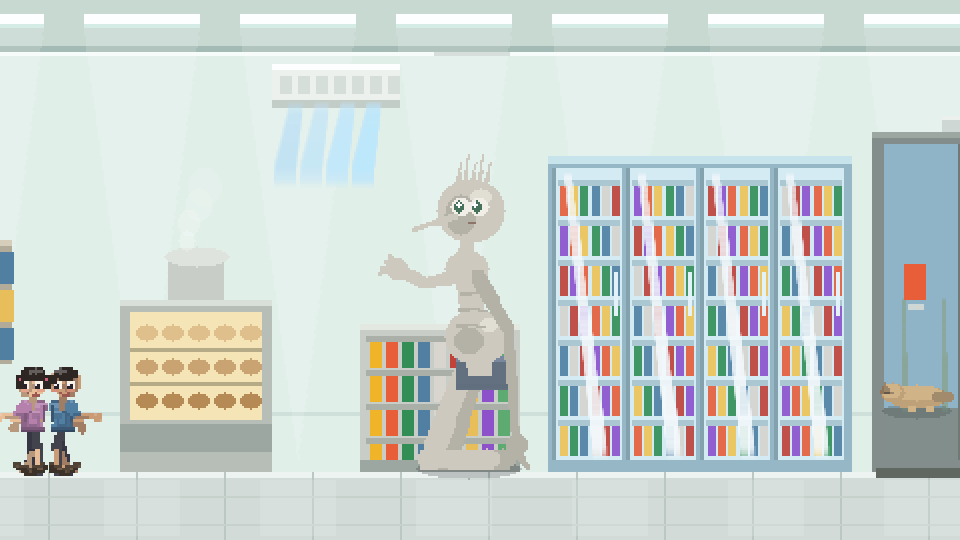

## Everybody is friendly, including the frightening ones

Thai folklore's most feared night spirits live here, and every one of them is a
neighbour with a small problem:

| Who | The story about them | What they actually want |
|---|---|---|
| **Kong Koi** | a one-legged forest spirit who drinks from sleeping travellers' toes | he's too shy to try, has no teeth, and would like something soft — mango sticky rice |
| **Krahang** | a man who flies at night on two rice-winnowing baskets | he came down hard in the paddy and both baskets are kindling. New ones, woven properly |
| **Phi Pop** | blamed for every stomach ache in four villages | has never possessed anybody. Wants a hot bowl of tom yum, handed over by somebody who isn't backing away while they do it |
| **Krasue** | a floating head trailing her own glowing entrails | leaves her body in the forest each night and can never find it again. Cheerful about it. Needs a lantern |
| **Tai Hong** | died badly on this road and simply stayed | not angry. Not anything. Just still there, waiting to be noticed. Wants a small shrine so people know somebody was here |
| **Kuman Thong** | the golden child in the glass cabinet, who is supposed to make you rich | six years old, and has been for eighty. Lives behind the stall with a red Fanta in front of him. Wants something sweet, handed over by somebody who isn't frightened |
| **Mae Ya Nang** | the lady who lives inside the engine, who every truck on the road has one of | rode forty years in the cab and nobody once said thank you. The garland on the mirror went brown in the first week. Wants a fresh one |
| **Mae Nak** | the most famous ghost in the country: the wife who would not accept that her husband had gone | waiting on the step of a house at the far end of the paddies for somebody who is not coming. Everybody knows the story; nobody has told her. Wants a light left burning |

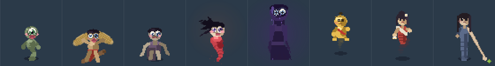

The three new ones are spread down the length of the map rather than gathered
with the others — the golden child behind the village stall, the engine lady out
at the crossroad where the trucks go past, and Mae Nak alone at the far end of
the paddies, one arm reaching a good deal further than an arm goes for a lime
lying on the ground.

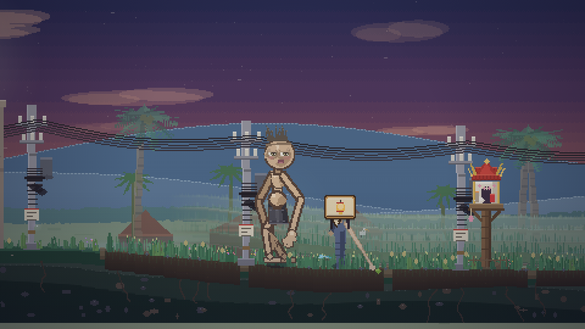

Plus five villagers, a monk who isn't supposed to want anything and would still
like a leaf float, and — as of this version — fourteen cats and dogs.

### They are drawn like cartoons, on purpose

Every one of them is built head-first: the skull is between a third and a half
of the whole figure, the limbs are short and thick, and the silhouette is made
of circles. Kong Koi is nine-tenths head and one leg. Krahang is a barrel with a
basket in each hand. At 480×270 a realistically-proportioned ghost is a grey
smudge with a dot on top; a cartoon one is a character you can tell apart from
forty pixels away.

The eyes are the same eyes the prete got: a white, an iris with a dark rim and a
lit underside, a pupil, a big catchlight and a small one, and a lid that comes
down — for a blink, or because the hour is wrong for them and they are half
asleep. The pupils slide to whatever has their attention.

### And they have evenings

They used to stand on a mark and turn to face you from anywhere on the screen,
which is the posture of a thing waiting to be clicked. Each of them now has
something they are doing at this hour, something they are looking at, and a
feeling about it that you can read without a word being said:

| Who | What they do with the evening |
|---|---|
| **Kong Koi** | chases whatever is glowing, in short hops, and gives up on it; sits down and dozes before dawn |
| **Krahang** | practises flying after dark — up, wobble, down — and spends the day sitting with the broken baskets |
| **Phi Pop** | edges away whenever a villager comes near, and comes back out when they have gone |
| **Krasue** | drifts up and down the forest path looking for the body she left somewhere |
| **Tai Hong** | watches the road, and looks away when somebody walks down it who cannot see him |

Come within about fifty pixels and they notice you once — a small start, a look
up, and a mark in the air over their head: a question mark if you have never
spoken, a heart if you are friends. Carry the thing one of them has been wanting
and they perk up at it from twice that distance. A ghost that was dozing wakes
when you arrive. And when the piggy bank goes off, every one of them within
sight of it turns, stares, and then is delighted.

The mark in the air is the whole vocabulary — question, heart, spark, tear,
zzz, dots — and the mouth underneath it changes shape to match. Nothing here
speaks.

## It speaks Thai, properly

**It opens in Thai, and in Thai there is no English left.** The village is
Thai, so the game is, on a device that can draw it — and on one that cannot (a machine with no Thai face renders every Thai
codepoint as the same rectangle) it quietly falls back to English instead. There
is a language key in the top right of the ledger. Press it — or **V** — and the
whole interface, every place name, every item, every skill, every prompt and
every thing a bed can be told to do turns over into English and back, and
whichever you last chose is what it opens in next time.

The panels are measured rather than positioned, because Thai sets wider than
English: the day-and-clock box in the corner takes the width its own two strings
need, so "วันที่ ๖  11:05น." does not print on top of itself the way it did when
that box was a fixed eighty-six pixels.

**And the last of the English went.** A sweep that hooks the *drawing* rather
than the lookup — because a hardcoded `PRESS ENTER` never asks for a
translation and is therefore invisible to a lookup — found eight strings still
arriving in Latin. The count on a stack of things is `×2` rather than `x2`. The
compass says **น**, and the two ends of the road say **ตก** and **ออก**, drawn
without going through the dictionary because a bare `E` is also the letter on
the key you press to do things and translating that to ออก would have put
"exit" on the button that means "use". And the title stopped naming keys
altogether — see below. It reports zero now, and it runs every time the
translation sweep does.

Thai is genuinely hard to draw at this size: forty-four consonants, vowels that
sit above, below, in front of and behind the consonant they belong to, and four
tone marks that stack on top of the ones already up there.

I did try hand-drawing it, the way the Latin face is hand-drawn — all 56 glyphs
the game actually uses, with the mark-stacking engine to go with them. At a
6×8 cell it was not legible: Thai letters are told apart by the position of a
small head-loop, and a loop two pixels across is a blob. Half the consonants
came out as the same shape. So that got thrown away.

What ships instead **rasterises the reader's own Thai face onto a pixel grid
twice as fine as the game's**, and thresholds it hard.

Thai has to be two things at once here and the two pull against each other. It
has to stay pixel art — square pixels, hard edges, sitting next to a 5×7
hand-drawn Latin face — and it has to be legible, which at eleven pixels it is
not, because the head-loops that tell one Thai consonant from another close up
and the tone marks snap off.

It took four goes. Thresholding an anti-aliased render broke it. Supersampling
onto the game's own grid properly broke it slightly less. Drawing it
anti-aliased at the display's full resolution fixed the legibility and put a
modern UI font in the middle of a pixel game. What works is to keep the hard
threshold and give it a finer grid to be hard on: every Thai pixel is a square
half a game pixel across, which is four times the area to draw a head-loop in
and not one soft edge anywhere. The mask is built once and blitted with
smoothing off, so it sharpens with the display instead of being pinned to one
scale.

**Nothing about the layout moved** at any point: every width is still measured
in game pixels, so a panel sized for Thai is still sized for Thai and a line
that fitted still fits.

The art for the face that did not work is kept in [`th/glyphs.py`](th/glyphs.py)
with a note on why, in case somebody wants to try it at a bigger cell.

Two more things had to be true before it counted as working:

- **A line that is half Thai and half not** — `+2 ข้าว`, `ต้องใช้ 6 แผ่นไม้`, a
  price with a number in front of it — is split into runs and each run goes to
  the face that owns it. The whole string used to go to the Thai face, so a
  number inside a Thai sentence looked nothing like the same number on the
  plaque beside it.
- **A device with no Thai font at all** renders every Thai codepoint as the same
  rectangle. The game checks for that once, by rasterising a real Thai letter
  and a private-use codepoint and comparing them, and if they come out
  identical the language switch declines and says why. A language of identical
  boxes is worse than no translation.

Thai has no spaces inside a word, so a long Thai run is broken by character —
but the Thai here uses spaces between *phrases*, and breaking by character
regardless split those in half. It breaks on the spaces first now, and only
chops a phrase when that one phrase is wider than the line.

**All of it is translated now, and that is checked rather than believed.** The
translation happens at the drawing boundary — every string in the game goes
through one lookup on its way to the screen — so the way to find what is still
speaking English is to hook that lookup, walk the game through every screen
there is, and print what came past untranslated. That sweep ships with the game
as [`th/sweep.js`](th/sweep.js); it visits the title, all ten chapters of the
first night, every panel of
the ledger, the stall, the order board, the kitchen, the workbench, the give
screen, the morning card, all four memories, the ceremony and the end card, and
drives the prete the length of the map at four different hours, and talks to
every person and every ghost in the village. It reports 591 strings drawn and,
as of this build, **nothing untranslated and nothing still in Latin**.

That number has gone up by a hundred and sixty in two days, and every one of
them was a hole in the sweep rather than a new line of prose.

First the ledger: it was walked by moving `TREE.col`, which the ledger stopped
having when it became four tabs of rows, so it had been drawing row zero of
every tab and nineteen strings behind row one — every villager's and every
ghost's biography, every wardrobe blurb, every wish — were quietly printing in
English.

Then the big one. **The sweep had never opened a conversation.** It walked the
panels and the story beats and the cutscenes and never once stood in front of a
villager and talked to them, so the whole of `VOICE` — the way each of the six
of them speaks to a stranger, to somebody who has fed them, and when they are
asking for something, sixty-five lines of it — had been in English since the
day it was written. It talks to everybody now, in all three registers, and
because `pick()` takes one line at random out of each list it also reads the
tables directly: three passes over a conversation prove nothing about the
fourth line in an array of five.

There are two nets under it now. The sweep hooks the *lookup*, which catches a
string that went looking for a translation and did not find one, and the
*drawing*, which catches a string that never went looking — a hardcoded
`PRESS ENTER` is invisible to the first and is the whole problem for the
second. And the test suite has its own copy that walks the dialogue tables
without a browser, so a new line of prose with no Thai behind it fails the
build rather than waiting to be noticed by somebody playing in Thai.

Anything glued together out of fragments had to be taken apart for that to be
true: `'DAY ' + 8` and `cost + ' merit'` and `'road, still blocked' + ' · ' +
'garland, still fallen'` were each one string too long to look up, so each half
is looked up on its own. The clock is not a translation at all but a different
convention — Thailand does not say *half past four in the afternoon* on a clock
face, so in Thai it reads `16:30น.`

Some words stay Thai in both languages, because there is no English for them
and the English would be worse: **นาข้าว** for a bunded flooded rice field,
**โอ่ง** for the big glazed water jar that stands in the shade of every house,
**ยุ้งข้าว** for the granary up on its posts, and **แม่โพสพ** for the woman
standing in your paddy.

| | | |
|---|---|---|
|  |  |  |

## Everyone talks to you differently depending on how well they know you

Nobody in the village has one line. Each of them has a register for a stranger,
a register for somebody who has fed them, and a register for asking — and asking
is the one that matters, because it is the only place in the game where a person
tells you plainly what to go and do:

> **Yai Pen:** *Eighty-one. I can still climb a ladder. That is what worries them.*
> **Yai Pen:** *If I ask my son he will take a week. If I ask you it is done tonight.*
> **Yai Pen:** *Bring me 2 jasmine. Then we are square.*

Feed them once and the first line changes for good.

### And the lines keep getting shorter

Every pass over this game cuts text, and this one cut a third of the guide.
Fifty-one lines, 2,339 characters of them, down to 1,655 for the same fifty-one
jobs: *Lift a jar, carry it over, tip it out* is **Lift, carry, tip**; *The
board at the gate sells chickens, ducks, and one very large buffalo* is **The
board at the gate sells livestock**; *Somebody is standing in the water. Longer
than the farm has* is **Somebody is standing in the water**, because the second
sentence was a thing you could not act on.

Two lines went altogether because the game was saying them twice — Lung Somchai
telling you to sleep off the road with the hint under him already saying *get
off the road and sleep*, and a fourth line about the stove that folded into the
third. And the opening now costs four cards instead of ten: climbing out of your
own grave used to print six narration cards in the first thirty seconds, which
is a wall of reading before anybody has touched anything. It prints two, and the
rest of it is in the animation.

## Nothing in front of the game

There used to be a layer of near-black grass blades drawn over the whole frame
at a faster parallax than the world, to sell depth. What it actually did was put
two hundred dark smears between you and the game: they crossed faces, they
crossed the prompts, and along the bottom of the screen they read as dirt on the
lens. Gone. The tall grass you can walk through still stands in the world, where
it belongs.

## Nothing announces itself

There is no signpost anywhere on this road any more. There were six, each a
slab of painted lettering standing in the middle of a village at two in the
morning, and every one of them was the loudest thing in its own picture. The
place names itself instead: walk into the banana grove and *the banana grove*
fades in at the top of the frame and fades out again.

The farm had its own version of the problem: a painted marker board on a stake
over every bed, five of them in a row, so the field you were supposed to be
proud of looked like a car park. Those went too. **Walk up to a bed and what is
growing in it fades in over the soil**, and fades out again behind you — which
is the same rule, applied to a thing rather than a place.

Nothing gets a banner. Merit, rice, a plank, a coin — whatever you just earned
comes off the thing that gave it to you and drifts up out of the world, small,
where it happened. Two at once stack rather than printing through each other.
The one hint the guide has for you sits low on the screen like a subtitle and
then goes.

| | | |
|---|---|---|
|  |  |  |
|  |  |  |

## Talking to somebody

A conversation used to be a panel at the bottom of the screen with a portrait
stuck on the side of it. You read a panel. You do not talk to one, and nothing
in it is happening: the letters arrive at a constant rate, out of a face that
is not moving, in the same box for a joke and for somebody telling you they have
been dead a hundred and forty years.

Now **the words come out of the person's head.** A cloud with a tail that
tapers all the way down to the mouth it came from, their name on a peg hooked
over the corner, and the camera leaning off you to sit between the two of you so
whoever is speaking is actually in the shot. Both of you turn to face each
other. If the speaker is somewhere you cannot see them — or there is no speaker
at all, because it is the narrator — the line comes in low across the bottom
instead, on nothing, the way a subtitle does.

**Every line has a feeling, and the face does it.** Fourteen of them: calm,
warm, happy, laughing, bright, shocked, asking, thinking, sad, tired, cross,
shy, awed, fond. The important lines are tagged by hand. Everything else is read
off the text — how many exclamation marks, whether it ends in a question,
whether the words in it are thank-you words or sorry words. It is a guess; a
guess beats every line in the game being delivered with the same flat face.

What the feeling drives:

- **The brows.** The inner end of the near brow lifts for sorry and drops for
  having none of it, which at this size is the whole of an expression.
- **The eyes**, wider when startled and half shut when weary.
- **The mouth**, which opens and closes while the words come out and then
  settles into a smile, a line, or a frown.
- **The head**, nodding along the sentence, flinching once on a shock.
- **A blush** on the two lines that deserve one.
- **The cloud itself** — softer paper for a quiet line, spikes all the way
  round it for a shouted one.
- **A small mark in the air** beside the cloud, drawn rather than typed: an
  exclamation, a question, a note, a sweat drop, a z, three thinking dots, a
  spark, a heart, a puff of temper. Each one is stamped nine times, eight of
  them in cream, so it reads against a night sky as well as against parchment.
- **The speed.** Excitement types faster, sorrow slower, and the typewriter
  *stops*: a tenth of a second at a comma, a quarter at a full stop, and longer
  on a dash. A machine that never pauses reads like a fax.
- **The voice.** Everybody has their own pitch — Mali is a piccolo, Tai Hong is
  a foghorn — and a question climbs a fifth as it goes.


Fill 108 merit — as many as the beads on a prayer mala — and the last page turns.
Then the village throws you a water-pouring ceremony at dawn, and everyone you
befriended comes to see you off. The farm keeps going without you; somebody will
find the lanterns still burning over the beds and wonder who left them on.


## The shop, which you can walk into

The one at the crossroad is a real room, not a menu. The glass front, the three
bands across the fascia, the strip lights, the fridge wall, the hot cabinet with
the buns going round under it. You push the door and it **chimes** — two bells, a
fifth apart, the sound every one of these makes — and the air conditioning comes
on under everything and stays on until you leave.

Inside is its own little scene, seven hundred pixels end to end. You are nine feet
tall and the ceiling is seven, so he goes in on his knees and shuffles the aisle
like that, which is the first time in the game the world is too small for him
rather than the other way round.

There are three things to stop at: the girl at the till, who wais at the door out
of habit whether or not anybody came through it; the hot cabinet; and the four
doors of cold. Two customers drift between them, and through the glass you can see
the two dogs asleep on the step outside, because they are always on the step
outside.

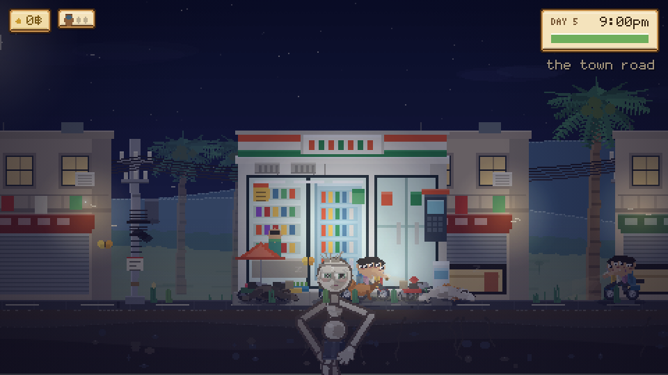

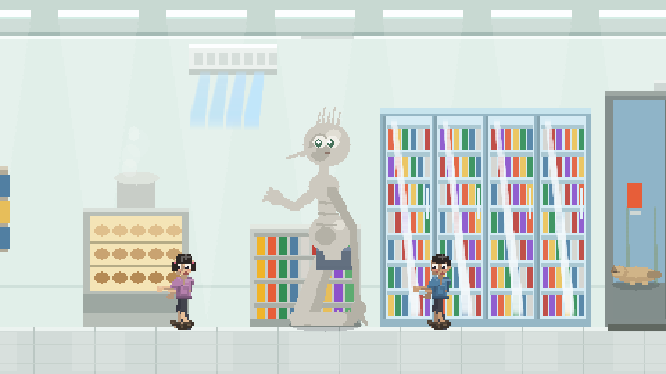

### And the dogs on the step

Five strays live on the road now, three of them off the shop, where the concrete
is warm and somebody always drops something. Each one has its own coat — the tan
one, the black one, the dusty white one, the ginger — and each one breathes while
it sleeps, gets up when you come near, and lies back down when you have gone.

## Four festivals, on a wheel you can learn

A fourteen-day calendar, so a save of any length sees all of them, more than once.
None of them is a cutscene. They are a different village for a night, and the
evening before, somebody tells you what tomorrow is.

### วันพระ — the alms round

Day 3 and day 10, from six to eleven. **Four monks walk the lane barefoot** in a
line with their bowls held at the waist. Six people are already kneeling with trays
when they get there — rice pot, spoon, a low stool for whoever is too old to kneel.
The line stops at each one, three spoonfuls go in the bowl, the giver puts their
hands together, and the line moves on. On a merit day the village's own monk stops
doing his everyday round, because he is in this one.

You have nothing to put in a bowl. You can kneel, which turns out to count.

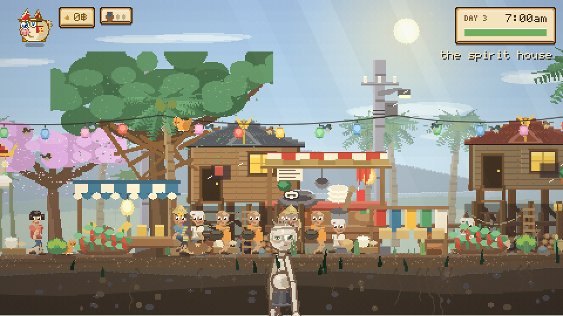

### งานวัด — the หมอลำ stage

Day 6, from seven at night until it stops. A **stage goes up on the temple ground**
at chest height on a scaffold, with a printed sunburst backdrop, two par cans on the
frame, and **two speaker stacks taller than the stage**, which is the whole point of
a หมอลำ stage. A singer at the mic with her eyes shut, two หางเครื่อง in sequins and
ชฎา stepping side to side, a khaen player sat at the edge with the pipes up. The
riff is a **pentatonic figure in eighths at 128** over a bass pulse, with the khaen
drone coming in once a bar.

Seven people stand in front of it in the spill of the lamps, silhouettes with a warm
edge, **turning their hands** the way รำวง is turned. You can join in. Nobody minds;
nobody can see you.

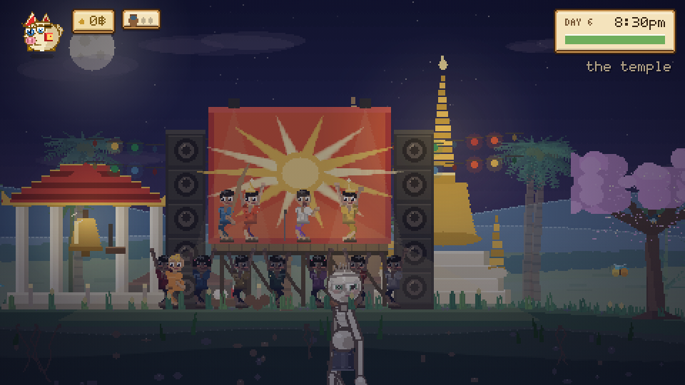

### ลอยกระทง — the night of the floats

Day 9, from seven. **Krathongs come out onto the pond** — banana-leaf cups with
folded points round the rim, flowers, three sticks and a candle — and drift, and go
out, and are replaced. If you have made one you can push it out yourself.

And **โคมลอย go up over the whole village**, all night, from everywhere, thinning as
they climb until they are the same brightness as the stars.

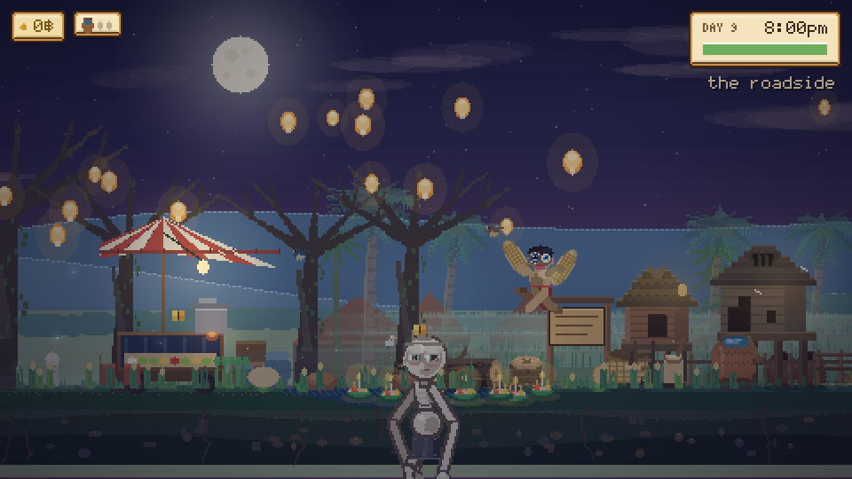

### สงกรานต์ — the water days

Day 12, ten until five. A **blue barrel** at the roadside with a bowl floating in
it, four kids round it in flower shirts with ประแป้ง on their cheeks, two of them
with pump guns and one dipping. The road goes dark in patches where it lands and
dries out again in the heat. Round the side, somebody's grandmother sits on a stool
with her hands out while the scented water goes over them.

You can pick up the bowl. It goes through you and lands on the road behind, which
is the joke and also the saddest thing in the game. Mali throws hers anyway, at
where she thinks you are.

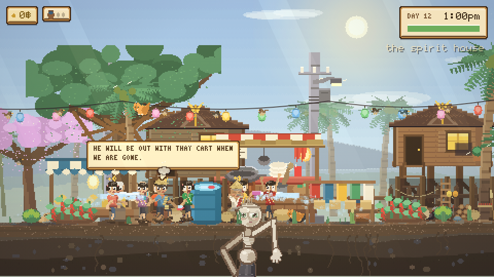

## The lore (actual research)

- The prete is the Thai **hungry ghost**: **as tall as palm trees**, pot-bellied,
  **hands as big as palm leaves**, a **mouth the size of a needle's eye**. At
  night they make a thin high whistle asking the living to dedicate merit to
  them — which is your greeting button.
- The exit is real: when the living **make merit and dedicate it** — often by
  pouring water — a prete can be released.
- **Phra Phum Chao Thi**, the spirit-house guardian, is depicted as a regal gold
  figure holding **a sword in one hand and a money bag in the other** — look
  inside the shrine. He keeps the village ledger, and yours.
- **Phra Mae Thorani** is shown wringing water from her hair; **Phra Witsanukam**
  is the patron the craft guilds still garland once a year; **Phra In** is Indra,
  who in the Thai telling comes down himself when somebody's merit is worth the
  trip.
- **Nang Tani** genuinely lives in wild banana groves and is genuinely benevolent.
  **Mae Posop** is carried out of the last field of the harvest wrapped in
  cloth, like a bride, and you apologise to her out loud for a dropped grain.
- The red Fanta on the shrine ledge is not a joke.

Sources: [Preta](https://en.wikipedia.org/wiki/Preta) ·
[Ghosts in Thai culture](https://en.wikipedia.org/wiki/Ghosts_in_Thai_culture) ·
[Preta: Hungry Ghost Spirits in Thailand](https://mysakonnakhon.com/preta-hungry-ghost-spirits-in-thailand/) ·
[Krahang](https://en.wikipedia.org/wiki/Krahang) ·
[Kong Koi](https://en.wikipedia.org/wiki/Kong_koi) ·
[Phra Mae Thorani](https://en.wikipedia.org/wiki/Phra_Mae_Thorani) ·
[Vishvakarman](https://en.wikipedia.org/wiki/Vishvakarma) ·
[A Guide to Thai Spirit Houses](https://www.thethailandlife.com/thai-spirit-houses)


## What's inside

One HTML file, ~1.05 MB, 480×270 canvas integer-scaled with `image-rendering:
pixelated`. Parses and initialises in about a tenth of a second, has the whole
road built inside half a second behind a loading screen, and holds 50–60 fps
with a fully stocked farm on screen.

- **Nothing is a sprite sheet, and nothing is a font glyph.** Every character is a
  procedural puppet posed fresh each frame — two-bone IK limbs, a walk cycle
  driven by *distance travelled* so feet never slide, velocity lean, landing
  squash, a pot belly on its own spring, and a verlet-simulated cloth wrap. The
  prete is drawn cartoon-first: one hard ink line all the way round, flat colour
  inside it, forty-two pixels of leg on 3px-wide bones, arms that hang past the
  hip, and a head far too big for either.
- **Hands that arrive, rather than appear.** The arm pose picks a branch —
  hanging, reaching into the soil, holding a jar, blocking, in the air — and
  for a long time the hand simply *was* wherever the new branch said. So the
  frame any job began, both hands teleported fourteen to sixteen pixels, which
  on a character sixty pixels tall is the whole arm moving between one frame
  and the next. That is not an animation, it is a cut, and it is what looked
  broken. The pose is a target now and the hand springs to it over about an
  eighth of a second, in the body's own frame so walking does not drag it.
  Measured: sixteen pixels down to one and a half, and it is a test.
- **Four long fingers and a thumb, and they move.** They were four splayed
  spikes on a fan once, which is a claw, and a claw is the most frightening
  thing you can put on a cozy character; then they were three stubs, which is
  safe and says nothing. Long is the point of him — he is a man stretched — so
  they are long again, but each one is **two segments with a knuckle**, rounded
  at the end rather than pointed, and curled rather than spread. One number
  closes the whole hand: nearly shut on a water jar, wide open reaching into
  the soil, and each finger carries its own phase off the sway clock so the
  four of them ripple instead of moving as a block. That is the difference
  between a hand and a mitten.
- **A planted foot does not move.** The walk cycle is split into a stance half
  and a swing half rather than driven by a cosine: through stance the foot
  tracks straight backwards at exactly his walking speed, which is the only
  shape that leaves it stationary against the ground. The phase advances one
  half-cycle per step length travelled, so the identity that keeps it honest —
  `phaseRate * stride === 1` — holds at every speed. Measured slip is 0.00 px/s
  at five different speeds, in both directions.
- **Working with your hands takes a beat.** Planting, watering, picking, giving
  and putting your palms together are one system: a crouch, a reach and a
  payload that fires at the middle of the movement, when his hands actually
  arrive. Nothing in the field is instant, and nothing is a menu.
- **He moves slowly, and late.** The head and the hands ride their own springs and
  arrive a beat behind the shoulders; the body carries a slow idle sway and a
  breath; the walk eases in and drifts out over most of a second instead of
  snapping to speed. None of it is keyframed — it falls out of the simulation,
  which is why it never repeats exactly.
- **The farm runs whether or not you are looking at it.** The animals and the
  ghosts you hired advance on the same fixed step as everything else — the
  harvester really does walk the row and put things in your basket while you are
  two zones away buying seed. What *grows* does not: beds, paddies and trees all
  move in one pass while you sleep, so the state of the field is a thing you
  decided at dusk rather than a thing that happened to you while you were
  looking the other way.
- **The first night is one list.** Ten beats — climb, meet, follow, supper,
  hide, field, plough, water, plant, free — each with an optional enter, step,
  prompt and overlay, stepped one at a time off a single integer in the save
  file. Nothing in it reaches into the rest of the game except through that
  integer, so the moment the last beat lands the village behaves exactly as it
  always did, and a save from before the first night existed is simply treated
  as having finished it.
- **One number is the time of day.** Nought is the blackest part of the night
  and one is full morning; the sky's four gradient bands, the sun, the moon,
  the stars, the clouds, the ambient darkness, the lamp glows, the aerial haze
  on each parallax layer, and whether the ambience is crickets or birds all
  read off it and nothing else. The clock sets it now rather than the other way
  round — half past six is orange because the clock says half past six — and
  the sleep under his floorboards is still that number moving from 0 to 0.92
  over nine seconds.
- **One set of colours, graded by the clock.** The 7,200-pixel play layer and
  the three parallax layers behind it are painted once each and never repainted.
  The time of day is then four full-screen fills over the top: a dark stencil
  with a hole punched in it for every lamp, a warm `overlay` pass that fades in
  with the sun, a cool band along the ground that fades out with it, and a coat
  of the horizon's own colour on each parallax layer in proportion to its
  distance, which is aerial perspective. Much cheaper than a second copy of a
  two-megapixel canvas — and the frame rate is the same with the grade as
  without it.

  The layers used to be painted for the night the story opens on, which was
  fine while the game was one night long. With a clock running six in the
  morning to two the next night it meant every daylight hour came out the same
  slate grey as three a.m., so they are painted in daylight now and the night
  is the thing that gets added.
- **The plough is a pendulum you can see.** The marker you are timing and the
  share that dips into the soil ride the same number, so what you watch and what
  you hit are the same object rather than a bar pretending to be a plough. Every
  connection speeds the swing up and adds a step to a pentatonic run; a miss
  slows it and resets the combo. The sod that turns over is a physical particle
  with its own spin, bounce and settle.
- **The grass lies down, and there is a cache behind it.** Every tuft in camera
  range is a spring with a rest position set by the wind; walking through pushes
  them over and occasionally flushes whatever was sitting in them. They are
  blitted from baked sprites keyed on kind, height, bend and colour — and the
  key has fewer possible values than the cache has slots, which is the whole
  difference between a cache and a bakery.
- **Platforms are one-way and forgiving.** The feet are tested against the slice
  of air they fell through this frame rather than against a position, so a fast
  drop cannot tunnel through a plank; a rising jump that clips the lip of one
  gets pulled up onto it; and down-and-jump steps off the top of one instead of
  jumping off it.
- **The tutorial cannot get stuck behind itself.** Mae Posop's rice lesson does
  not step forward one beat at a time; it scans backwards from the last step for
  the furthest thing that has demonstrably happened, because harvesting a paddy
  resets its stage and "keep the water up" can never be true again afterwards.
  She also walks the bund towards you while she is teaching, so the one
  character who explains the game can never end up somewhere you can't tap.
- **Every prompt in the world is one ordered list.** Fixed furniture first — the
  barn, the jar, the log, her — then the beds and paddies, then people, then the
  things flying about. A dragonfly drifting over a ripe bed must never be what
  your tap lands on. (The people loop was missing the guard the rest of the list
  had, which is how Krahang came to be answering for the water jar.)
- **The bugs each have their own motion, not a shared wander.** A dragonfly
  accelerates in bursts and coasts; a firefly integrates two slow sines; a
  grasshopper is a ballistic arc with a cooldown; a cicada is pinned to a trunk
  and emits an actual synthesized chirp; a beetle ignores you entirely. Each is
  clamped to the patch it was spawned in and despawns when you are far enough
  away.
- **The little scenes are not a mode.** No state machine, no separate render
  path: the bars, the dimming, the light pool and the typed line are one
  function drawn over the live world, and the game underneath keeps running.
- **The cutscenes use the same rig ideas at a different scale.** The man you used
  to be has hair and ordinary eyes and already that nose, and the prete himself
  climbs out of his own grave in the first scene, drawn by the same function that
  draws him in the village.
- **The type is part of the art.** Two bitmap fonts defined as row bitmasks and
  rasterised in the page; each drawn string is cached to its own small canvas, so
  a line of text costs one blit rather than a few hundred rectangles. There is no
  webfont, so nothing loads late and nothing reflows.
- **A 7,200-pixel road** through nine named zones over six parallax layers,
  pre-rendered once into cached canvases and built across frames behind a loading
  screen. The east end is new country: deep forest, a stream with stones across
  it, and fallen trees long enough to walk along.
- **Every panel is drawn, then cached.** Frames, bubbles, keycaps and sky clouds
  are filled once into offscreen canvases and reused; so are the radial glows on
  every lantern, lamp, firefly and floating head. One function draws every box in
  the game, so the whole interface changes shape from a single place.
- **Menus are hit-tested from the draw pass.** Each screen records where it put
  things as it paints them, so a tap resolves against real layout instead of a
  second copy of the geometry.
- **Atmosphere:** strings of coloured lanterns swaying over the road, blossom
  trees, night-market stalls, drifting mist that pools in the graveyard and the
  paddies, candles on the graves, spirit-motes, fireflies, moths around the lamps,
  and a real-time lighting pass so fixing the streetlight visibly warms that
  stretch.
- **A life under every house.** Water jars, a leaning bicycle with a basket on
  the front, stacked firewood, a tray of chillies drying, a broom, a hammock
  nobody is in, a dog's bowl, a pair of sandals, a sack of rice and the ladder
  up — baked once per house and blitted, with the window lit and somebody
  turning over in it at night and standing open with a shirt hung in it by day.
- **Thirty-odd things that answer.** A jar you can look into, a bicycle bell you
  can ring at two in the morning and regret, a stone with a whole town under it,
  a pot to smell, a stool far too small for you to sit on, a stream, a
  scarecrow, chillies, washing. Each says one thing the first time and something
  shorter afterwards, and a few of them change the world a little — the bell
  starts every dog in the village, the stone empties in five directions.
- **All audio synthesized live** — crickets, frogs, a ranat-ek pentatonic figure,
  temple gongs, and one long prete whistle.
- **The baht sign is a drawn glyph.** It lives in the Thai Unicode block, so
  every price was being rasterised from the platform's Thai face and coming out
  in a different typeface from the number beside it. It has its own 5x7 bitmap
  now, and the Thai matcher steps around it.
- **The type has a second alphabet.** The bitmap faces cover Latin; Thai is
  supersampled four times from the platform face and downsampled to 1-bit by
  coverage, then cached like every other string, and a line that mixes the two
  is split into runs so each goes to its own face. Translation happens at the
  drawing boundary — `pTxt` and `wrap` look every string up on the way to the
  screen — so no call site had to be touched and an untranslated string simply
  comes through in English rather than going missing.
- **One guide, not two.** The tutorial nudges, every "you need seed" and "the
  jar is by the house", all funnel through one call. If Mae Posop is within
  earshot it comes out of her mouth; if you are two zones away it comes up on a
  line under the plaques, which drops below whatever the HUD has already put in
  that band. Before this there was a second spirit at your shoulder saying the
  same kind of thing at the same time, in a bubble of her own.
- **Sprite-baked static art.** The rice, the tree crowns, the farmhouse, the pen
  and the barn are hundreds of tapers and ellipses each, and they are the same
  hundreds every frame — so each is painted once into a small canvas and blitted
  from then on, keyed by whatever about it can actually change. Verified
  pixel-exact against painting straight into the world: zero pixels differ at
  every farm location. It bought 12 fps.
- **The title screen is a scene, not a splash.** Four bands of rice drawn as
  clumps rather than a comb, each on a baseline that wanders a few pixels over
  the width of the screen so that a paddy reads as a surface and not a ruled
  line; water whose ripples and sun-path are stirred every frame; three egrets
  standing in the middle distance; seven birds that never come down, and six
  that do. Each of the six waits, gets bored, picks a free perch from the eight
  going — his palm, his head, his shoulder, his knee, two patches of earth
  beside him and two clumps out in the field — and flies there on an arc. His
  palm is the one they prefer. The prete sits on the bund using the same puppet
  as everywhere else with a sitting pose added to it, and is reflected in the
  water in front of him by drawing him again upside down, clipped to the water
  and stepped with no time at all so his cloth is not simulated twice a frame.
- **The interaction prompt is the thing's name with an arrow under it.** The row
  of pictures it replaced had a specific failure: the glyph for *talk* is the
  same glyph whoever is standing there, so the one screen element whose entire
  job is telling you which of three overlapping things you are about to use
  could not do it. Each label is laid out against the box a **finger** has to
  hit rather than the plate the words sit on, and collisions push the later
  label up a whole target height; the arrow stays on the thing and a dotted
  thread joins them. The hit record carries the arrow tip, so a test can assert
  the invariant that actually matters — *the arrow points at the thing it
  names* — instead of at pixels.
- **How human he is, is a number between nought and one.** `drawPrete` takes it
  and lerps six things off it: two colour ramps towards skin, the rib contrast
  towards nothing, a belly scale, an eye scale, a hair count and a mouth radius.
  There is no second sprite and no swap — the ghost is a dial. The step is
  credited the instant the piggy bank breaks, so nothing can leave him owed one,
  but `humanAmt()` reports the PREVIOUS step for as long as the burst is
  charging, which is how the change ends up hidden inside the white.
- **The village routine is a table, not a state machine.** Six rows per person
  of `[from, to, offset, job]` against the clock; the walk order is issued when
  they are more than twenty-six pixels from where the hour says they should be,
  and marked `routine` so that being spoken to cancels it. The job is a pose
  plus something in the hands, and it only plays when they are standing still,
  within thirty pixels of the spot, and not reacting to anything.
- **What that scene cost, and what it costs now.** Drawn honestly it was 38ms a
  frame — 26fps, on the front page, against 16ms for the farm, which is the
  heaviest thing the game draws in play. Two thirds of it was rice: four bands,
  three hundred clumps, a tapered polygon for each stalk and three more for the
  grain on top of it. The clock on the title is pinned, so the sky, the far
  shore and the palms are the same picture in every frame: they are painted
  once. So is each band of rice — and then bent back into the wind by blitting
  its strip a row at a time, each row pushed sideways by how far it stands
  above the mud, rows wanting the same whole pixel going together. That is
  about nine draws a band instead of eight hundred, and it is a truer bend than
  the old one, which leaned each stalk as a straight line out of the ground.
  6ms a frame now.
- **Everything in reach is a list, not a slot.** The interaction check used to
  end at the first thing that matched — thirty-odd candidates each guarded by
  *if nothing has claimed the prompt yet*. That is a precedence list, and a
  precedence list is fine right up until two things overlap, at which point the
  loser does not exist. The guards are gone: every candidate adds itself, the
  order they were written in becomes the order of the list, the front of the
  list is the prompt exactly as before, and the rest each get an icon. One or
  two things ask to sit at the back rather than be left out — the water jar
  standing where the bed is, after dark — and a stable sort keeps everything
  else where it was.
- **A pending transition can set a state after the guard has run.** Every
  screen here is a state plus the object behind it, and a frame checks the two
  agree before it updates and before it draws. A wipe fires its callback
  *halfway through itself* — which is neither of those moments — so a callback
  that sets a state whose object has been cleared since the wipe began got a
  whole frame of drawing a screen with nothing behind it, and that is the
  black-screen-for-good bug. The check runs again the instant a callback
  returns, and starting a new game cancels any transition still in flight.
- **Two clouds cannot occupy the same sky.** Two villagers standing close
  enough to talk to each other are standing close enough for their speech
  bubbles to overlap, and the second was drawn straight over the first — which
  nobody noticed while the lines were English and short, and which happened
  every time once they were Thai and wider. Each frame's clouds are remembered;
  one that would collide is lifted clear of the others, and because its tail
  can no longer reach its speaker without ruling a line through somebody else's
  cloud, it gets a stub and you join the two up by where they are.
- **And then the thing you are standing on wins.** Written order is a good
  default and a bad rule. People are checked before plants, which is right when
  a ghost and a papaya bush are both an arm's length away — but a person is
  noticed from forty pixels and a bush from twenty-two, so Krahang, who happens
  to stand twenty-five pixels from a clay pit, answered for the pit from every
  position it was possible to stand in. Distance now breaks the tie, rounded
  into sixteen-pixel bands first, so two things at the same spot keep the
  written order and only a real step decides anything. Flavour — a scarecrow, a
  bell, an animal that follows you about and is therefore always underfoot —
  goes to the back outright rather than merely last in the list, because being
  nearest is enough to win the key now. A test walks the prete onto all
  thirty-four plants and all fourteen people in turn and checks he gets the one
  he is standing on.
- **Adding a ninth ghost must not need a ninth edit.** The five the game shipped
  with were given a home, a ground line and an animation phase in one loop at
  load, and indexed by name in the next line. Three more were added later, in a
  file of their own, further down the same script — they drew fine, walked fine
  and talked fine, and the index knew nothing about them, so a saved game
  forgot every one of them and the journal drew the wrong face. The setup loop
  skips whoever already has a home and the index is rebuilt rather than added
  to, so both are now write-once; a test asserts every ghost in the list can be
  found by name, and that a new one is still your friend after you put the game
  down.
- **Carrying is a pose, not an attachment.** The water jar used to float beside
  the hip; now it is drawn inside the prete, between his two arms, so the back
  hand is behind it and the front hand closes over the rim. Both elbows are
  bent the other way from usual so they fall outward under the weight, the
  torso leans back off it, the head comes forward over it, the hips drop two
  pixels and the whole walk rolls side to side. And lifting it is a movement:
  he crouches, gets his hands under it, and the jar arrives in his arms
  halfway up — which is the frame where the weight becomes his.
- **The night is one function.** Everything that happens between two days —
  the basket paid, every watered bed moved on, the flooded paddies counted, the
  trees grown, the animals fed, the hired ghosts' night's work, the bar
  refilled, the day's presents and conversations forgotten — is a single pass
  over the farm, called once, that returns the card you wake up to. Nothing
  else in the game is allowed to advance a crop, which is why the field is
  always exactly what you left at dusk.
- **Translation is checked three ways, because two were not enough.** Every
  string reaches the screen through one lookup, so [`th/sweep.js`](th/sweep.js)
  hooks that lookup and walks the game through every screen it has — opening
  every conversation in three registers, because the lines a stranger gets are
  not the lines a friend gets. It hooks the *drawing* as well, which catches a
  string that never asked for a translation at all, and one glued together
  after it was translated.

  Both of those only ever see a line the walk managed to trigger, and that is
  a hole you can drive a village through: **twenty-eight of the things that
  answer sat in English for a month** because each of those tables holds a
  second line for the second time you ask, and the walk asked once. Somebody
  playing in Thai hit a bicycle bell twice and got *Ting.* So the third pass
  ignores the walk entirely: it reads the game's own tables — every top-level
  table there is, found by name in the source, followed all the way down — and
  asks the dictionary about every piece of prose it finds, whether or not
  anything ever drew it. It found a hundred and fifty lines the first time it
  ran: every dish description, every tool, every blessing, every friendship
  line, every loading caption.

  And then somebody sent a screenshot of Lung Somchai saying *That's my field.
  Two seasons, nobody's turned it.* in English. That line is not in a table —
  it is a string literal inside a function, behind a chapter and a position on
  the road, and all three passes were blind to it. So there is a fourth, and it
  does not run the game at all: it **tokenises the whole built script**, takes
  every string literal in it, keeps the ones that read like something a person
  says, and asks the dictionary about each. Sixty more. All four are tests now.
  1,030 literals read as prose and 593 in the tables, none untranslated, none
  still in Latin letters in Thai mode.
- **A state with nothing behind it is impossible.** Every screen here is a
  state plus the object behind it, and each is supposed to clear both together.
  If they ever came apart — a state left set with its object gone — the draw for
  it read a field off null, threw every frame, and the canvas stopped for good.
  A black screen that never comes back is the worst bug this game can have, so
  it costs one check a frame to rule out: before update and before render, a
  state whose object is missing falls back to play. A fuzz that puts the game
  into all fifteen of its states with everything nulled found six of these and
  now finds none.
- **Two functions cannot quietly share a name.** Every part of the game is
  concatenated into one script, so a duplicate name is not an error — the later
  one silently wins and the earlier becomes dead code that still looks live.
  That happened once, to a whole map screen. Twenty-eight names are shadowed on
  purpose (later parts patching earlier ones) and the build knows all
  twenty-eight; a twenty-ninth fails the build and says which two files.
- Autosave, a friends journal, canvas-drawn touch controls, and a dawn ending.

## Putting it on itch.io

Everything the store page needs is in [`itch/`](itch): the game zipped with
`index.html` at the root, a 630×500 cover, a 1920×620 banner, and the settings
that matter (HTML project, 960×540 embed, mobile friendly).

Neither picture is drawn by hand. Both are **the game running with `GS.plate`
set** — a flag that takes the purse, the clock, the prompts and the thumb
controls off and leaves the village standing there — with the lettering set over
the top at the size each picture wants, by [`itch/keyart.js`](itch/keyart.js).
Change the game and the store art changes with it; it can never be a picture of
a build that no longer exists.

The scene is the village road at twenty past eight at night: the noodle stall
lit, a string of coloured lanterns across the wires, a power pole, two houses
with their windows on, a cat in the tamarind, and nine feet of grey ghost
standing in the middle of it that nobody is running from. That is the game in
one frame, which the rice field — pretty as it is — was not.

| | |
|---|---|
| 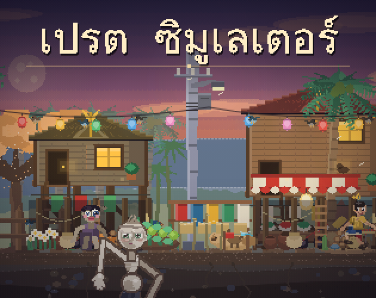 | 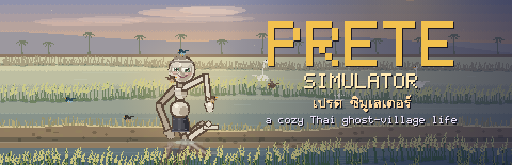 |

Made with rice and incense. May you go to a good place.
