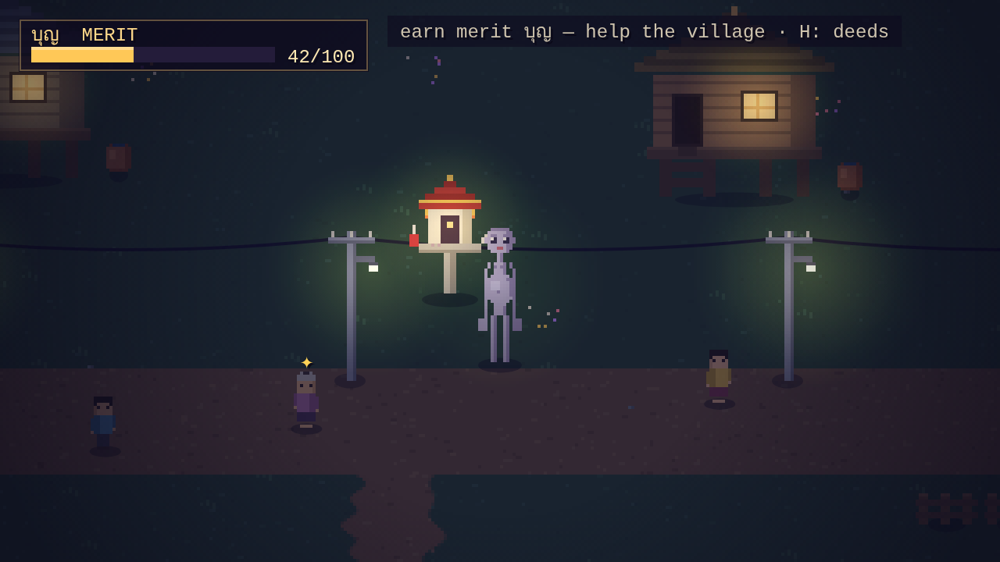
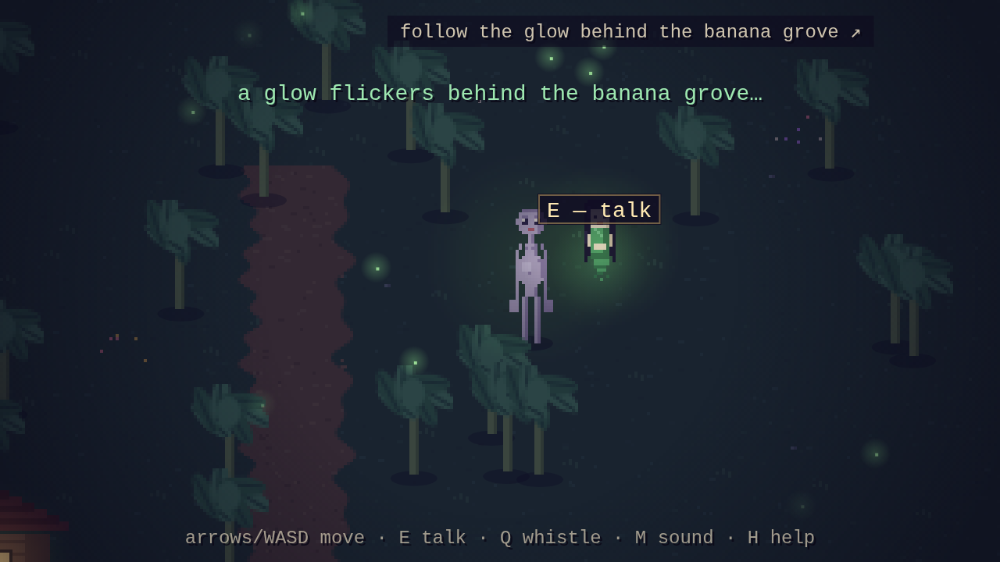
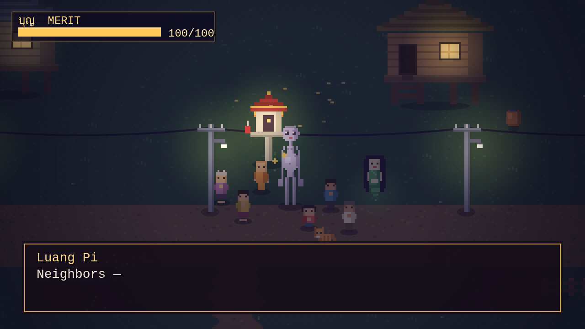

# Prete Simulator · เปรตซิมูเลเตอร์

A cozy pixel-art game about being a very tall, very sorry Thai hungry ghost.

> karma is a ledger, not a cage.

In your last life you took what wasn't yours, drank what wasn't offered, and
laughed past the temple gate. So the ledger tipped — and you woke beneath the
moon as a **prete (เปรต)**: tall as the palm trees, hungry as a drought, with
a mouth the size of a needle's eye.

Now you haunt a little village at night. Not to scare anyone — to earn your
way home. Gather **100 merit (บุญ)** and the road opens.

**Playtime:** ~10–15 minutes · zero fail states · maximum coziness ·
sound on if you can (fully playable muted)

## Play

Open `index.html` in any browser. One file, no build, no assets, no
dependencies. Works from disk or any static host.

## Controls

| Input | Action |
|---|---|
| Arrows / WASD | walk (slowly — you are nine feet of ghost) |
| E / Space / Enter / tap | talk · interact · advance text |
| **hold E** | fix things only you can reach |
| Q | วี้ดดด — the famous prete whistle |
| H | the Ledger (deeds, progress, controls) |
| M | mute (persists) |

Touch controls appear automatically on phones. Progress saves in the browser.

## How merit works

- **Walk behind the banana trees.** Something glows in the grove north-east
  of the village. Her name is Tani, she lives there, and she'll explain the
  whole karma/merit system to you, ghost to ghost.
- **Stand close when villagers pray.** People leave offerings at the
  **ศาลพระภูมิ** (spirit house) and dedicate the merit to "any hungry soul
  nearby." That's you. Hurry over when you see the ✦ and the merit drifts to
  you like moths to a lamp.
- **Help with your enormous size.** The broken **เสาไฟฟ้า** (streetlight) is
  too high for any ladder — not for you. Meow-Meow the cat is stuck up the
  big tamarind tree. Lesser spirits gnaw at the village's sleep, and exactly
  one thing frightens them: a nine-foot hungry ghost with good lungs.
- **Be a polite neighbor.** The monk at the north sala pours water for you
  (กรวดน้ำ), the noodle uncle leaves a bowl out for the spirits, and the cat,
  once rescued, accepts pets.

Fill the bar, tell Tani, and go to the spirit house at dawn.

| | |
|---|---|
|  |  |

## The lore (actual research)

The prete (เปรต, from Sanskrit *preta*) is the Thai form of the Buddhist
**hungry ghost** — a being reborn into insatiable hunger by the weight of its
own karma:

- Thai folklore pictures them **as tall as palm trees**, skeletal but
  pot-bellied, with **hands as big as palm leaves** and a **mouth the size of
  the eye of a needle** — so they can never eat enough to ease the hunger.
- You become one through bad deeds: **stealing** (especially from temples or
  monks), cheating, drinking, corruption, and above all **wronging your
  parents** — hence the giant hands and tiny mouth.
- At night they make a **thin, high whistling sound** (วี้ดๆ), asking the
  living to dedicate merit to them.
- And the exit really is merit: when the living **make merit and dedicate it**
  (อุทิศส่วนกุศล, often by pouring water — กรวดน้ำ), a prete can be released
  toward a better rebirth. That mechanic is the whole game.

Sources: [Preta (Wikipedia)](https://en.wikipedia.org/wiki/Preta) ·
[Ghosts in Thai culture (Wikipedia)](https://en.wikipedia.org/wiki/Ghosts_in_Thai_culture) ·
[Preta: Hungry Ghost Spirits in Thailand (My Sakon Nakhon)](https://mysakonnakhon.com/preta-hungry-ghost-spirits-in-thailand/)

The banana grove isn't random either — Thai ghost stories put spirits among
the banana trees, including **Nang Tani (นางตานี)**, the green-clad lady who
lives in wild banana groves and is generally benevolent. In this game she's
your first friend, your tutorial, and the only one who tells you the truth
kindly.

The offerings at the spirit house include the traditional garlands, rice,
incense — and the little bottle of **red Fanta (น้ำแดง)** you'll spot on the
ledge, because no Thai spirit house is complete without one.

## What's inside

- One self-contained HTML file (~90 KB). Canvas 2D at 320×180, integer-scaled,
  `image-rendering: pixelated`.
- All art hand-placed rectangles at runtime — the prete, five villagers, a
  monk, Nang Tani, a cat with four frames, stilt houses, the spirit house,
  banana trees, power poles with sagging wires, a noodle cart.
- A real-time lighting pass: warm pools punched out of the night for windows,
  lanterns and streetlamps — so fixing the เสาไฟฟ้า visibly warms the road.
  Fireflies in the grove. Dawn arrives when you do.
- All audio synthesized live with WebAudio: crickets, a soft night pad,
  pentatonic plucks, temple dings, and one long prete whistle.
- Quests: a streetlight, a cat, three sour spirits, a monk's blessing, noodle
  offerings, prayer events, petting the cat (+1 บุญ, capped, as is fair).
- A karma-ledger help screen, autosave, touch controls, and an ending with a
  กรวดน้ำ ceremony that turns the night to morning.

Made with rice and incense. ขอให้ไปสู่สุคติ 🌸
