# Prete Simulator

A quiet side-scrolling game about climbing out of the ground with no memory at
all, being fed by an old man who is not afraid of you, and paying him back with
one morning's work in a field.

> karma is a ledger, and you are not allowed to read your own.

You come up out of a burial field at three in the morning, one handful of
somebody else's earth at a time. You do not know your name. You do not know
what you did. You are a **prete** — a hungry ghost, tall as the palm trees and
thin as a pole, ash-grey, with hands like palm leaves, a pot belly under a
visible ribcage, a mouth the size of a needle's eye, one small orange nose, six
hairs left, and two enormous ringed eyes that have not closed properly since.
You cannot eat anything you cook. You're going to cook a great deal anyway.

Far down the road there is one light on: a noodle cart with an old man behind
it, open since four in the afternoon, selling to nobody. **He looks you up, and
up, and up, and puts down the ladle, and tells you to sit before you frighten
the moths.** Then he walks you home past the sleeping houses and the dogs, puts
rice out on the step, and tells you to come back at first light because there
is a field to turn and he is seventy-one.

Nobody will tell you what you did. Not Lung Somchai. Not Mae Posop, who has
watched the paddies since before you were buried in sight of them. Not Phra
Phum, who keeps the ledger in his hands. **It comes back on its own, one page
at a time, as you earn the right to it** — and by the last page you will wish
it hadn't.

**Nothing in this game fights.** There are no enemies, no health bar and no way
to lose. There is a burial field, a road, a village, a derelict farm nobody has
worked in years, a stove, a weaving mat, seven miles of country, and eleven
people — five of them dead — who each quietly want one small thing.

**It starts with one night and one old man.** The first twenty minutes are a
walk home in the dark, a meal you cannot eat, a few hours under somebody's
floorboards, and then a plough put into your hands at sunrise. Break the
ground, carry the water, put the seed in. Nothing else in the game is explained
until you need it.

**Then it is a livelihood, and it runs a day at a time.** Wake at six with a
full bar and a clock in the corner; spend the bar on the field; put the crop in
the basket by the gate; be somewhere with a bed before two in the morning. Sleep
is the only thing that moves the world on — the basket is paid, the watered beds
come up a stage, and you wake to a card telling you what the night did. Forage,
cook, tip the basket in; rent the rest of that farm off the notice on the gate;
turn beds, flood the second นาข้าว, plant durian, buy chickens; then cook what
you grew for the people who ordered it by name. Merit is what the ledger counts
and baht is what the landlord counts, and you cannot get both out of the same
bowl of food — giving it away earns one, sending it earns the other. That
choice is the game.

And merit is also the bar. A prete cannot eat, so nothing you cook puts your
strength back; doing a kind thing for somebody does. **You cannot farm this
land without being good to the people on it**, which is the one rule the whole
thing is built to make you feel rather than read.

Your dead friends will work the farm for you. That is not a metaphor: feed a
hungry ghost once and it will come and water your beds while you are away.

**Playtime:** an hour and a half or so · built for phones, fine on desktop · sound on if you can

## Play

Open `index.html` in any browser. One self-contained file — no build, no assets,
no dependencies, and **not a single network request**: the art, the sound and the
lettering are all generated in the page. The road is built behind a loading
screen in about half a second.

## Controls

**Tap where you want to go.** That's the whole thing. The prete walks there and
uses whatever is standing on the spot — tap the stove and he walks over and starts
cooking, tap a plant and he picks it, tap a ghost and he says hello. A gold mark
pulses on the ground where you're headed. Drag to change your mind.

**And when you get there, everything in reach gets an icon.** A row of them
above his head, left to right in the order the things are actually standing
around him, each with a hair-thin thread down to the thing it belongs to. Tap
one and he does that. The gold one is what **E** does; the rest are the
neighbours. This exists because the game used to keep exactly one interaction
at a time, and the shipping basket, the rice barn and a ghost all stand within
about thirty pixels of each other — so two of the three were simply unusable,
whichever way you shuffled along. Now none of them are.

There are four buttons, bottom corners, and each one is a drawn picture rather
than a letter:

| Button | What it does |
|---|---|
| the open book, bottom left | your ledger — skills, looks, friends, and the map |
| the sound, bottom left | the prete's whistle, which is just a hello |
| the heart, bottom right | give somebody something you made |
| the chevron, bottom right | jump |

**And you can jump.** He always could; there was simply nothing to land on.
Now there is: the low wall out of the graveyard, the crates by the noodle cart,
the chopping log, fence rails, the water jars along the road, the roof of the
field hut, his own floor beams, the fallen trees and the stepping stones out in
the deep country. Every one of them is a one-way plank — you go up through it
and land on top — and holding **down** while you jump steps you back off it.

The jump has the small mercies that make one feel good: a tenth of a second of
coyote time off a ledge, a jump buffered just before you land, a short hop if
you let go early, a beat of float at the top of the arc, more steering in the
air than on the ground, and a grab for the lip of a plank you nearly cleared.
On a touch screen a **flick upward anywhere** jumps too, so the button is a
convenience rather than the only way up.

Everywhere else a tap means *go on*: it advances dialogue, chooses a recipe, and
holds still to hold a gauge. Where a screen needs two sides — the rhythm steps,
the pans of the karma scale — the left and right thirds of the display stand in
for left and right.

A keyboard still works if you have one: arrows walk, **space** jumps, **shift**
runs, **E** confirms, **G** gives, **C** whistles, **Tab** opens the ledger,
**Q** jumps to the map, **V** switches between English and Thai, **M** mutes,
**Esc** goes back. Turn a phone sideways. Progress saves in the browser.

| | |
|---|---|
|  | 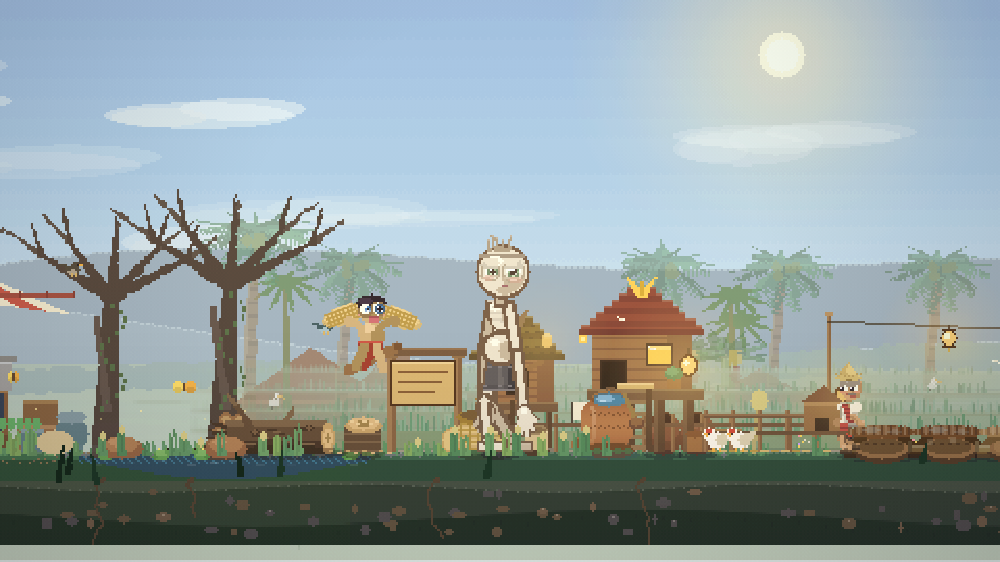 |

## The past comes back in pieces, and you play every one

There is no prologue explaining who you were. There are **four memories** and you
earn every one of them. They arrive without asking — you'll be walking
down the road and the world will white out — and each one is a short scene you
play rather than watch: letterboxed, a title in the corner, dust in the light,
and nobody narrating at you until after you've done the thing.

**The shelf.** Tap along the floor of a room you half know. Moving makes noise
and standing still lets it settle; fill the meter and the shape asleep on the mat
rolls over and mumbles. There is a bowl on the shelf with a coin in it. Take it.

**The gate.** Three taps. Each one empties the bottle and tips the whole horizon
further. Then you laugh past the temple gate, and the bell rings for you anyway.

**The scale.** Everything you took on one brass pan; one flower on the other. Tap
the two sides and the beam does lift — and then it sags right back, every time,
because that is the entire point. When you give up it slams, and the soil falls.

**Four bowls.** The last page, and the only one you can't do anything about. The
same room, years later, by daylight. A photograph on the altar of a young man who
still had hair. An old woman kneeling, setting out rice. Reach for the bowl —
your hand goes straight through, three times, and she never looks up. Then she
sets out a fourth.

Everything you recover is filed in the **PAST** tab of your ledger, one line per
page, and until the last one turns the ending will not start.

| | | |
|---|---|---|
| 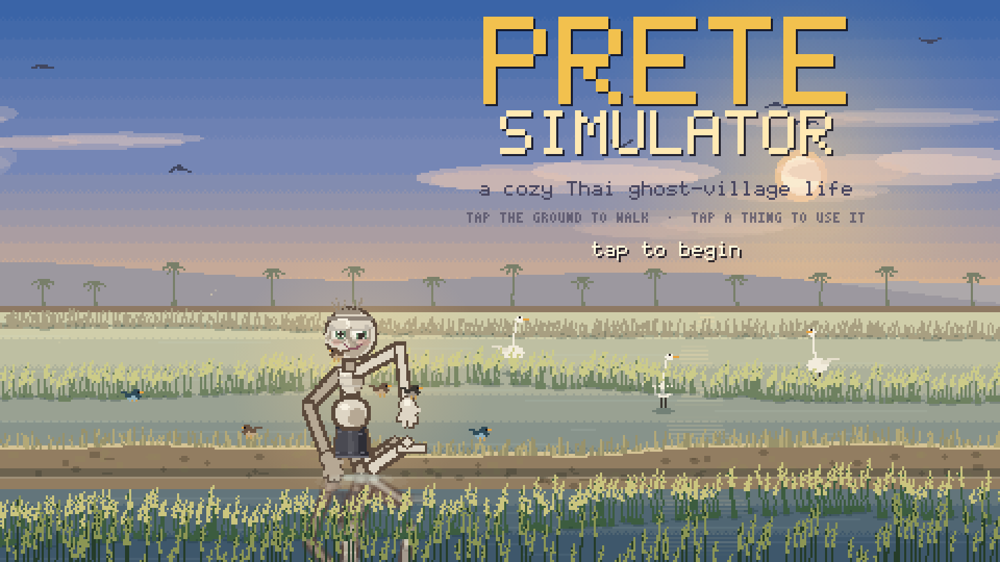 | 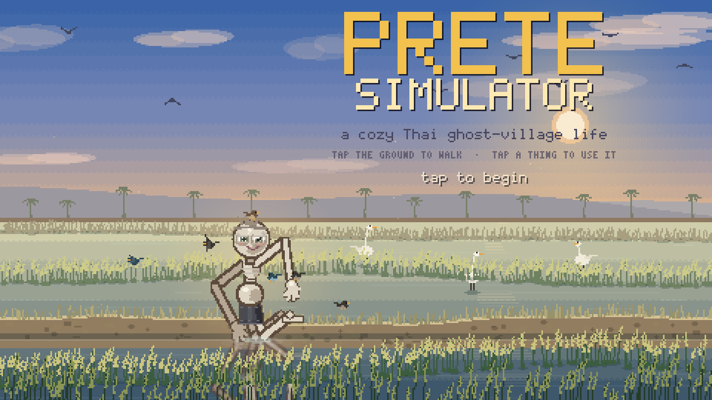 | 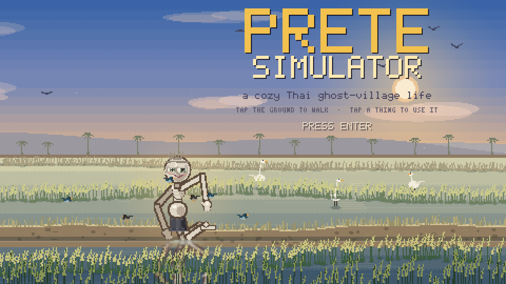 |
| 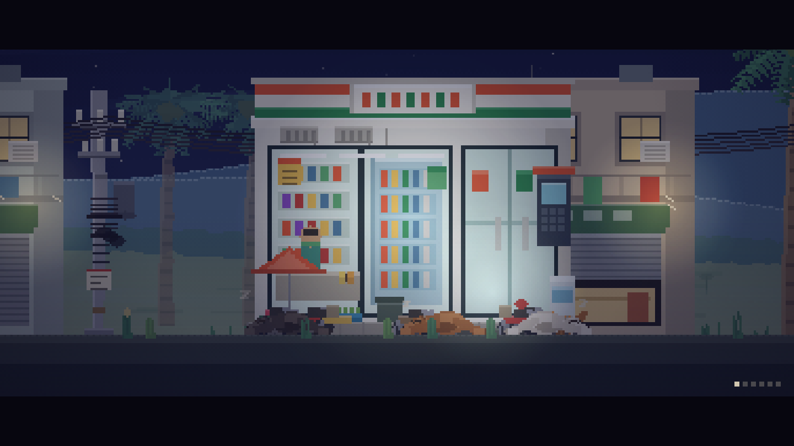 | 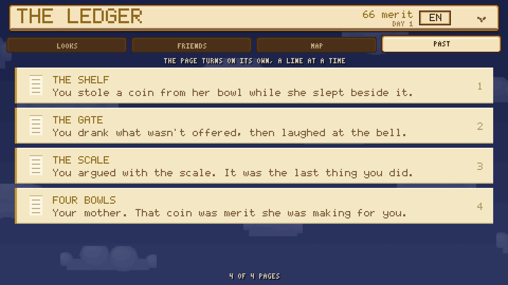 | 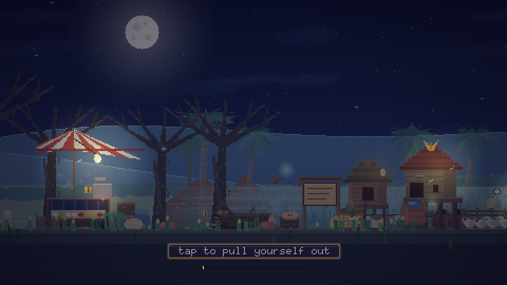 |

## The first night

The game opens with you under the ground, and the only control that does
anything is *pull*.

**Tap, and a hand comes up through the soil.** Seven of them and you are out,
kneeling in a burial field at three in the morning with your hands full of
somebody else's earth. A line of narration a tap — no speaker, so no cloud,
just the words low on the screen:

> *The earth does not want to let go. The earth is outvoted.*
>
> *There is a word for this, and you find you already know it. Prete. A hungry
> ghost. Somebody is paying for something.*

Then five more lines, and the last one is the whole of the tutorial: **far down
the road, one light is on.**

| | |
|---|---|
| 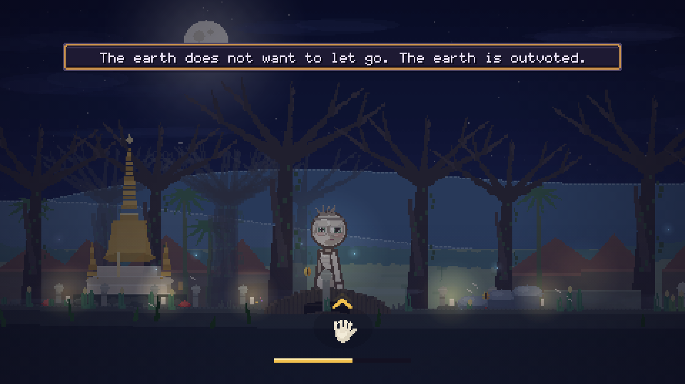 | 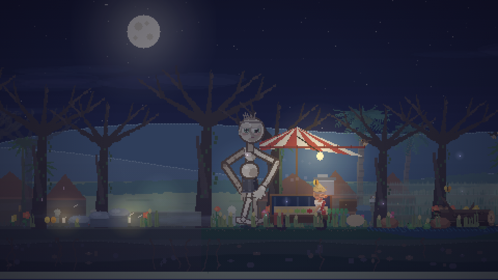 |

### Lung Somchai, who is not afraid of you

He has had that cart on that corner for thirty years. Drunks, monks, a
policeman who never paid, two elephants once in the same week. He looks at your
knees, then further up, and further up again, and puts the ladle down.

> **Lung Somchai:** *Ah. One of the hungry ones. My grandmother fed one on the
> back step every Wan Phra of her life.*
>
> **Lung Somchai:** *Well, I am closing. Nobody comes at three. Walk with me —
> the house is not far and there is rice in the pot.*

**Then you follow him home, and that is the whole scene.** He wheels off east
at an old man's pace and waits, with commentary, whenever you fall behind. On
the way: a dog called Daeng who barks at him too, and every other dog in the
village answering; his own field, dark and untouched for two seasons; a window
going out overhead as you pass under it; a hundred yards of sleeping houses.

At the house he puts a banana leaf of rice down on the step and steps back —
the way you put food out for a dog you have decided to like. **You get it as
far as your mouth.** The mouth is the width of a needle's eye and the rice is
rice. What comes through is the steam.

He stoops ninety pixels of leg down to the step for it, gets both hands under
it, brings it all the way up, tips his face into the bowl, and holds it there
with his hands shaking while the mouth opens as far as a needle's eye opens.
The lines land on the frame where it does not work. Then he puts it back down.

> *It is the first kind thing anybody has done for you and you cannot even do
> it properly.*

He tells you to sleep somewhere that is not the road. There is space under his
floor, between the stilts. The night passes in five lines and a gecko saying
its own name seven times directly above your head, and the sky over the paddy
goes the colour of the inside of a shell.

| | |
|---|---|
| 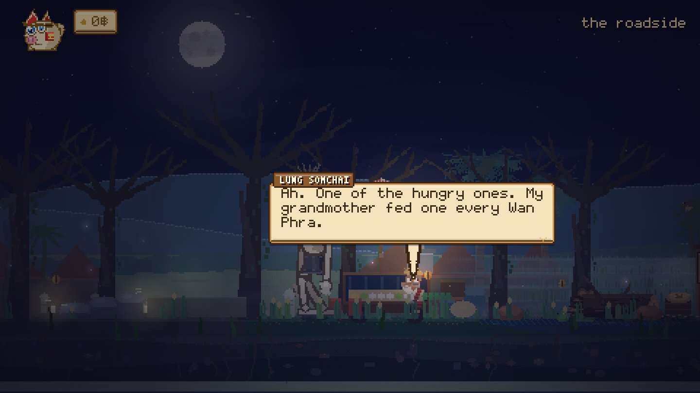 | 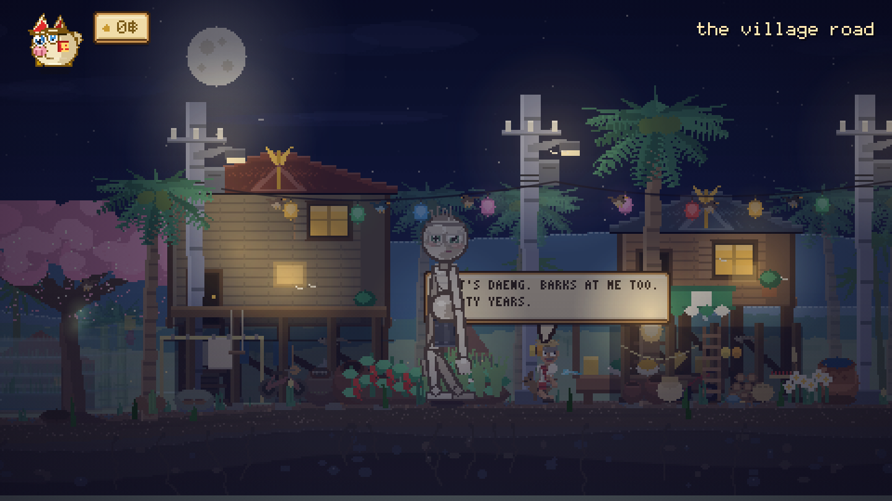 |
| 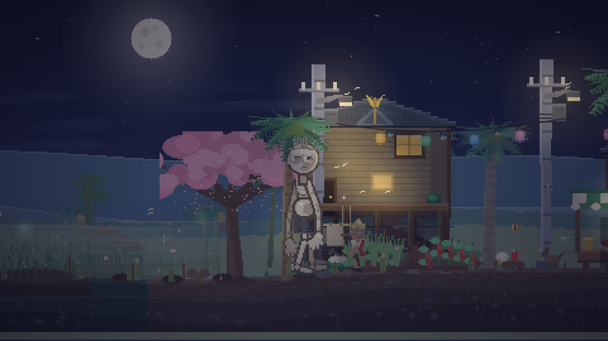 | 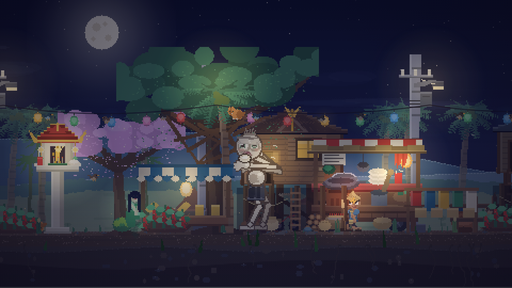 |
| 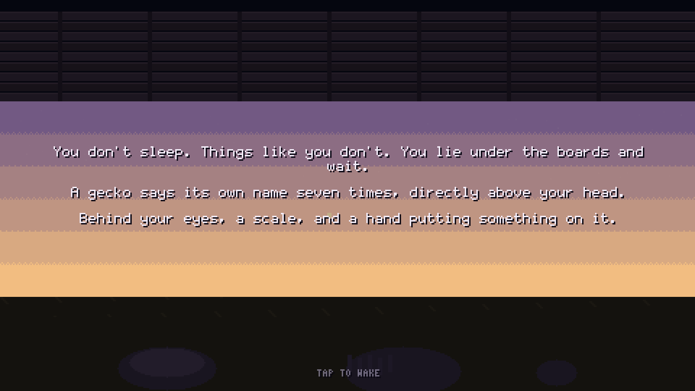 | 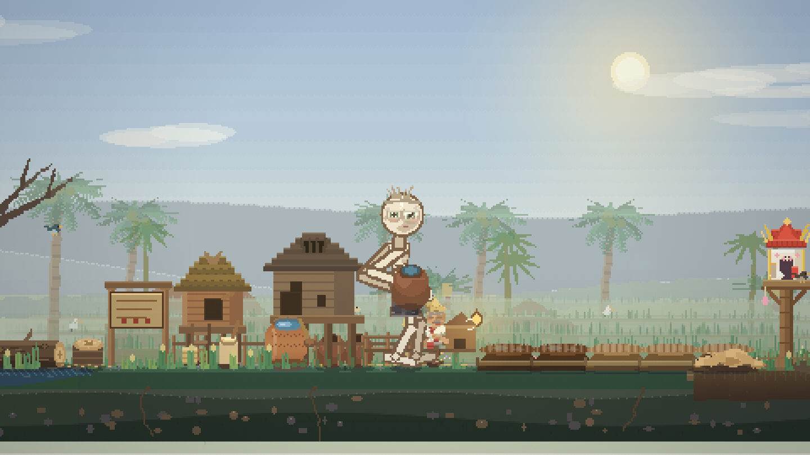 |

## The plough, the jars, and the seed

In the morning he is up before you, holding something, and he walks you west
past the hut to five beds that have gone to brick.

**The plough is the one mini-game in the first hour and the whole of it is one
idea: the ground pulls the blade, and you drive on the pull.** A marker swings
across a band under the furrow and the share dips with it. Land it in the green
and a slab of earth turns over with a noise like a door closing, the note goes
up a step, and the furrow gets a little longer; land it in the middle of the
green and it is a clean one, and the note goes up two. Miss and the blade skips
out of the ground, the combo dies and the swing slows down.

It gets faster every time you connect, so a bed always ends harder than it
started, and a bed turned without a single skip is worth two merit on its own.
Six bites a bed, five beds. Birds come down for the worms.

Then the ground wants water before it wants seed, and **the โอ่ง are things you
actually pick up**. Lift one, carry it — you walk slower, and you are visibly
carrying it — and either tip it over a bed or put it down wherever you want it
to live from now on. It holds three pours. Refill at the big jar by the hut.

He sows from the near end. You take the far one, a seed pressed in at a time,
and he will finish the field alone if you let him, at about a bed a minute,
saying *slowly, slowly, it all goes in the same ground.*

| | |
|---|---|
| 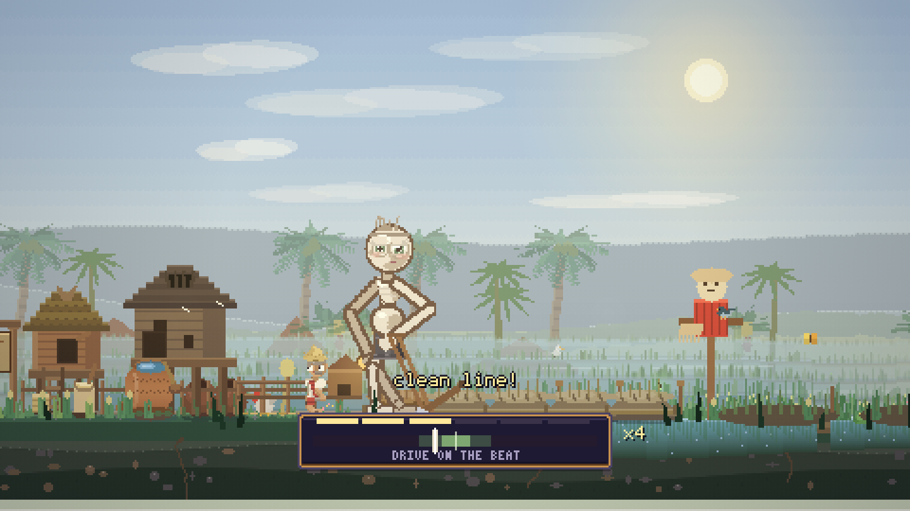 |  |

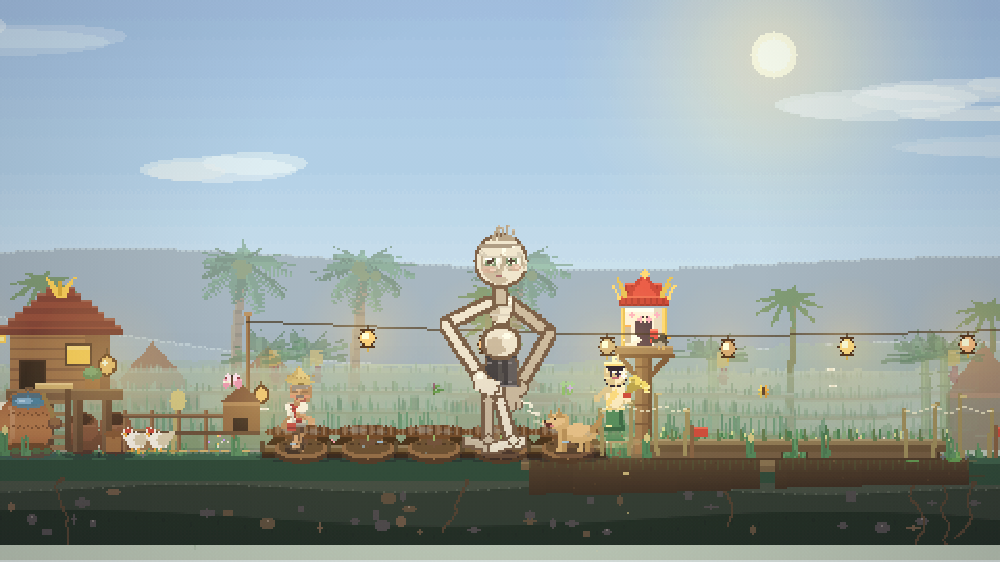

## What a ghost can do that a farmer cannot

The ledger has a fifth column now, **FIELD**, and every one of them makes *his*
work quicker rather than yours easier:

| Skill | What it does |
|---|---|
| **Water Yoke** · คานหาบน้ำ | a jar on each end, and no slower for it — two at a time, at walking pace |
| **Ploughman** · มือไถ | you know the pull now; the window to drive the blade is half again as wide |
| **Seed Shot** · พ่นเมล็ด | hold a seed behind that needle of a mouth and put it in a bed from clear across the field |
| **Long Draught** · อึกใหญ่ | drink the jar — all of it — then stand at the end of a row and give it back |

Seed Shot arcs a grain across the field and thumps it into the soil from ninety
pixels away. Long Draught waters every turned bed within eighty pixels at once,
in one sweep, and looks completely ridiculous. Both of them are the same joke:
the body that is a punishment turns out to be extremely good at farming.

## Mae Posop, who owns the field

**แม่โพสพ.** Thai farmers have apologised to her for centuries — for dropping a
grain, for stepping on a fallen ear, for cutting when she was still carrying.
She is not a quest-giver with a marker over her head. She is standing in your
paddy because it is her paddy too, and it has stood empty two years and she has
taken it personally.

> **Mae Posop:** *You cannot eat. Good. Then you will not be tempted to keep any
> of it.*

She teaches the whole of a rice crop, one step at a time, in the order a field
actually happens — and she comes to meet you along the bund while she is doing
it, so the one character who explains the game can never end up somewhere you
can't reach:

| | |
|---|---|
| **Seed** | there is a sack of it in your barn, by the gate |
| **Water** | the โอ่ง in the shade of the house has never once run dry |
| **Mud** | let the water in, and put the seed down into it — gently, it is somebody |
| **Waiting** | keep the water up and let it alone. Rice has never once been hurried |
| **Thanks** | it is bowing. That is it asking. Cut it, and say thank you out loud |

She used to be the first thing in the game and the reason the road east was
shut. She is not any more: the old man's morning is the opening now, and there
is no wall of mist across the one route the story takes. **She is a thing you
find**, standing in a paddy nobody has worked, once the first field is in — and
the rice crop she teaches is the whole second act of the farm.

| | | |
|---|---|---|
| 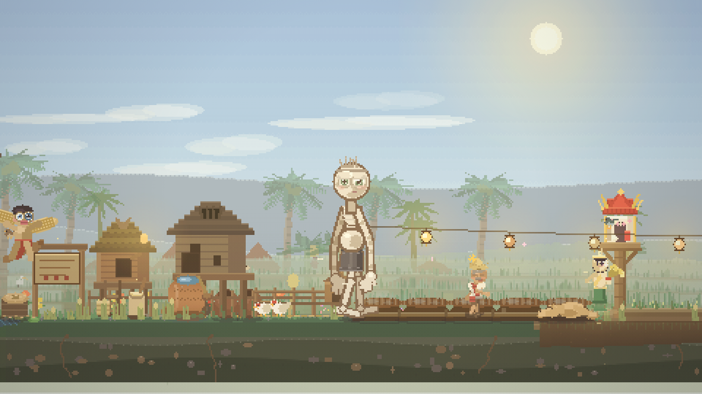 | 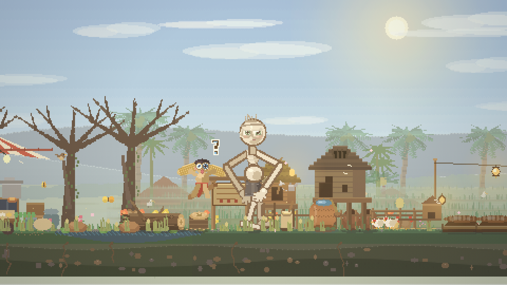 | 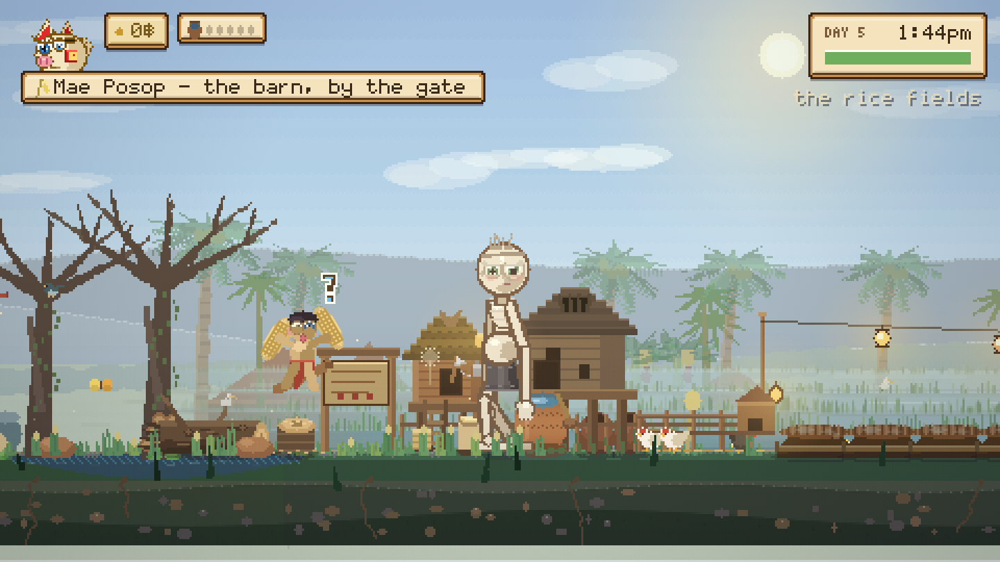 |

## The interface is one wooden box, cut from the same plank

Every panel, bubble, tag and menu is a **carved wooden frame** — a dark plank
edge, a lit inner bevel, a parchment field — and every one stays exactly inside
its own rectangle. Your merit sits on a small plaque in the top left and the day,
the clock and what's left in you on another in the top right; what you're
carrying sits on a **toolbar** along the bottom, one slot per thing, the way a
farming game does it. That is the whole permanent interface: two plaques and a
row of slots, and nothing else is on screen unless you are standing next to it.
Nobody speaks from a box at the bottom of the screen: the words come out of the
head they belong to, in a cloud with a tail, and only one voice talks at a
time.

Nothing in the interface is a font character standing in for a picture — the
ticks, hearts, stars, arrows, flowers, prayer beads and the book on the menu
button are all drawn from pixels. **So are the letters.** The game carries two
hand-drawn bitmap faces — a 5x7 for everything and a 3x5 for the small print —
and every glyph lands on whole pixels at whole-number scales, which is why the
text is sharp instead of smeared.

## A day

The unit of this game is a day, and it is the Stardew Valley shape on purpose:
**the clock, the bar, the basket, the bed.**

**Six in the morning to two the next night.** The clock in the top right is the
real one — the sky reads off it rather than the other way round, so half past
six is orange because it is half past six. It runs at about three game-minutes
to the second, which makes a full day something like six or seven real minutes
of work.

**A bar, not a stamina meter.** Every job on the farm costs something out of it:
turning a bed, watering, picking, flooding a paddy, chopping, catching. Empty it
and nothing dramatic happens — the game simply stops letting you work, and if
you stand there empty for six seconds the prete lies down where he is and the
night takes him. You lose the rest of the day, which is Stardew's rule, and no
more than that.

The one thing that fills it back up is **merit** — which is the only mechanic
here that had to be reinvented rather than borrowed, because Stardew refills the
bar with food and a prete cannot eat. Doing a kind thing for somebody puts the
strength back in your arms. That is the whole theology of the game in one
number: the only way to keep working the land is to keep being decent to the
people on it.

**The basket by the gate.** You are never paid at the counter for a crop. You
put it in the basket outside your gate, somebody comes for it in the night, and
the coins are there in the morning.

**Sleep is the only thing that moves the day on.** Lie down under the farmhouse
and the night passes in one fade: the basket is emptied and paid, every watered
bed moves a stage, the flooded paddies count another night, the trees grow, the
animals leave you something, the ghosts you hired do a night's work — and you
wake to **a card that tells you exactly what the night did**, which is the only
screen in the game that stops the world.

| | | |
|---|---|---|
| 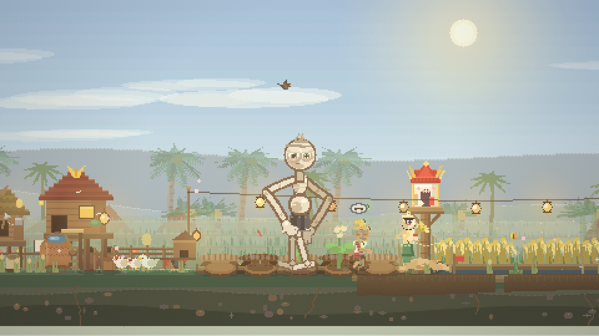 | 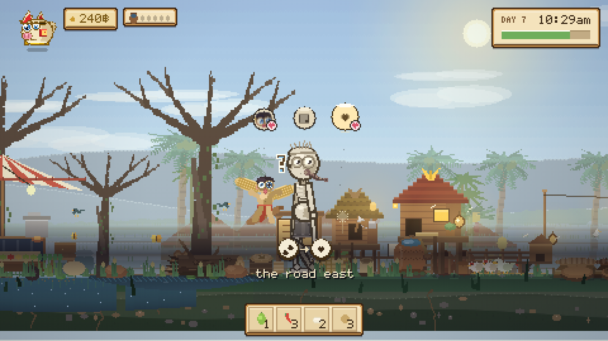 | 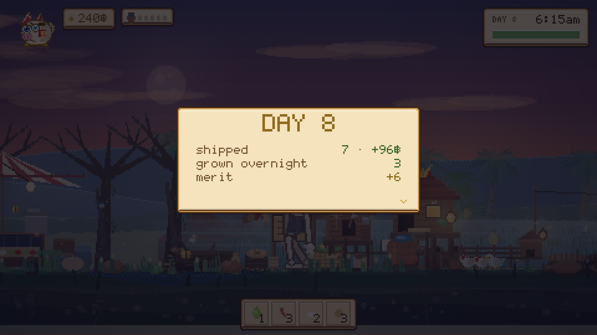 |

**Hearts, and one present a day.** Everybody in the village and every ghost has
ten hearts. Turning up and talking to somebody counts once a day; a present
counts for a lot more, and the thing they have actually been hoping for counts
for most of all — but only one present each, per person, per day. A friendship
made in one afternoon with a full basket is not a friendship. The FRIENDS page
of the ledger is the row of hearts.

An order is not a present, though, and never counts against the day's one: when
somebody has asked you for two bowls of something by name, you can hand over
both.

## The farm

Out west in the rice fields there is a shack with a hole in the roof, an empty
pen, and a notice still nailed to the gate. **One hundred and twenty baht and it
is yours** — the first bed, a handful of seed, and every other thing on the
place for sale on the board by the gate: another bed, a rice field, a hole for a
tree, a sapling, a chicken, a roof that keeps the rain out.

| | | |
|---|---|---|
| 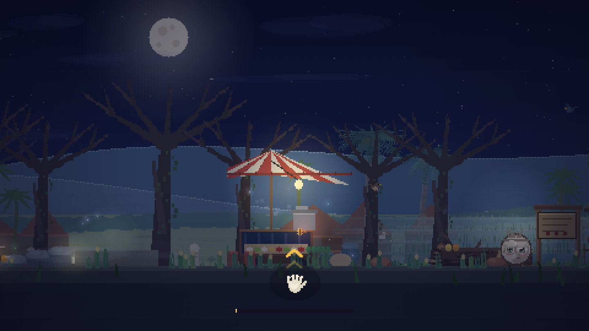 | 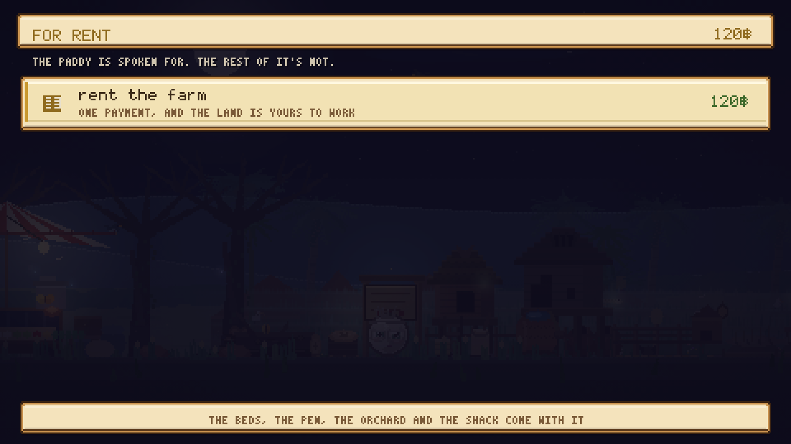 | 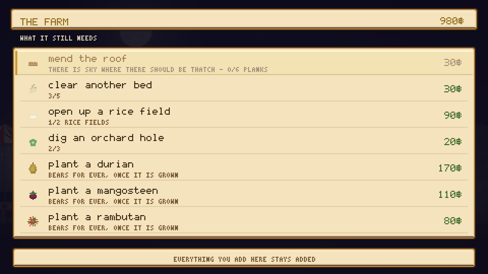 |

**A barn, and a water jar.** Seed comes out of a **ยุ้งข้าว** — a rice granary
up on four posts, with a ladder and a hatch — and the tools you have earned hang
on the wall of it, so the skill tree has somewhere in the world to show up.
Water comes out of the **โอ่ง**, and it is a trip rather than a click: the jar
never runs dry, but you can only carry two waterings at a time until you go and
earn a proper can.

**Five dry beds.** One crop to a bed — green papaya, chilli, holy basil,
galangal, morning glory. **Sow, water, sleep, pick.** A watered bed moves on one
stage in the night and a dry one does not move at all, so watering before dark
is the whole job. There is no signboard on a stake telling you what is in it:
walk up to a bed and what is growing there fades in over the soil, and fades
out again behind you.

**Two นาข้าว.** A rice field is a different animal: a bunded box you flood, sow,
and then keep flooded, because rice in a dry paddy simply stops and waits. It
takes two flooded nights to a stage instead of one, and pays four rice, two bran
and two seed — and while it is standing there full of water it holds the moon in
it.

**Three fruit trees.** Buy a sapling and put it in a hole and then *wait* —
durian, mangosteen, rambutan take eight nights to come up and then bear every
second night for the rest of the game. A durian is worth thirty-six baht on its
own, which is most of a bed's whole crop.

**A pen.** Chickens, ducks and one very large water buffalo. Keep rice bran in
the trough and they leave you eggs, duck eggs, buffalo milk and manure every
little while. Stop feeding them and they simply stop — nothing on this farm can
die, they just look at you about it.

| | | |
|---|---|---|
| 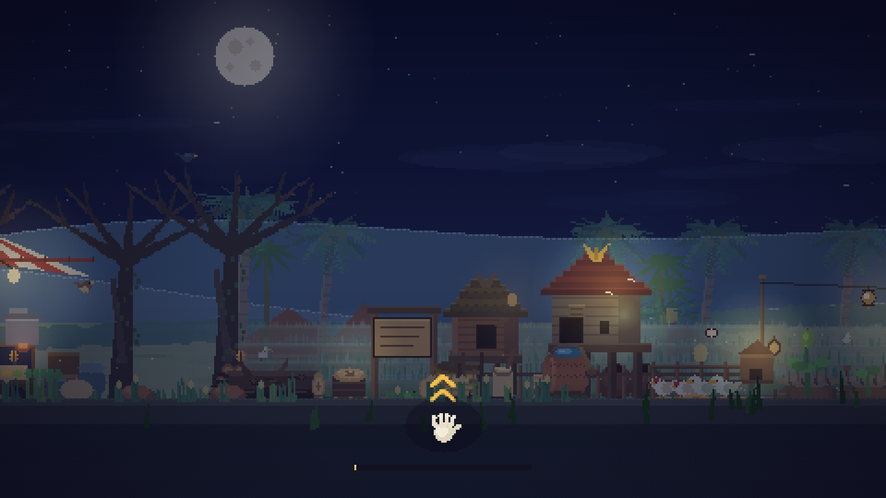 | 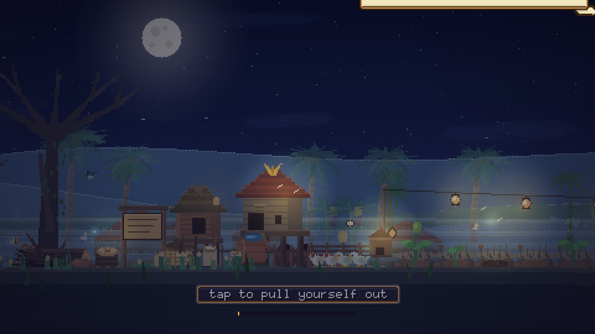 | 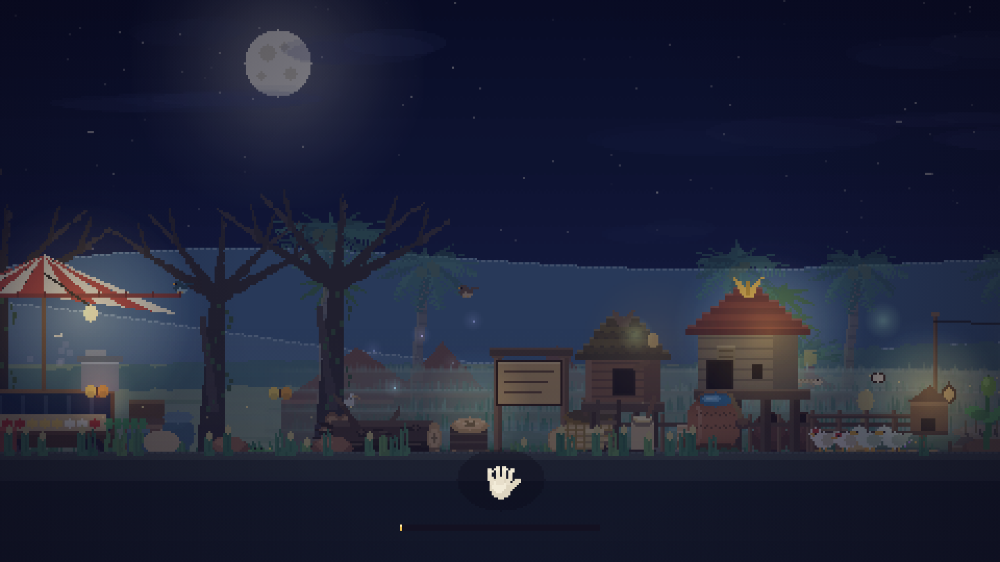 |
| 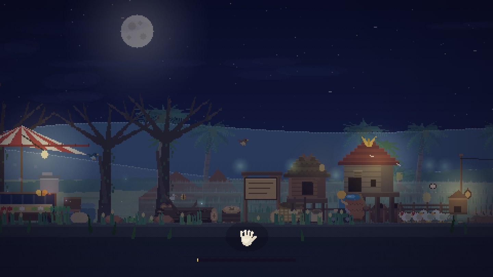 | 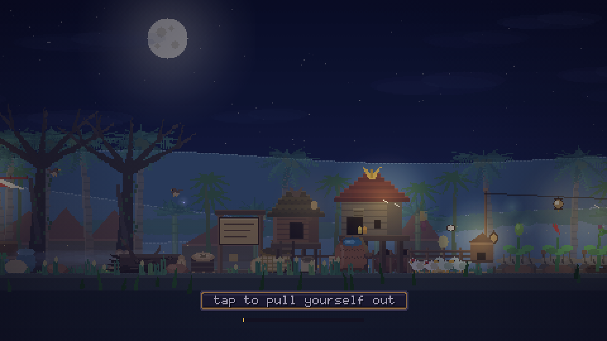 |  |

Every one of those is a *gesture*, not a menu tick: he folds ninety pixels of
leg into a crouch, reaches both long arms down to the soil, and the thing
happens at the moment his hands actually get there.

## Ghosts make good farmhands

Feed a hungry ghost the thing it has been waiting a century for and it becomes
your friend. Ask a friend for help and it stops haunting its patch of road,
comes to the farm, and takes a job:

| Who | What they do |
|---|---|
| **Kong Koi** hops the row with a bucket | waters any bed that has gone dry |
| **Krahang** flies in on his baskets | picks whatever is ripe and puts it in your basket |
| **Phi Pop** minds the trough | keeps bran in front of the animals |
| **Krasue** floats the dikes at night | keeps the water up in the นาข้าว, and cuts the rice |
| **Tai Hong** stands under the trees | brings the fruit down |

They keep at it whether or not you are on screen, they wear a small badge
saying what they are doing, and you can send any of them back to the road from
the board at the gate. One job to one ghost.

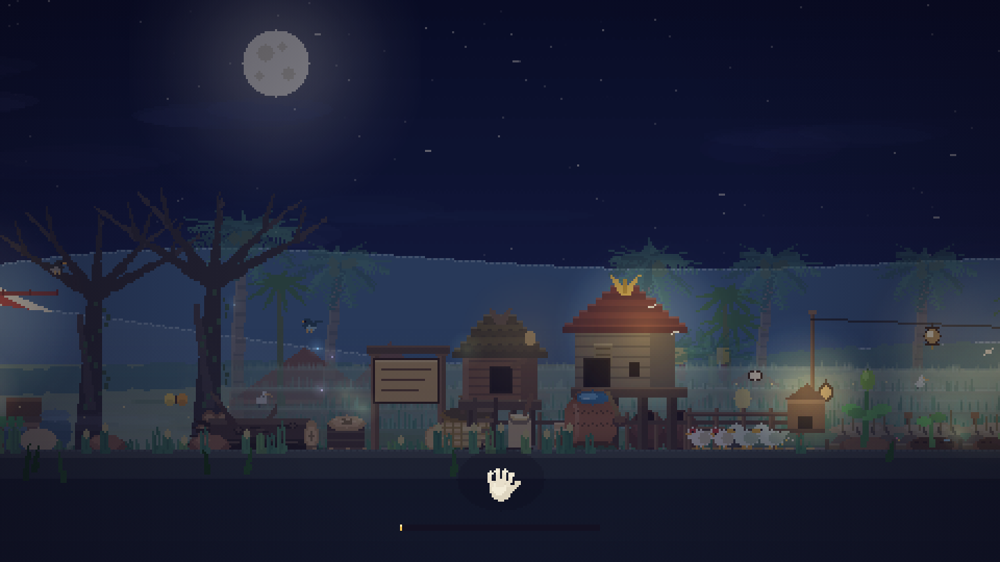

## Things that fly at dusk

Six of them, each drawn and each moving its own way, because that is the whole
pleasure of it: you learn that a dragonfly hangs perfectly still and then darts,
that a firefly cannot be hurried, that a grasshopper only goes when you get
close, and that a rhinoceros beetle does not care about you at all.

| | |
|---|---|
| **หิ่งห้อย** firefly | drifts over the water after dark and blinks · 14฿ |
| **แมงปอ** dragonfly | hangs still, then darts. Paddies only · 18฿ |
| **จักจั่น** cicada | clings to a trunk and shouts about it · 22฿ |
| **ด้วงกว่าง** rhinoceros beetle | walks a branch at night, horn first · 34฿ |
| **ตั๊กแตน** grasshopper | one enormous hop at a time · 11฿ |
| **ผีเสื้อ** butterfly | never in a straight line · 16฿ |

You need the net from your ledger, and then it is a swing rather than a click:
you get three, the hoop has a real radius, and the bug is living its own life
the whole time. Miss and it bolts. A beetle is worth more than a day of papaya,
which is exactly why children in this village spend the whole of dusk in the
long grass. Catch all six and the ledger notices.

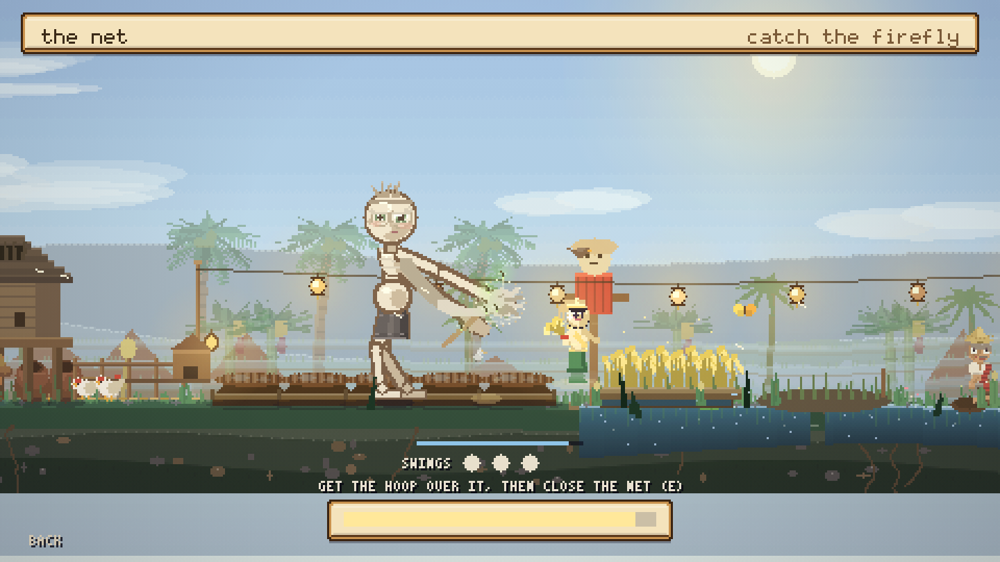

## And everything else that lives here

A village at night is not empty and a village in the morning is extremely not
empty. None of this does anything for you. That is the point of it.

**Birds** sit on the wires between the streetlamps, on the fence rails and up in
the trees, hopping about and turning round. They will not stay while a nine-foot
ghost goes past: get within forty pixels and they go up in a clatter, wheel
about for a few seconds, and come back to *near enough* the twig they left,
which is the whole charm of a bird. Whistle and you clear a hundred and fifty
pixels of them at once. Turn a bed over and they come down for the worms.

**Dogs** — three of them, and they have opinions about you at two in the morning.
One barks, the others answer, and the rest of the road stays asleep through it.
Hold out a hand and it will smell it for a long moment, the way a dog does when
it is making a decision about you; then it leans on your shin, which is as high
as it can reach, and after that it is your dog and you can scratch its ear.

**Chickens** peck and scratch under the houses and scatter when you get close,
and roost when it is dark. **Frogs** sit at the pond and out in the flooded
paddy and hop away from you in exactly the wrong direction. **Geckos** live on
the walls and are mostly a noise — ตุ๊กแกกกก, seven times, at the worst possible
moment. **Squirrels** work the banana grove. **Butterflies and dragonflies** are
out all day; **fireflies** replace them at dusk.

**And the grass parts.** Every tuft within a couple of hundred pixels is a
little spring with a rest position set by the wind. Walk through and they lie
down and come back up behind you; so do the chickens, and so does the old man.
Push through enough of it and something comes out — a butterfly, a dragonfly, a
grasshopper, a bird, or at night a firefly that was sitting in there the whole
time.

## Seven thousand pixels of country

Nine named zones, west to east: the burial ground, the roadside where his cart
is parked, the rice fields and the derelict farm, the village road, the spirit
house, the banana grove, the temple, the old forest, and — new, and worth the
walk — **the deep country**, where the road runs out into palms and bananas, a
stream with three stones across it, and fallen trees thick enough to stand on.
Nothing lives out there but birds and the noise of them.

The same road at two in the morning and at nine is not the same road. At night
it is lamps and lit windows and a hard dark between them; by morning the far
ridge has gone half to haze, the windows are open with washing hung in them, and
you can see how much of the village is actually chickens.

| | |
|---|---|
| 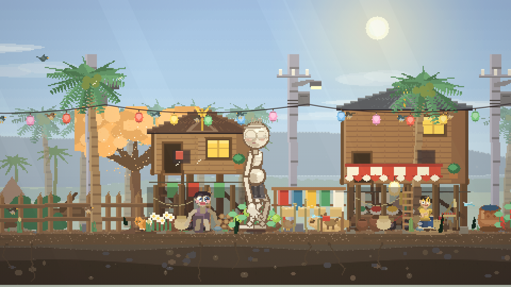 | 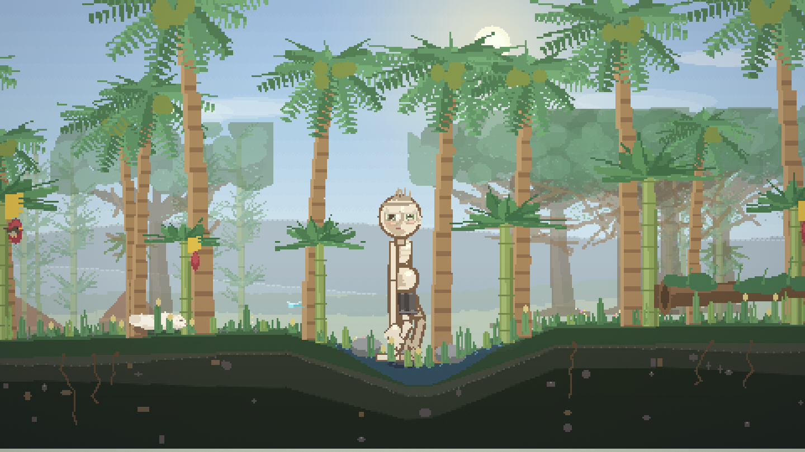 |
| 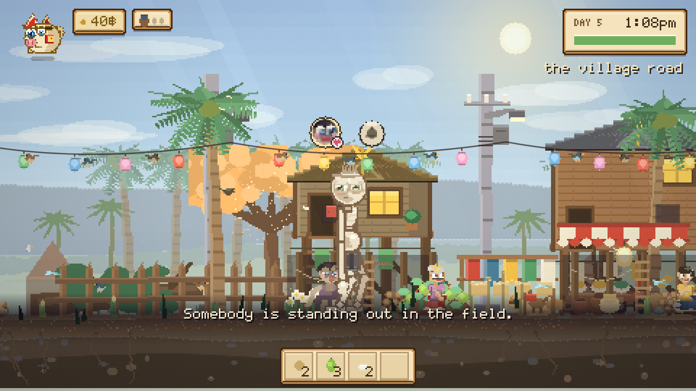 |  |

## Planks, and a roof that keeps the rain out

There is a fallen trunk and a chopping stump on the track outside the gate. With
an **axe** you can hold to wind up — the axe rises, an arc fills, it gets heavy —
and let go to strike. Line up on the wedge and a plank splits off; miss and it
bounces and you feel it. Four to a session.

The shack then goes up in **three stages, paid in planks rather than only baht**:

| | | |
|---|---|---|
| **mend the roof** | there is sky where there should be thatch | 6 planks · 30฿ |
| **board the walls** | and a shutter that closes | 9 planks · 55฿ |
| **lay a proper floor** | somebody could live here again | 12 planks · 80฿ |

And the building changes at every stage — a hole through the ridge, then a mat
tacked over the gap and planks stacked ready, then a lit window and a lamp by
the door, then a ladder worth climbing, a mat at the top of it, and something
green in a pot. A prete has no use for a house. You build one anyway.

| | |
|---|---|
| 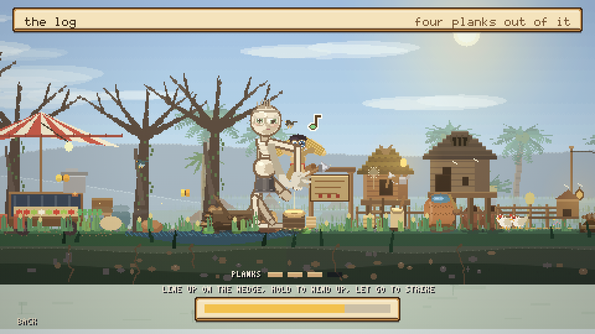 | 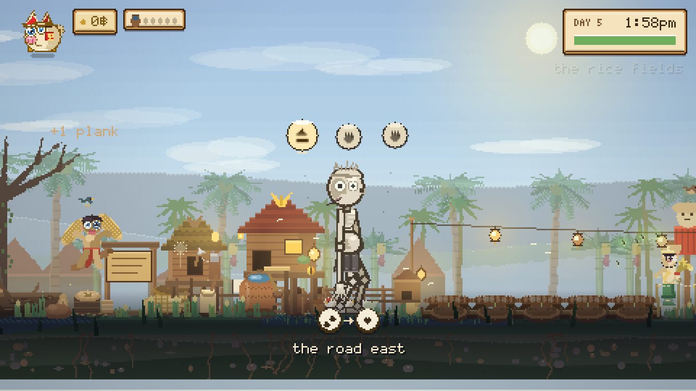 |

## Money, and orders

**P'Nok sells; she does not buy.** She used to take anything off you over the
counter, which made the basket by your gate pointless — so now her stall is
where seed and bran come from, and the crop goes in the basket. She says so if
you try. A dish is still always worth more than the sum of its parts, which is
the entire argument for owning a stove.

**And the village orders supper by name.** Up to three standing orders at a
time — *P'Nok wants 2 Tom Yum · 122฿* — printed across the top of the screen,
listed in full on the board by the stall, and repeated out loud if you go and
ask the person yourself. Cook it, carry it to them, and they pay in coins *and*
merit. It is the only thing in the game that pays both.

| | |
|---|---|
| 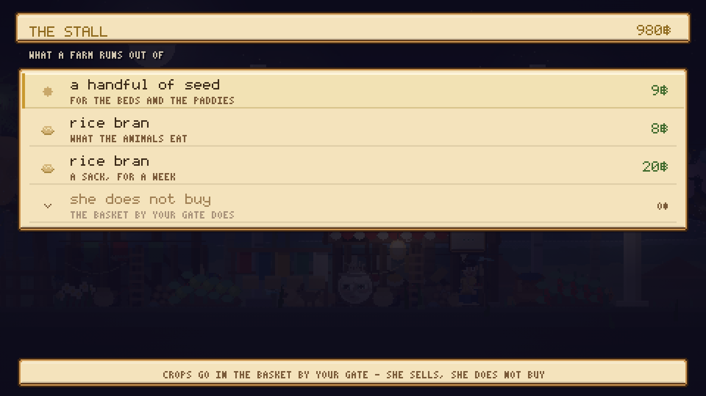 | 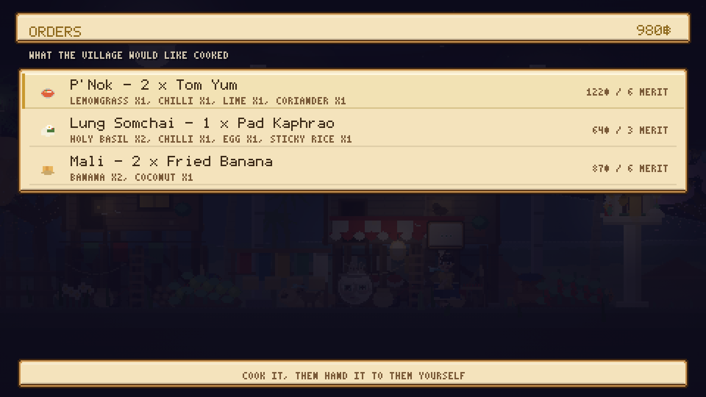 |

## What else you do

**Pick things.** Rice and coriander in the paddies, chillies and lemongrass in
the gardens, jasmine in the flower patches, bananas and mango and banana leaf in
the grove, bamboo in the old forest, river clay by the pond. Everything regrows.

**Cook things.** Lung Somchai leaves his clay stove burning all night and is too
old to be precious about it. Five real dishes — papaya salad, mango sticky rice,
tom yum, fried banana, coconut cakes — each cooked through two hands-on steps:
pound in the mortar on the beat, keep the steam in the green band, flip when it's
golden, plate it nicely.

**And then it is plated properly.** Nothing you make is an inventory icon. Each
dish is served the way it would actually arrive: papaya salad heaped on a banana
leaf with a lime wedge and dried shrimp, sticky rice moulded beside sliced mango
and drizzled with coconut cream, tom yum steaming in its bowl with lemongrass
laid across the rim.

| | | |
|---|---|---|
|  |  |  |

**Make things.** A mat outside the stall, and five things to weave: a jasmine
garland, a folded banana-leaf float, a winnowing basket, a paper lantern, and a
small roadside shrine — each one shown finished and turned in the light before it
goes in your basket.

**Help.** Four jobs nobody else can reach, each a hands-on minigame where you
steer your enormous hand directly: splice the dead streetlight while the current
kicks, lift a fallen tree off the road and keep it level, hang Phra Phum's fallen
garland, and lift the cat down from the tamarind — slowly, because she isn't
afraid of big, she's afraid of *sudden*.

| | |
|---|---|
|  |  |

**Give it away.** Merit is the ledger; coins are the landlord. Every made thing
in your basket is a choice between the two.

## Little scenes

The first time something happens to you the game takes three seconds to notice
it. Two black bars slide in, the rest of the road steps back into shadow, a pool
of warm light stays on whoever it is about, and one line types itself along the
bottom — the first seed you push into the ground, the first thing you grow, the
first person who asks you for something, the first dead neighbour who is kind to
you back.

They play **over the world where it stands**, on the real characters, with the
camera leaning onto them. Nothing pauses to a menu, nothing loads, nothing is
locked behind one, and a tap gets you out. Each one plays exactly once, ever.

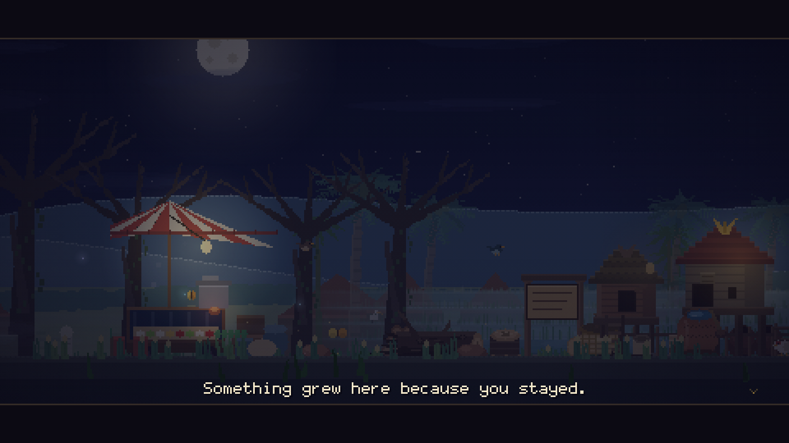

## Ascend, and be blessed

Merit is both your progress bar and your currency, and spending it never costs
you progress. But you don't just *tap* a skill and own it.

Choose one and the world drops away: the sky goes to dawn, god-rays open, and you
rise through streaming clouds — hold to climb, lean to drift. At the top there is
a terrace of cloud with a gold rail, and a **deva** waiting on it, one of three
depending on which branch you're climbing:

| Branch | The god who meets you | What they grant |
|---|---|---|
| **body** | **Mae Thorani**, the earth goddess wringing water from her hair | strength, stride, a lighter body |
| **hands** | **Witsanukam**, patron of every craftsman | steady hands, deft weaving, a divine tongue |
| **heart** | **Phra In**, Indra of the thirty-three | an inner eye, a cool heart, loving-kindness |

They say something to you, and then you hold to receive it — a beam comes down,
the gauge fills with gold, and the skill is *given* rather than bought. Then you
descend, and the ledger is waiting where you left it.

| | | |
|---|---|---|
|  |  |  |

## The Ledger and the map

Five wooden tabs over a drifting sky: **skills**, **looks**, **friends**, the
**past** — your recovered memories, one flat page each, blank and question-marked
until they come back, with a red dot on the tab when there's one you haven't read
— and the whole 7,200-pixel road drawn as a **map**: nine named zones along the top, every
stove, shrine, workbench, pond and grove pinned on four tiers so nothing collides,
your five ghost friends on their own row, a marker where you're standing, and one
line at the bottom telling you what to do next.

Every card is a tap target: tap it to read it, tap it again to choose it.

The skill tree runs down four columns, and the last one is **tools**:

| BODY | HANDS | HEART | TOOLS |
|---|---|---|---|
| Giant Stride | Steady Hands | Merit Magnet | Sickle |
| Palm-Leaf Reach | Divine Tongue | Inner Eye | Watering Can |
| Carrying Pole | Deft Weaving | Cool Heart | Bug Net |
| Light Body | Two Hands | Loving-Kindness | Axe |

**Tools are the cheapest column in the game on purpose** — two merit for the
sickle — because the farm needs them to open up at all and nothing there should
ever be a wall. Each one changes what your hands can do, and each one appears
hanging on the barn wall once it's yours. And it is **Mae Posop** who meets you
at the top of the climb when you ascend for one: the rice mother handing you a
sickle is a different kind of blessing from a god handing you a virtue.

**Inner Eye** is the one to save for: it shows a little thought-cloud over
everybody's head with the thing they're quietly hoping for, so you never have to
guess. There's also a wardrobe of five hand-woven sarongs, a garland, a sabai
sash, 108 prayer beads and gold leaf — all simulated cloth, not swapped sprites.

| | | |
|---|---|---|
|  |  |  |

## Everybody is friendly, including the frightening ones

Thai folklore's most feared night spirits live here, and every one of them is a
neighbour with a small problem:

| Who | The story about them | What they actually want |
|---|---|---|
| **Kong Koi** | a one-legged forest spirit who drinks from sleeping travellers' toes | he's too shy to try, has no teeth, and would like something soft — mango sticky rice |
| **Krahang** | a man who flies at night on two rice-winnowing baskets | he came down hard in the paddy and both baskets are kindling. New ones, woven properly |
| **Phi Pop** | blamed for every stomach ache in four villages | has never possessed anybody. Wants a hot bowl of tom yum, handed over by somebody who isn't backing away while they do it |
| **Krasue** | a floating head trailing her own glowing entrails | leaves her body in the forest each night and can never find it again. Cheerful about it. Needs a lantern |
| **Tai Hong** | died badly on this road and simply stayed | not angry. Not anything. Just still there, waiting to be noticed. Wants a small shrine so people know somebody was here |

Plus five villagers, a monk who isn't supposed to want anything and would still
like a leaf float, and a cat.

## It speaks Thai, properly

There is a language key in the top right of the ledger. Press it — or **V** —
and the whole interface, every place name, every item, every skill, every prompt
and every thing a bed can be told to do turns over into Thai.

Thai is genuinely hard to draw at this size: forty-four consonants, vowels that
sit above, below, in front of and behind the consonant they belong to, and four
tone marks that stack on top of the ones already up there.

I did try hand-drawing it, the way the Latin face is hand-drawn — all 56 glyphs
the game actually uses, with the mark-stacking engine to go with them. At a
6×8 cell it was not legible: Thai letters are told apart by the position of a
small head-loop, and a loop two pixels across is a blob. Half the consonants
came out as the same shape. So that got thrown away.

What ships instead **rasterises the reader's own Thai face and downsamples it
to one bit properly** — drawn four times oversized, then each real pixel is
turned on if the glyph actually covers a third of it. Thresholding an
anti-aliased render, which is what it used to do, ate exactly the strokes Thai
cannot spare: the head-loops and the tone marks. It also draws Thai a third
smaller than before, because the layouts are measured for a 5×7 Latin cell and
Thai has to sit in the same box — at the old size every label in the ledger ran
into the column beside it.

The art for the face that did not work is kept in [`th/glyphs.py`](th/glyphs.py)
with a note on why, in case somebody wants to try it at a bigger cell.

Two more things had to be true before it counted as working:

- **A line that is half Thai and half not** — `+2 ข้าว`, `ต้องใช้ 6 แผ่นไม้`, a
  price with a number in front of it — is split into runs and each run goes to
  the face that owns it. The whole string used to go to the Thai face, so a
  number inside a Thai sentence looked nothing like the same number on the
  plaque beside it.
- **A device with no Thai font at all** renders every Thai codepoint as the same
  rectangle. The game checks for that once, by rasterising a real Thai letter
  and a private-use codepoint and comparing them, and if they come out
  identical the language switch declines and says why. A language of identical
  boxes is worse than no translation.

Thai has no spaces inside a word, so a long Thai run is broken by character —
but the Thai here uses spaces between *phrases*, and breaking by character
regardless split those in half. It breaks on the spaces first now, and only
chops a phrase when that one phrase is wider than the line.

**All of it is translated now, and that is checked rather than believed.** The
translation happens at the drawing boundary — every string in the game goes
through one lookup on its way to the screen — so the way to find what is still
speaking English is to hook that lookup, walk the game through every screen
there is, and print what came past untranslated. That sweep ships with the game
as [`th/sweep.js`](th/sweep.js); it visits the title, all ten chapters of the
first night, every panel of
the ledger, the stall, the order board, the kitchen, the workbench, the give
screen, the morning card, all four memories, the ceremony and the end card, and
drives the prete the length of the map at four different hours. It reports 438
strings drawn and, as of this build, **nothing untranslated**.

Anything glued together out of fragments had to be taken apart for that to be
true: `'DAY ' + 8` and `cost + ' merit'` and `'road, still blocked' + ' · ' +
'garland, still fallen'` were each one string too long to look up, so each half
is looked up on its own. The clock is not a translation at all but a different
convention — Thailand does not say *half past four in the afternoon* on a clock
face, so in Thai it reads `16:30น.`

Some words stay Thai in both languages, because there is no English for them
and the English would be worse: **นาข้าว** for a bunded flooded rice field,
**โอ่ง** for the big glazed water jar that stands in the shade of every house,
**ยุ้งข้าว** for the granary up on its posts, and **แม่โพสพ** for the woman
standing in your paddy.

| | | |
|---|---|---|
| 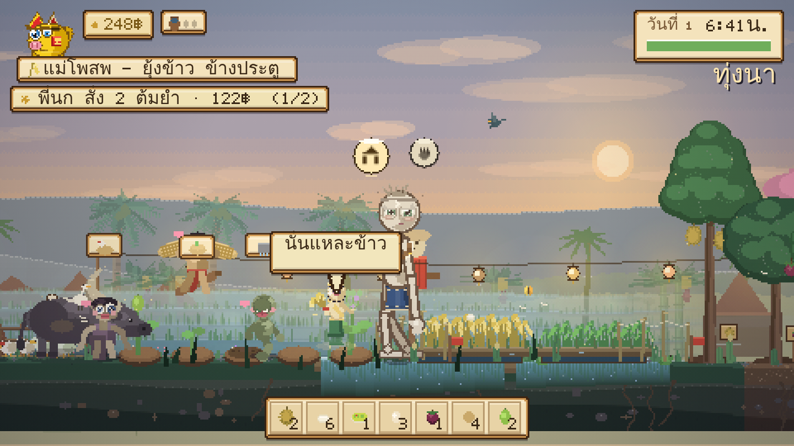 | 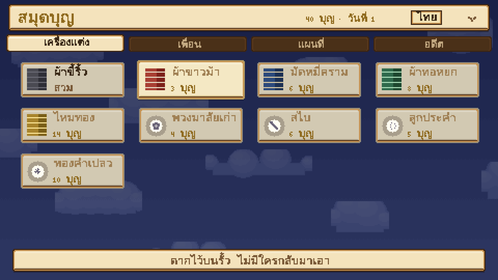 | 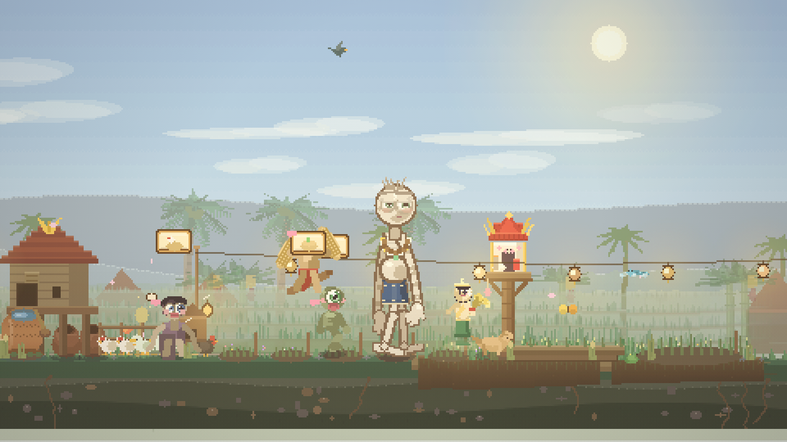 |

## Everyone talks to you differently depending on how well they know you

Nobody in the village has one line. Each of them has a register for a stranger,
a register for somebody who has fed them, and a register for asking — and asking
is the one that matters, because it is the only place in the game where a person
tells you plainly what to go and do:

> **Yai Pen:** *Eighty-one. I can still climb a ladder. That is what worries them.*
> **Yai Pen:** *If I ask my son he will take a week. If I ask you it is done tonight.*
> **Yai Pen:** *Bring me 2 jasmine. Then we are square.*

Feed them once and the first line changes for good.

## Nothing announces itself

There is no signpost anywhere on this road any more. There were six, each a
slab of painted lettering standing in the middle of a village at two in the
morning, and every one of them was the loudest thing in its own picture. The
place names itself instead: walk into the banana grove and *the banana grove*
fades in at the top of the frame and fades out again.

The farm had its own version of the problem: a painted marker board on a stake
over every bed, five of them in a row, so the field you were supposed to be
proud of looked like a car park. Those went too. **Walk up to a bed and what is
growing in it fades in over the soil**, and fades out again behind you — which
is the same rule, applied to a thing rather than a place.

Nothing gets a banner. Merit, rice, a plank, a coin — whatever you just earned
comes off the thing that gave it to you and drifts up out of the world, small,
where it happened. Two at once stack rather than printing through each other.
The one hint the guide has for you sits low on the screen like a subtitle and
then goes.

| | | |
|---|---|---|
| 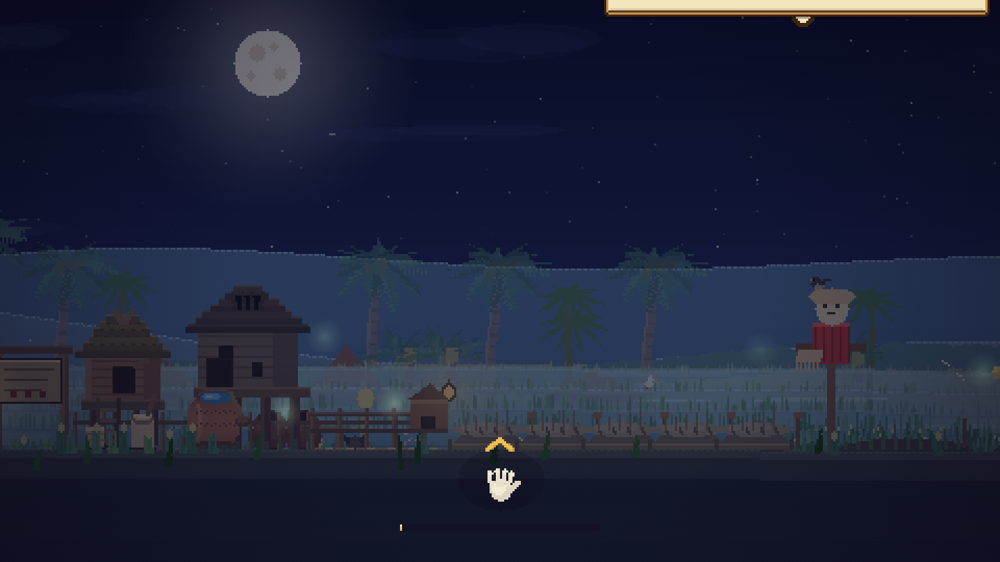 |  | 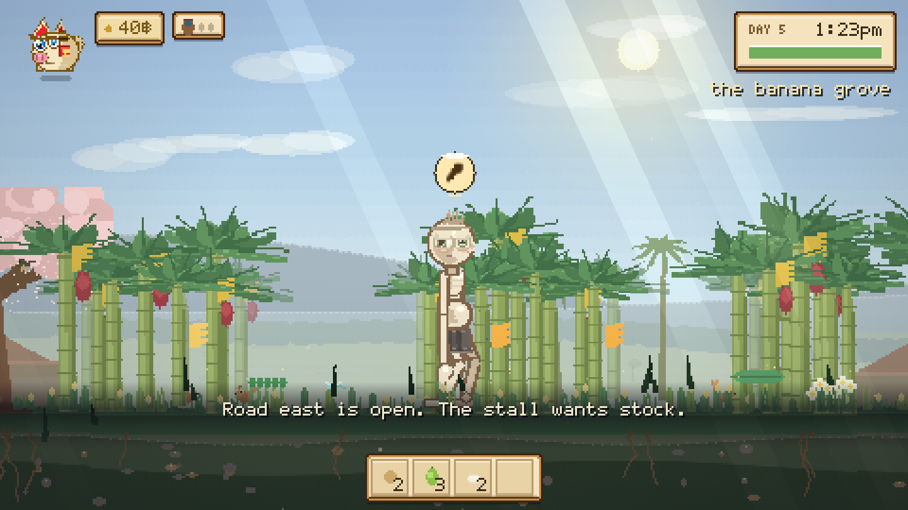 |
| 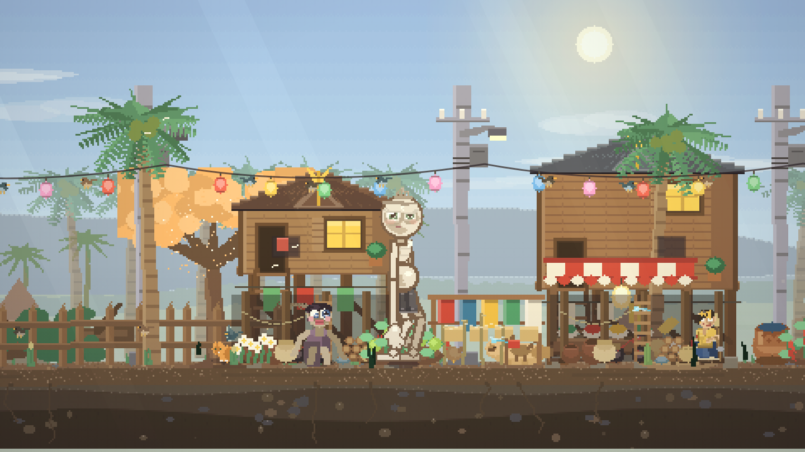 | 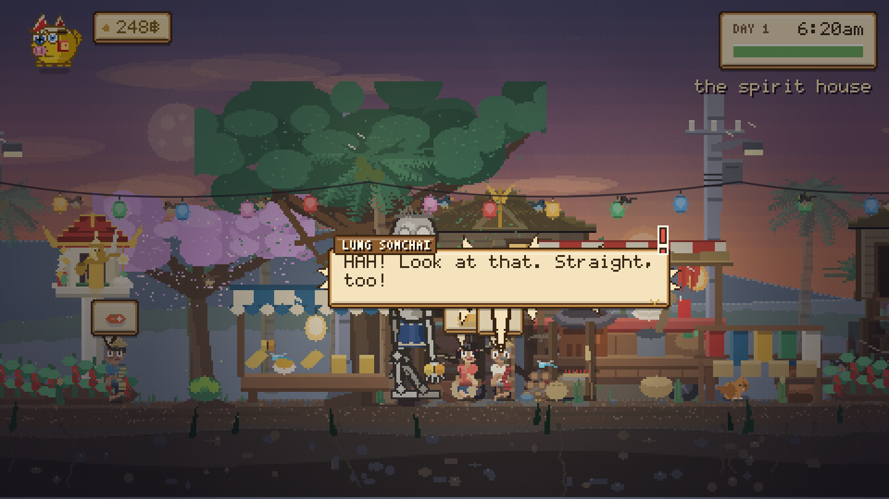 | 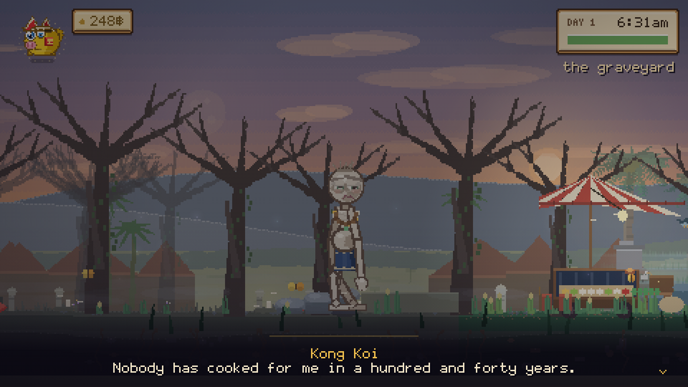 |

## Talking to somebody

A conversation used to be a panel at the bottom of the screen with a portrait
stuck on the side of it. You read a panel. You do not talk to one, and nothing
in it is happening: the letters arrive at a constant rate, out of a face that
is not moving, in the same box for a joke and for somebody telling you they have
been dead a hundred and forty years.

Now **the words come out of the person's head.** A cloud with a tail that
tapers all the way down to the mouth it came from, their name on a peg hooked
over the corner, and the camera leaning off you to sit between the two of you so
whoever is speaking is actually in the shot. Both of you turn to face each
other. If the speaker is somewhere you cannot see them — or there is no speaker
at all, because it is the narrator — the line comes in low across the bottom
instead, on nothing, the way a subtitle does.

**Every line has a feeling, and the face does it.** Fourteen of them: calm,
warm, happy, laughing, bright, shocked, asking, thinking, sad, tired, cross,
shy, awed, fond. The important lines are tagged by hand. Everything else is read
off the text — how many exclamation marks, whether it ends in a question,
whether the words in it are thank-you words or sorry words. It is a guess; a
guess beats every line in the game being delivered with the same flat face.

What the feeling drives:

- **The brows.** The inner end of the near brow lifts for sorry and drops for
  having none of it, which at this size is the whole of an expression.
- **The eyes**, wider when startled and half shut when weary.
- **The mouth**, which opens and closes while the words come out and then
  settles into a smile, a line, or a frown.
- **The head**, nodding along the sentence, flinching once on a shock.
- **A blush** on the two lines that deserve one.
- **The cloud itself** — softer paper for a quiet line, spikes all the way
  round it for a shouted one.
- **A small mark in the air** beside the cloud, drawn rather than typed: an
  exclamation, a question, a note, a sweat drop, a z, three thinking dots, a
  spark, a heart, a puff of temper. Each one is stamped nine times, eight of
  them in cream, so it reads against a night sky as well as against parchment.
- **The speed.** Excitement types faster, sorrow slower, and the typewriter
  *stops*: a tenth of a second at a comma, a quarter at a full stop, and longer
  on a dash. A machine that never pauses reads like a fax.
- **The voice.** Everybody has their own pitch — Mali is a piccolo, Tai Hong is
  a foghorn — and a question climbs a fifth as it goes.

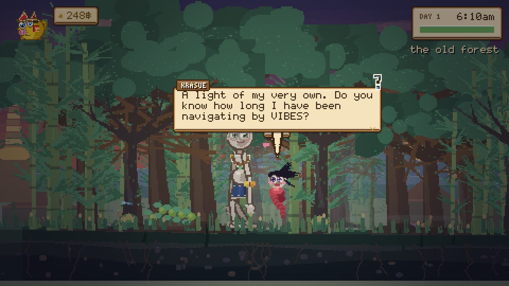

Fill 108 merit — as many as the beads on a prayer mala — and the last page turns.
Then the village throws you a water-pouring ceremony at dawn, and everyone you
befriended comes to see you off. The farm keeps going without you; somebody will
find the lanterns still burning over the beds and wonder who left them on.

## The lore (actual research)

- The prete is the Thai **hungry ghost**: **as tall as palm trees**, pot-bellied,
  **hands as big as palm leaves**, a **mouth the size of a needle's eye**. At
  night they make a thin high whistle asking the living to dedicate merit to
  them — which is your greeting button.
- The exit is real: when the living **make merit and dedicate it** — often by
  pouring water — a prete can be released.
- **Phra Phum Chao Thi**, the spirit-house guardian, is depicted as a regal gold
  figure holding **a sword in one hand and a money bag in the other** — look
  inside the shrine. He keeps the village ledger, and yours.
- **Phra Mae Thorani** is shown wringing water from her hair; **Phra Witsanukam**
  is the patron the craft guilds still garland once a year; **Phra In** is Indra,
  who in the Thai telling comes down himself when somebody's merit is worth the
  trip.
- **Nang Tani** genuinely lives in wild banana groves and is genuinely benevolent.
  **Mae Posop** is carried out of the last field of the harvest wrapped in
  cloth, like a bride, and you apologise to her out loud for a dropped grain.
- The red Fanta on the shrine ledge is not a joke.

Sources: [Preta](https://en.wikipedia.org/wiki/Preta) ·
[Ghosts in Thai culture](https://en.wikipedia.org/wiki/Ghosts_in_Thai_culture) ·
[Preta: Hungry Ghost Spirits in Thailand](https://mysakonnakhon.com/preta-hungry-ghost-spirits-in-thailand/) ·
[Krahang](https://en.wikipedia.org/wiki/Krahang) ·
[Kong Koi](https://en.wikipedia.org/wiki/Kong_koi) ·
[Phra Mae Thorani](https://en.wikipedia.org/wiki/Phra_Mae_Thorani) ·
[Vishvakarman](https://en.wikipedia.org/wiki/Vishvakarma) ·
[A Guide to Thai Spirit Houses](https://www.thethailandlife.com/thai-spirit-houses)

## What's inside

One HTML file, ~700 KB, 480×270 canvas integer-scaled with `image-rendering:
pixelated`. Parses and initialises in about a tenth of a second, has the whole
road built inside half a second behind a loading screen, and holds 50–60 fps
with a fully stocked farm on screen.

- **Nothing is a sprite sheet, and nothing is a font glyph.** Every character is a
  procedural puppet posed fresh each frame — two-bone IK limbs, a walk cycle
  driven by *distance travelled* so feet never slide, velocity lean, landing
  squash, a pot belly on its own spring, and a verlet-simulated cloth wrap. The
  prete is drawn cartoon-first: one hard ink line all the way round, flat colour
  inside it, forty-two pixels of leg on 3px-wide bones, arms that hang past the
  hip, and a head far too big for either.
- **A planted foot does not move.** The walk cycle is split into a stance half
  and a swing half rather than driven by a cosine: through stance the foot
  tracks straight backwards at exactly his walking speed, which is the only
  shape that leaves it stationary against the ground. The phase advances one
  half-cycle per step length travelled, so the identity that keeps it honest —
  `phaseRate * stride === 1` — holds at every speed. Measured slip is 0.00 px/s
  at five different speeds, in both directions.
- **Working with your hands takes a beat.** Planting, watering, picking, giving
  and putting your palms together are one system: a crouch, a reach and a
  payload that fires at the middle of the movement, when his hands actually
  arrive. Nothing in the field is instant, and nothing is a menu.
- **He moves slowly, and late.** The head and the hands ride their own springs and
  arrive a beat behind the shoulders; the body carries a slow idle sway and a
  breath; the walk eases in and drifts out over most of a second instead of
  snapping to speed. None of it is keyframed — it falls out of the simulation,
  which is why it never repeats exactly.
- **The farm runs whether or not you are looking at it.** The animals and the
  ghosts you hired advance on the same fixed step as everything else — the
  harvester really does walk the row and put things in your basket while you are
  two zones away buying seed. What *grows* does not: beds, paddies and trees all
  move in one pass while you sleep, so the state of the field is a thing you
  decided at dusk rather than a thing that happened to you while you were
  looking the other way.
- **The first night is one list.** Ten beats — climb, meet, follow, supper,
  hide, field, plough, water, plant, free — each with an optional enter, step,
  prompt and overlay, stepped one at a time off a single integer in the save
  file. Nothing in it reaches into the rest of the game except through that
  integer, so the moment the last beat lands the village behaves exactly as it
  always did, and a save from before the first night existed is simply treated
  as having finished it.
- **One number is the time of day.** Nought is the blackest part of the night
  and one is full morning; the sky's four gradient bands, the sun, the moon,
  the stars, the clouds, the ambient darkness, the lamp glows, the aerial haze
  on each parallax layer, and whether the ambience is crickets or birds all
  read off it and nothing else. The clock sets it now rather than the other way
  round — half past six is orange because the clock says half past six — and
  the sleep under his floorboards is still that number moving from 0 to 0.92
  over nine seconds.
- **One set of colours, graded by the clock.** The 7,200-pixel play layer and
  the three parallax layers behind it are painted once each and never repainted.
  The time of day is then four full-screen fills over the top: a dark stencil
  with a hole punched in it for every lamp, a warm `overlay` pass that fades in
  with the sun, a cool band along the ground that fades out with it, and a coat
  of the horizon's own colour on each parallax layer in proportion to its
  distance, which is aerial perspective. Much cheaper than a second copy of a
  two-megapixel canvas — and the frame rate is the same with the grade as
  without it.

  The layers used to be painted for the night the story opens on, which was
  fine while the game was one night long. With a clock running six in the
  morning to two the next night it meant every daylight hour came out the same
  slate grey as three a.m., so they are painted in daylight now and the night
  is the thing that gets added.
- **The plough is a pendulum you can see.** The marker you are timing and the
  share that dips into the soil ride the same number, so what you watch and what
  you hit are the same object rather than a bar pretending to be a plough. Every
  connection speeds the swing up and adds a step to a pentatonic run; a miss
  slows it and resets the combo. The sod that turns over is a physical particle
  with its own spin, bounce and settle.
- **The grass lies down, and there is a cache behind it.** Every tuft in camera
  range is a spring with a rest position set by the wind; walking through pushes
  them over and occasionally flushes whatever was sitting in them. They are
  blitted from baked sprites keyed on kind, height, bend and colour — and the
  key has fewer possible values than the cache has slots, which is the whole
  difference between a cache and a bakery.
- **Platforms are one-way and forgiving.** The feet are tested against the slice
  of air they fell through this frame rather than against a position, so a fast
  drop cannot tunnel through a plank; a rising jump that clips the lip of one
  gets pulled up onto it; and down-and-jump steps off the top of one instead of
  jumping off it.
- **The tutorial cannot get stuck behind itself.** Mae Posop's rice lesson does
  not step forward one beat at a time; it scans backwards from the last step for
  the furthest thing that has demonstrably happened, because harvesting a paddy
  resets its stage and "keep the water up" can never be true again afterwards.
  She also walks the bund towards you while she is teaching, so the one
  character who explains the game can never end up somewhere you can't tap.
- **Every prompt in the world is one ordered list.** Fixed furniture first — the
  barn, the jar, the log, her — then the beds and paddies, then people, then the
  things flying about. A dragonfly drifting over a ripe bed must never be what
  your tap lands on. (The people loop was missing the guard the rest of the list
  had, which is how Krahang came to be answering for the water jar.)
- **The bugs each have their own motion, not a shared wander.** A dragonfly
  accelerates in bursts and coasts; a firefly integrates two slow sines; a
  grasshopper is a ballistic arc with a cooldown; a cicada is pinned to a trunk
  and emits an actual synthesized chirp; a beetle ignores you entirely. Each is
  clamped to the patch it was spawned in and despawns when you are far enough
  away.
- **The little scenes are not a mode.** No state machine, no separate render
  path: the bars, the dimming, the light pool and the typed line are one
  function drawn over the live world, and the game underneath keeps running.
- **The cutscenes use the same rig ideas at a different scale.** The man you used
  to be has hair and ordinary eyes and already that nose, and the prete himself
  climbs out of his own grave in the first scene, drawn by the same function that
  draws him in the village.
- **The type is part of the art.** Two bitmap fonts defined as row bitmasks and
  rasterised in the page; each drawn string is cached to its own small canvas, so
  a line of text costs one blit rather than a few hundred rectangles. There is no
  webfont, so nothing loads late and nothing reflows.
- **A 7,200-pixel road** through nine named zones over six parallax layers,
  pre-rendered once into cached canvases and built across frames behind a loading
  screen. The east end is new country: deep forest, a stream with stones across
  it, and fallen trees long enough to walk along.
- **Every panel is drawn, then cached.** Frames, bubbles, keycaps and sky clouds
  are filled once into offscreen canvases and reused; so are the radial glows on
  every lantern, lamp, firefly and floating head. One function draws every box in
  the game, so the whole interface changes shape from a single place.
- **Menus are hit-tested from the draw pass.** Each screen records where it put
  things as it paints them, so a tap resolves against real layout instead of a
  second copy of the geometry.
- **Atmosphere:** strings of coloured lanterns swaying over the road, blossom
  trees, night-market stalls, drifting mist that pools in the graveyard and the
  paddies, candles on the graves, spirit-motes, fireflies, moths around the lamps,
  and a real-time lighting pass so fixing the streetlight visibly warms that
  stretch.
- **A life under every house.** Water jars, a leaning bicycle with a basket on
  the front, stacked firewood, a tray of chillies drying, a broom, a hammock
  nobody is in, a dog's bowl, a pair of sandals, a sack of rice and the ladder
  up — baked once per house and blitted, with the window lit and somebody
  turning over in it at night and standing open with a shirt hung in it by day.
- **Thirty-odd things that answer.** A jar you can look into, a bicycle bell you
  can ring at two in the morning and regret, a stone with a whole town under it,
  a pot to smell, a stool far too small for you to sit on, a stream, a
  scarecrow, chillies, washing. Each says one thing the first time and something
  shorter afterwards, and a few of them change the world a little — the bell
  starts every dog in the village, the stone empties in five directions.
- **All audio synthesized live** — crickets, frogs, a ranat-ek pentatonic figure,
  temple gongs, and one long prete whistle.
- **The baht sign is a drawn glyph.** It lives in the Thai Unicode block, so
  every price was being rasterised from the platform's Thai face and coming out
  in a different typeface from the number beside it. It has its own 5x7 bitmap
  now, and the Thai matcher steps around it.
- **The type has a second alphabet.** The bitmap faces cover Latin; Thai is
  supersampled four times from the platform face and downsampled to 1-bit by
  coverage, then cached like every other string, and a line that mixes the two
  is split into runs so each goes to its own face. Translation happens at the
  drawing boundary — `pTxt` and `wrap` look every string up on the way to the
  screen — so no call site had to be touched and an untranslated string simply
  comes through in English rather than going missing.
- **One guide, not two.** The tutorial nudges, every "you need seed" and "the
  jar is by the house", all funnel through one call. If Mae Posop is within
  earshot it comes out of her mouth; if you are two zones away it comes up on a
  line under the plaques, which drops below whatever the HUD has already put in
  that band. Before this there was a second spirit at your shoulder saying the
  same kind of thing at the same time, in a bubble of her own.
- **Sprite-baked static art.** The rice, the tree crowns, the farmhouse, the pen
  and the barn are hundreds of tapers and ellipses each, and they are the same
  hundreds every frame — so each is painted once into a small canvas and blitted
  from then on, keyed by whatever about it can actually change. Verified
  pixel-exact against painting straight into the world: zero pixels differ at
  every farm location. It bought 12 fps.
- **Everything in reach is a list, not a slot.** The interaction check used to
  end at the first thing that matched — thirty-odd candidates each guarded by
  *if nothing has claimed the prompt yet*. That is a precedence list, and a
  precedence list is fine right up until two things overlap, at which point the
  loser does not exist. The guards are gone: every candidate adds itself, the
  order they were written in becomes the order of the list, the front of the
  list is the prompt exactly as before, and the rest each get an icon. One or
  two things ask to sit at the back rather than be left out — the water jar
  standing where the bed is, after dark — and a stable sort keeps everything
  else where it was.
- **Carrying is a pose, not an attachment.** The water jar used to float beside
  the hip; now it is drawn inside the prete, between his two arms, so the back
  hand is behind it and the front hand closes over the rim. Both elbows are
  bent the other way from usual so they fall outward under the weight, the
  torso leans back off it, the head comes forward over it, the hips drop two
  pixels and the whole walk rolls side to side. And lifting it is a movement:
  he crouches, gets his hands under it, and the jar arrives in his arms
  halfway up — which is the frame where the weight becomes his.
- **The night is one function.** Everything that happens between two days —
  the basket paid, every watered bed moved on, the flooded paddies counted, the
  trees grown, the animals fed, the hired ghosts' night's work, the bar
  refilled, the day's presents and conversations forgotten — is a single pass
  over the farm, called once, that returns the card you wake up to. Nothing
  else in the game is allowed to advance a crop, which is why the field is
  always exactly what you left at dusk.
- **Translation is checked, not believed.** Every string reaches the screen
  through one lookup, so [`th/sweep.js`](th/sweep.js) hooks that lookup, walks
  the game through every screen it has, and prints whatever came past in
  English. 438 strings drawn, none untranslated.
- Autosave, a friends journal, canvas-drawn touch controls, and a dawn ending.

Made with rice and incense. May you go to a good place.
